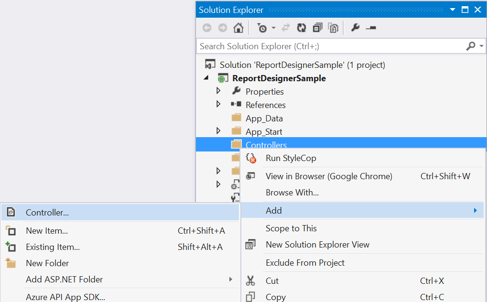
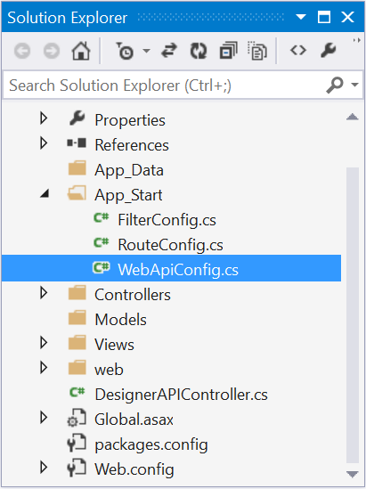

# Getting Started

This section explains briefly about how to create a **ReportDesigner** in your ASP.NET MVC application.

## Create your first ReportDesigner application in ASP.NET MVC

The following screenshots displays the Project Creation Wizard in Visual Studio 2013

Create a new ASP.NET MVC4 Web Application project by selecting the **WEB** category from the listed project template in Microsoft Visual Studio IDE.

Project Creation Wizard
{:.caption}

The following screenshot displays how to select the project template with razor view engine:

Select an empty template and click OK.

## Add Assembly References

1. In the Solution Explorer, right-click the `References` folder and then click `Add Reference`.

     

2. Add the following Syncfusion assemblies to the project that are necessary for using the report designer control.

   * Syncfusion.Chart.Wpf
   * Syncfusion.Compression.Base
   * Syncfusion.DocIO.Base
   * Syncfusion.EJ.ReportDesigner
   * Syncfusion.EJ.ReportViewer
   * Syncfusion.Gauge.Wpf
   * Syncfusion.Pdf.Base
   * Syncfusion.Presentation.Base
   * Syncfusion.Shared.Wpf
   * Syncfusion.SfMaps.Wpf
   * Syncfusion.XlsIO.Base
   * Syncfusion.EJ
   * Syncfusion.EJ.MVC

    > Refer the Syncfusion.EJ.MVC assembly from the installed location, [Installed Location]:\Program Files (x86)\Syncfusion\Essential Studio\ASP.NET MVC\{{ site.releaseversion }}\Assemblies\MVC\MVC4

    > Refer the other assemblies from the installed location, [Installed Location]:\Program Files (x86)\Syncfusion\Essential Studio\ASP.NET MVC\{{ site.releaseversion }}\Assemblies

3.  Add the following WebAPI assemblies from [NuGet package](https://www.nuget.org/packages/Microsoft.AspNet.WebApi/ "Web NuGet Package Details").

    * System.Web.Http
    * System.Web.Http.WebHost
    * System.Net.Http.WebRequest
    * System.Net.Http.Formatting

    > The System.Web.Routing and System.Net.Http assemblies are also required, which are referred by default when creating the project.

## Add Controller 

1. Right-Click on the **Controllers** folder in the project and select `Add` then select `Controller`.

    

2. Name the controller as **ReportDesignerController**.

    

3. Click Add.

    

### Modify RouteConfig.cs

1.Open the RouteConfig.cs file from `App_Start` folder of your application.

2.Modify the controller name to map to the **ReportDesigner** controller as follows.



using System;
using System.Collections.Generic;
using System.Linq;
using System.Web;
using System.Web.Mvc;
using System.Web.Routing;

namespace ReportDesignerSample
{
    public class RouteConfig
    {
        public static void RegisterRoutes(RouteCollection routes)
        {
            routes.IgnoreRoute("{resource}.axd/{*pathInfo}");
            routes.MapRoute(
                name: "Default",
                url: "{controller}/{action}/{id}",
                defaults: new { controller = "ReportDesigner", action = "Index", id = UrlParameter.Optional }
            );
        }
    }
}



### Add View page

1. Create a new folder **ReportDesigner** in `Views` folder.

    

2. Right-Click on the **ReportDesigner** folder in the `Views` folder and select `Add` then select `View`.

    

3. Name the view page as **Index**.

    

4. Click `Add`.

    

## Add Scripts and Styles

For complete dependencies list of report designer control [Click here](/aspnetmvc/ReportDesigner/Dependencies).

Add the below code snippet in the Index.cshtml page.



@using Syncfusion.JavaScript
@using Syncfusion.MVC.EJ

<!DOCTYPE html>
<html lang="en">
    <head>
        <meta charset="utf-8" />
        <title>@ViewBag.Title</title>
</head>
<body>
</body>
</html>
 

### Themes



<link href="http://cdn.syncfusion.com/{{ site.releaseversion }}/js/web/flat-azure/ej.web.all.min.css" rel="stylesheet" />
<link href="http://cdn.syncfusion.com/{{ site.releaseversion }}/js/web/flat-azure/ej.reportdesigner.min.css" rel="stylesheet" />

 

### Scripts

#### External dependencies



 

#### Internal dependencies

Refer the below scripts to render report designer control.



 
 

##### Code Mirror

To edit the SQL queries with syntax highlighter need to refer the below code mirror scripts and themes.



<link href="https://cdnjs.cloudflare.com/ajax/libs/codemirror/5.37.0/codemirror.min.css" rel="stylesheet" />
<link href="https://cdnjs.cloudflare.com/ajax/libs/codemirror/5.37.0/addon/hint/show-hint.min.css" rel="stylesheet" />

 

Add the script files and theme file references in the &lt;head&gt; tag of the Index.cshtml page.

> Also the scripts and styles can be referred from the installed location, [Installed Location]:\Program Files (x86)\Syncfusion\Essential Studio\ASP.NET MVC\{{ site.releaseversion }}\JavaScript\assets

### Unobtrusive Mode

#### Enable unobtrusive mode

1.To render the Report Designer in unobtrusive mode, refer to the **ej.unobtrusive.js** script file in &lt;head&gt; of Index.cshtml page.





2.Set **UnobtrusiveJavaScriptEnabled** to true in Web.config file of your application.

#### Disable unobtrusive mode

Set **UnobtrusiveJavaScriptEnabled** to false in Web.config file of your application.

>  Refer to the [unobtrusive section](https://help.syncfusion.com/aspnetmvc/unobtrusive) for more details.

### Registering namespaces within Web.config

Register the following namespaces in the web.config file present within the Views folder as well as the root directory of your application.



<namespaces>
    <add namespace="Syncfusion.EJ.ReportViewer"/>
    <add namespace="Syncfusion.EJ.ReportDesigner"/>
    <add namespace="Syncfusion.EJ"/>
    <add namespace="Syncfusion.MVC.EJ"/>
</namespaces>



### Add Control in View page

Add the following code example in the &lt;body&gt; tag of the `Index.cshtml` page that is already created. Set the desired `ServiceUrl` to ReportDesigner.



    @{Html.EJ().ReportDesigner("designer").ServiceUrl("/api/DesignerAPI").Render();}

@(Html.EJ().ScriptManager())



> The main reason for referring the **Script manager** in Index.cshtml is that, it can be referred as common by all the View files present within your application. If **unobtrusive** is set to true in the application, the script manager can be excluded, as the control is initialized using HTML5 attributes. Also for control rendering, you need to include **ej.unobtrusive.min.js** file along with ej.web.all.min.js in **Index.cshtml** page.

### Add WebAPI controller for ReportDesigner

The MVC ReportDesigner uses WebApi services to process the report file and process the request from control.

#### Add Controller

1. Right-Click on the project and select `Add` then click `New Item`. 

    

2. Select `Web API Controller Class` from the listed templates and name the controller as **DesignerAPIController.cs**. 

    

3. Click Add.

    

#### Inherit IReportDesignerController
 
The ApiController should inherit the `IReportDesignerController` and to process the report file. The interface `IReportDesignerController` contains the required actions and helper methods declaration to process the report. The `ReportDesignerHelper` and `ReportHelper` class contains helper methods that helps to process Post/Get request from control and return the response to control.

Please add the following code example in `DesignerAPIController.cs`.



using System;
using System.Collections.Generic;
using System.Linq;
using System.Net;
using System.Net.Http;
using System.Web.Http;
using System.IO;
using System.Web;
using Syncfusion.EJ.ReportViewer;
using Syncfusion.Reports.EJ;
using Syncfusion.EJ.ReportDesigner;

namespace ReportDesignerSample
{
    public class DesignerAPIController : ApiController, Syncfusion.EJ.ReportDesigner.IReportDesignerController
    {
        public string GetFilePath(string fileName)
        {
            string targetFolder = HttpContext.Current.Server.MapPath("~/");
            targetFolder += "Cache";

            if (!Directory.Exists(targetFolder))
            {
                Directory.CreateDirectory(targetFolder);
            }

            if (!Directory.Exists(targetFolder + "\\" + ReportDesignerHelper.EJReportDesignerToken))
            {
                Directory.CreateDirectory(targetFolder + "\\" + ReportDesignerHelper.EJReportDesignerToken);
            }

            var folderPath = HttpContext.Current.Server.MapPath("~/") + "Cache\\" + ReportDesignerHelper.EJReportDesignerToken + "\\";
            return folderPath + fileName;
        }

        [HttpGet]
        public object GetImage(string key, string image)
        {
            return ReportDesignerHelper.GetImage(key, image, this);
        }

        [HttpPost]
        public object PostDesignerAction(Dictionary<string, object> jsonResult)
        {
            return ReportDesignerHelper.ProcessDesigner(jsonResult, this, null);
        }

        public bool UploadFile(System.Web.HttpPostedFile httpPostedFile)
        {
            string targetFolder = HttpContext.Current.Server.MapPath("~/");
            string fileName = !string.IsNullOrEmpty(ReportDesignerHelper.SaveFileName) ? ReportDesignerHelper.SaveFileName : Path.GetFileName(httpPostedFile.FileName);
            targetFolder += "Cache";

            if (!Directory.Exists(targetFolder))
            {
                Directory.CreateDirectory(targetFolder);
            }

            if (!Directory.Exists(targetFolder + "\\" + ReportDesignerHelper.EJReportDesignerToken))
            {
                Directory.CreateDirectory(targetFolder + "\\" + ReportDesignerHelper.EJReportDesignerToken);
            }

            httpPostedFile.SaveAs(targetFolder + "\\" + ReportDesignerHelper.EJReportDesignerToken + "\\" + fileName);
            return true;
        }

        public void UploadReportAction()
        {
            ReportDesignerHelper.ProcessDesigner(null, this, HttpContext.Current.Request.Files[0]);
        }

        public object GetResource(string key, string resourcetype, bool isPrint)
        {
            return ReportHelper.GetResource(key, resourcetype, isPrint);
        }

        public void OnInitReportOptions(ReportViewerOptions reportOption)
        {
            //You can update report options here
        }

        public void OnReportLoaded(ReportViewerOptions reportOption)
        {
            //You can update report options here
        }

        public object PostReportAction(Dictionary<string, object> jsonResult)
        {
            return ReportHelper.ProcessReport(jsonResult, this as IReportController);
        }

        public FileModel GetFile(string filename, bool isOverride)
        {
            throw new NotImplementedException();
        }

        public List<FileModel> GetFiles(FileType fileType)
        {
            throw new NotImplementedException();
        }
    }
}



### Modify WebApiConfig.cs

1. Open the WebApiConfig.cs file from `App_Start` folder of your application.

    

2. Modify the **routeTemplate** to map to the API controller of **ReportDesignerSample** project as follows.

    

    using System;
    using System.Collections.Generic;
    using System.Linq;
    using System.Web.Http;
    namespace ReportDesignerSample
    {
        public static class WebApiConfig
        {
            public static void Register(HttpConfiguration config)
            {
                config.Routes.MapHttpRoute(
                    name: "DefaultApi",
                    routeTemplate: "api/{controller}/{action}/{id}",
                    defaults: new { id = RouteParameter.Optional }
                );
            }
        }
    }
    

### Run the Application

On running the application, Report Designer will be rendered like below.

