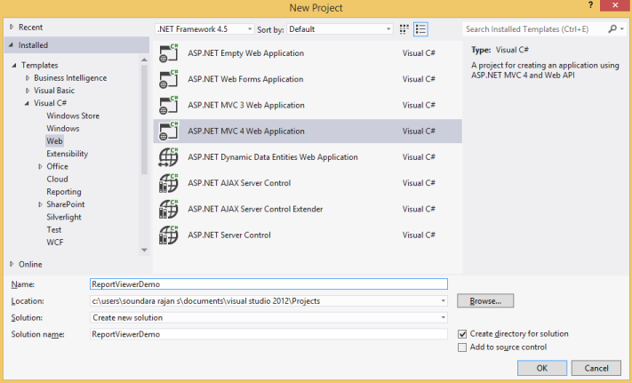
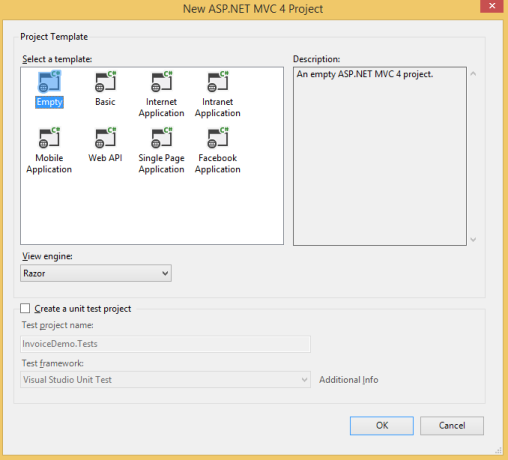
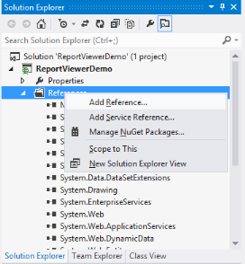
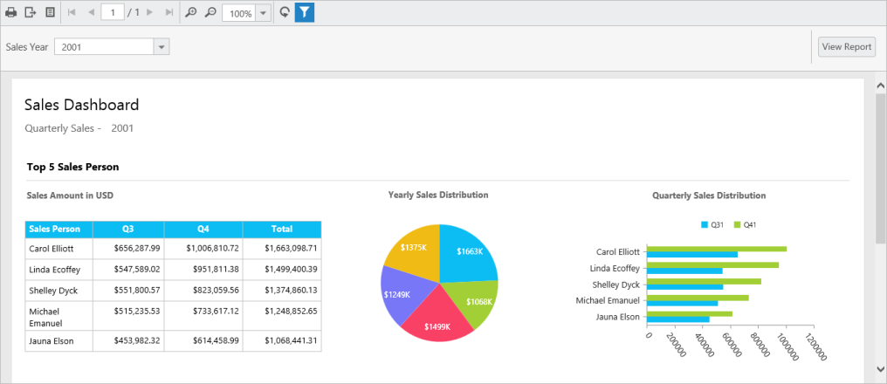
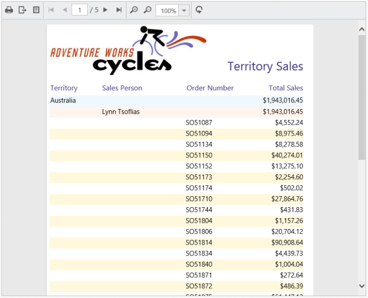
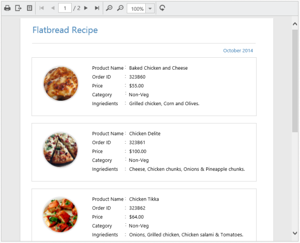

# Getting Started

This section explains briefly about how to create a ReportViewer in your web application with MVC.

## Create your first ReportViewer in MVC

This section explains how to configure a ReportViewer component in web application. As ReportViewer uses WebApi to process the report file, you can also learn how to create WebApi Service to process the report for ReportViewer. In the following example, the ReportViewer component displays the Sales Dashboard Report. 

Open Visual Studio and create a new project by clicking New Project. Select the Web category, select the ASP.NET MVC4 Web Application template, and then click OK. The following screenshot displays the Project Creation Wizard.

Project Creation Wizard
{:.caption}

The following screenshot displays how to select Internet application template with razor view engine.

### Add References, Scripts, Styles and Control in CSHTML Page

#### Add References

1. In the Solution Explorer, right-click the References folder and then click Add Reference

   
	
   Adding Reference
   {:.caption}

2. Add the following assemblies
	
   * System.Web.Routing  
   * System.Web.Http
   * System.Web.WebHost
   * System.Net.Http
   * System.Net.Http.WebRequest
   * System.Net.Http.Formatting
   * Syncfusion.Linq.Base
   * Syncfusion.EJ
   * Syncfusion.EJ.MVC
   * Syncfusion.EJ.ReportViewer
   * Syncfusion.Pdf.Base
   * Syncfusion.XlsIO.Base
   * Syncfusion.DocIO.Base
   * Syncfusion.Shared.Wpf
   * Syncfusion.Chart.Wpf
   * Syncfusion.Gauge.Wpf
   * Syncfusion.SfMaps.Wpf 
   
   N> Refer the above assemblies from the installed location, C:\Program Files (x86)\Syncfusion\Essential Studio\ASP.NET MVC\{{ site.releaseversion }}\Assemblies
   N>
   N> Refer System.Web.Http, System.Web.WebHost, System.Net.Http.WebRequest and System.Net.Http.Formatting assemblies from ASP.NET WebApi NuGet package.

3. Click OK

#### Add Scripts and Styles

Add the script files and CSS files in the &lt;title&gt; tag of the _Layout.cshtml page.

N> Use the following code example while adding scripts and styles.



<link rel="stylesheet" href="https://cdn.syncfusion.com/{{ site.releaseversion }}/js/web/flat-azure/ej.web.all.min.css" />



#### Add Control in View page

Add the following code example in the Index.cshtml page that is already created. Set the desired ReportPath and ReportServiceUrl to ReportViewer.



@using Syncfusion.MVC.EJ
@using Syncfusion.JavaScript.Models
@using Syncfusion.JavaScript
@using Syncfusion.JavaScript.ReportViewer

@{
    ViewBag.Title = "Index";
}
<h2>Index</h2>

    @{Html.EJ().ReportViewer("viewer").ReportPath("~/App_Data/Sales Dashboard.rdl").ReportServiceUrl("/api/ReportApi").Render();}



N> Add your report files to your application’s App_Data folder. You can obtain sample rdl/rdlc files from Syncfusion installed location(%userprofile%\AppData\Local\Syncfusion\EssentialStudio\{{ site.releaseversion }}\Common\Data\ejReportTemplate). {{ site.releaseversion }} is the Essential Studio Release Version.

### Add WebAPI controller for ReportViewer

The MVC ReportViewer uses WebApi services to process the report file and process the request from control.

Adding WebApi Controller
{:.caption}

### Inherit IReportController

The ApiController inherits the IReportController and you can add the following code example to its methods definition in order to process the report file. The interface IReportController contains the required actions and helper methods declaration to process the report. The ReportHelper class contains helper methods that helps to process Post/Get request from control and return the response to control.



using Syncfusion.EJ.ReportViewer;
using System;
using System.Collections.Generic;
using System.Linq;
using System.Net;
using System.Net.Http;
using System.Web.Http;

namespace ReportViewerDemo.Api
{
    public class ReportApiController : ApiController, IReportController
    {
        //Post action for processing the rdl/rdlc report
        public object PostReportAction(Dictionary<string, object> jsonResult)
        {
            return ReportHelper.ProcessReport(jsonResult, this);
        }
        //Get action for getting resources from the report
        [System.Web.Http.ActionName("GetResource")]
        [AcceptVerbs("GET")]
        public object GetResource(string key, string resourcetype, bool isPrint)
        {
            return ReportHelper.GetResource(key, resourcetype, isPrint);
        }
        //Method will be called when initialize the report options before start processing the report
        public void OnInitReportOptions(ReportViewerOptions reportOption)
        {
            //You can update report options here
        }
        //Method will be called when reported is loaded
        public void OnReportLoaded(ReportViewerOptions reportOption)
        {
            //You can update report options here
        }   
    }
}



### WebAPI Routing

You can route the WebAPI in Application_Start event into Global.asax file as follows.



using System;
using System.Collections.Generic;
using System.Linq;
using System.Web;
using System.Web.Security;
using System.Web.SessionState;
using System.Web.Http;

namespace ReportViewerDemo
{
    public class Global : System.Web.HttpApplication
    {
        protected void Application_Start(object sender, EventArgs e)
        {
            System.Web.Http.GlobalConfiguration.Configuration.Routes.MapHttpRoute(
            name: "DefaultApi",
            routeTemplate: "api/{controller}/{action}/{id}",
            defaults: new { id = RouteParameter.Optional });
        }
    }
}



### Run the Application

Run the sample application and you can see the ReportViewer on the page as displayed in the following screenshot.

ReportViewer with Sales Dashboard Report
{:.caption}

## Load SSRS Server Reports

ReportViewer supports to load RDL/RDLC files from SSRS Server. The following steps help you to load reports from SSRS Server.

1. Set the ReportPath from SSRS and SSRS ReportServerUrl in the ReportViewer properties.

   ~~~ CSHTML
   @using Syncfusion.MVC.EJ
   @using Syncfusion.JavaScript.Models
   @using Syncfusion.JavaScript
   @using Syncfusion.JavaScript.ReportViewer

   @{
       ViewBag.Title = "Index";
   }
   <h2>Index</h2>
   
    
       @(Html.EJ().ReportViewer("viewer").ProcessingMode(Syncfusion.JavaScript.ReportViewerEnums.ProcessingMode.Remote)
	   .ReportServiceUrl("/api/ReportApi")
	   .ReportServerUrl("http://mvc.syncfusion.com/reportserver")
	   .ReportPath("/SSRSSamples2/Territory Sales new"))  
   

   ~~~
   
2. Add the credential information in ReportApiController’sOnInitReportOptions method that is inherited in IReportController.

   ~~~ csharp
   public void OnInitReportOptions(ReportViewerOptions reportOption)
   {
       //Add SSRS Server and database credentials here
       reportOption.ReportModel.ReportServerCredential = new System.Net.NetworkCredential("ssrs", "RDLReport1");
       reportOption.ReportModel.DataSourceCredentials.Add(new DataSourceCredentials("AdventureWorks", "ssrs1", "RDLReport1"));
   }
   ~~~
  
3. Run the application and you can see the ReportViewer on the page as displayed in the following screenshot.

   
	
   Report from SSRS
   {:.caption}

## Load RDLC Reports

The ReportViewer has data binding support to visualize the RDLC reports. The following code example helps you to bind data to ReportViewer.

1. Assign the RDLC report path to ReportViewer’sReportPath property and set the data sources to the ReportViewer’sDataSources property.

   ~~~ CSHTML
   @(Html.EJ().ReportViewer("viewer").ProcessingMode(Syncfusion.JavaScript.ReportViewerEnums.ProcessingMode.Local)
   .ReportPath("~/App_Data/Product List.rdlc")
   .ReportServiceUrl("/api/ReportApi")
   .DataSources(ds => ds.Name("list").Value(ViewData["reportDsource"]).Add()))
   ~~~
  
2. The following code example illustrates the creation of business object data source.

   ~~~ csharp
   namespace ReportViewerDemo.Controllers
   {
       public partial class ReportViewerController : Controller
       {
           public ActionResult ProductList()
           {
               ProductList prodlist = new ProductList();
               ViewData["reportDsource"] = prodlist.GetData();
               return View();
           }
       }

       public class ProductList
       {
           public string ProductName { get; set; }
           public string OrderId { get; set; }
           public double Price { get; set; }
           public string Category { get; set; }
           public string Ingredients { get; set; }
           public string ProductImage { get; set; }

           public IList GetData()
           {
               List<ProductList> datas = new List<ProductList>();
               ProductList data = null;
               data = new ProductList() {ProductName = "Baked Chicken and Cheese",OrderId = "323B60",Price = 55,Category = "Non-Veg",Ingredients = "grilled chicken, corn and olives.",ProductImage = "" };
               datas.Add(data);
               data = new ProductList() {ProductName = "Chicken Delite",OrderId = "323B61",Price = 100,Category = "Non-Veg",Ingredients = "cheese, chicken chunks, onions & pineapple chunks.",ProductImage = ""};
               datas.Add(data);
               data = new ProductList() {ProductName = "Chicken Tikka",OrderId = "323B62",Price = 64,Category = "Non-Veg",Ingredients = "onions, grilled chicken, chicken salami & tomatoes.",ProductImage = ""};
               datas.Add(data);
               return datas;
           }
       }
   }
   ~~~
  
3. Run the application and you can see the ReportViewer on the page as displayed in the following screenshot.

   
	
   Product List RDLC Report
   {:.caption}