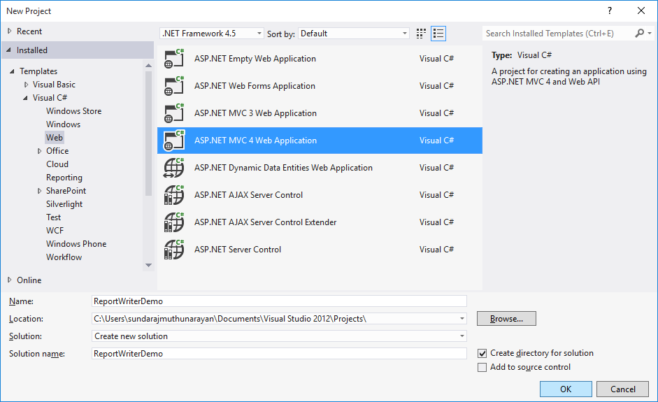
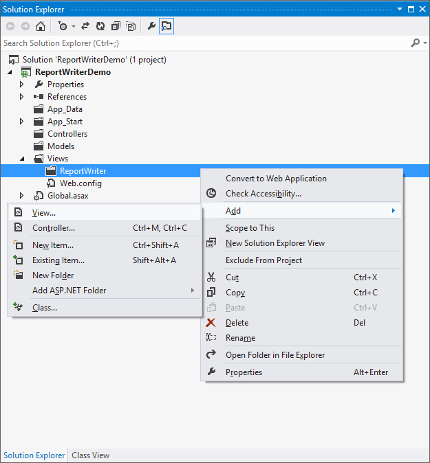
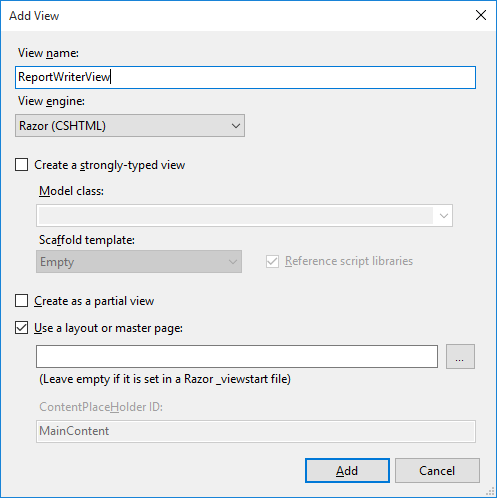
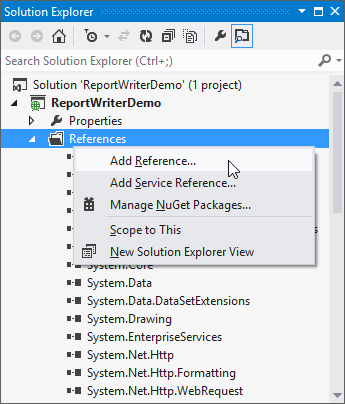
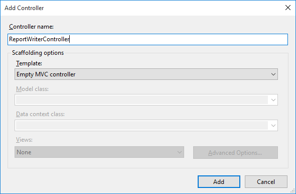

# Getting Started with ASP.NET MVC Application

This section describes how to export the Report Server report as PDF, Word, Excel, PPT and HTML formats in ASP.NET MVC application using ReportWriter.

## Project Creation

This section illustrates how to add ReportWriter to the ASP.NET MVC application. It includes the following steps.

1. Create a new ASP.NET MVC project by selecting the WEB category from the listed project template in Microsoft Visual Studio IDE.

    
   
2. The following screenshot displays how to select empty application template with razor view engine.

   
   
### Create CSHTML Page

To create a new CSHTML view page in the application follow the below steps.

1. Right click on the ReportWriter folder from Views followed by Add and then click View.
 
   

2. Specify the name and then click on OK.

   

### Add References   

1. In the Solution Explorer, Right-click the References folder and then click Add Reference.

    

2. Add the following references
  
   * Syncfusion.Chart.Wpf
   * Syncfusion.Compression.Base
   * Syncfusion.DocIO.Base   
   * Syncfusion.EJ.ReportViewer   
   * Syncfusion.Gauge.Wpf
   * Syncfusion.Linq.Base
   * Syncfusion.Pdf.Base
   * Syncfusion.SfMaps.Wpf
   * Syncfusion.Shared.Wpf
   * Syncfusion.XlsIO.Base  
   
   N> You can get the above assemblies from the installed location %localappdata%\Syncfusion\ReportsSDK\Samples\Common\Assemblies   

### Registering Assemblies within the Web.config file  

In your application’s root web.config file, add the below assembly information within the &lt;assemblies&gt; tag.

~~~html
<system.web>
    <compilation debug="true" targetFramework="4.5">
        <assemblies>
            <add assembly="Syncfusion.Chart.WPF, Version=14.1400.0.42, Culture=neutral, PublicKeyToken=3d67ed1f87d44c89"/>
            <add assembly="Syncfusion.Compression.Base, Version=14.1400.0.42, Culture=neutral, PublicKeyToken=3d67ed1f87d44c89"/>
            <add assembly="Syncfusion.DocIO.Base, Version=14.1400.0.42, Culture=neutral, PublicKeyToken=3d67ed1f87d44c89"/>
            <add assembly="Syncfusion.EJ.ReportViewer, Version=14.1400.0.42, Culture=neutral, PublicKeyToken=3d67ed1f87d44c89"/>
            <add assembly="Syncfusion.Gauge.WPF, Version=14.1400.0.42, Culture=neutral, PublicKeyToken=3d67ed1f87d44c89"/>
            <add assembly="Syncfusion.Linq.Base, Version=14.1400.0.42, Culture=neutral, PublicKeyToken=3d67ed1f87d44c89"/>
            <add assembly="Syncfusion.Pdf.Base, Version=14.1400.0.42, Culture=neutral, PublicKeyToken=3d67ed1f87d44c89"/>
            <add assembly="Syncfusion.SfMaps.WPF, Version=14.1400.0.42, Culture=neutral, PublicKeyToken=3d67ed1f87d44c89"/>
            <add assembly="Syncfusion.Shared.WPF, Version=14.1400.0.42, Culture=neutral, PublicKeyToken=3d67ed1f87d44c89"/>
            <add assembly="Syncfusion.XlsIO.Base, Version=14.1400.0.42, Culture=neutral, PublicKeyToken=3d67ed1f87d44c89"/>
        </assemblies>
    </compilation>      
</system.web>
~~~ 

### Registering namespaces within Web.config

Now you need to register the below mentioned two namespaces in the web.config file present within the Views folder as well as the Root directory of your application.

* Syncfusion.EJ.ReportViewer

~~~html
<namespaces>
    <add namespace="System.Web.Mvc"/>
    <add namespace="System.Web.Mvc.Ajax"/>
    <add namespace="System.Web.Mvc.Html"/>    
    <add namespace="System.Web.Routing"/>
    <add namespace="System.Web.WebPages"/>    
    <add namespace="Syncfusion.EJ.ReportViewer"/>
</namespaces>
~~~

## ReportWriter Initialization  

1. Initialize ReportWriter by using the controller in the Application. To create a controller in the Application, please follow the below steps.

   
   
2. Specify the name to the controller and then click on OK.

   

4. Set the following properties to ReportWriter.   

   * ReportPath - Set the local file system or Report Server path of report.
   
   * ReportProcessingMode - Set ProcessingMode as Remote for RDL and Report Server report also Local for RDLC report.
   
   * WriterFormat - Set WriterFormat as PDF, Excel, Word and HTML.
   
5. Add the following code to the ReportWriter in the controller class.

   ~~~ csharp
   public ActionResult Index(string writerFormat)
   {
       try
       {
           string fileName = null;
           WriterFormat format;
           HttpContext httpContext = System.Web.HttpContext.Current;
           ReportWriter reportWriter = new ReportWriter();
           reportWriter.ReportPath = Server.MapPath("~/App_Data/GroupingAgg.rdl");
           reportWriter.ReportProcessingMode = ProcessingMode.Remote;

           if (writerFormat == "PDF")
           {
               fileName = "GroupingAgg.pdf";
               format = WriterFormat.PDF;
           }
           else if (writerFormat == "Word")
           {
               fileName = "GroupingAgg.doc";
               format = WriterFormat.Word;
           }
           else if (writerFormat == "Html")
           {
               fileName = "GroupingAgg.Html";
               format = WriterFormat.HTML;
           }
           else if (writerFormat == "PPT")
           {
               fileName = "GroupingAgg.ppt";
               format = WriterFormat.PPT;
           }           
           else
           {
               fileName = "GroupingAgg.xls";
               format = WriterFormat.Excel;
           }
           reportWriter.Save(fileName, format, httpContext.Response);
        }
        catch
        {
        }
        return View();
    }   
   ~~~
   
6. Add the following code example in the &lt;body&gt; tag of the CSHTML page to view ReportWriter export options.

   ~~~ html
   <body>
       

           

               ReportWriter Demo
           

           

               @{Html.BeginForm("Index", "ReportWriter", FormMethod.Post);
               {
                   

                       <h3>Description</h3>
                       
                           Essential Report Writer is a powerful control for exporting RDL files into specified
                           format files.The following are some of the key features of this component: Provides
                           support for various chart types that include Area, Bar, Column, Pie, Funnel, Radar, Line and
                           so on. Provides support for both Matrix and Table and also provides support for
                           both single, and multi-level row groupings and column groupings. Provides support
                           for other common controls such as Textbox, Image, Rectangle, Line and both Circular
                           and Linear Gauges. Provides support for report parameter.
                        
                   

                   

                       <h3>Export Report</h3>
                       
                           Choose a file format to view the selected document generated from Report file by using Essential ReportWriter.
                       
                       

                           
                               <strong>Save As : </strong>
                           

                           <input type="radio" name="writerFormat" value="PDF" checked="checked" />
                           <label for="btnPDf">PDF </label>

                           <input type="radio" name="writerFormat" value="Word" />
                           <label for="btnWord">Word </label>

                           <input type="radio" name="writerFormat" value="xls" />
                           <label for="btnxls">Excel </label>

                           <input type="radio" name="writerFormat" value="Html" />
                           <label for="btnHtml">Html </label>
                           
                           <input type="radio" name="writerFormat" value="PPT" />
                           <label for="btnHtml">PPT </label>                           

                           <input type="submit" name="button" value="Generate" style="width: 18%; margin-left: 2%;"/>
                       

                   

                   Html.EndForm();
               }
              }
           

       

    </body>   
   ~~~

7. Run the application. The following output displays ReportWriter export options, Select the export option and click on Generate button.

    

8. The following output displays exported report in the PDF format.

   
   