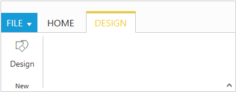
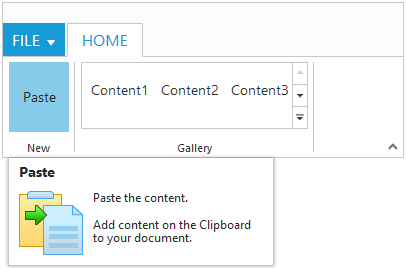

# AngularJS-Support 

It is possible to add object, array collection in the Ribbon control with AngularJS. The one way binding support is provided for Ribbon control.

`ej-ribbon` is the control tag where, `ej` is tag prefix and `Ribbon` is the control name.

## Tabs and Contextual Tabs

Ribbon Tabs and Contextual Tabs are Array Collections and the inner tag is used for them.

Objects with in these Array Collections can be extended by using hyphen. E.g. `e-applicationTab-menuItemId="menu"`



     @section ControlsSection{
        

    

        

            

                

                    

                        

                            

                                

                                    

                                        
New.<&#47;h6>" e-buttonsettings-contenttype="imageonly" e-buttonsettings-imageposition="imagetop" e-buttonsettings-prefixicon="e-ribbon e-new" e-buttonsettings-click="executeAction">
                                            

                                        

                                    

                                

                            

                        

                    

                

                

                    

                        

                            

                                

                                    

                                        

                                            

                                                

                                                    

                                                

                                            

                                        

                                    

                                

                            

                        

                    

                

            

            <ul id="menu">
                <li>
                    <a>FILE</a>
                    <ul>
                        <li>
                            <a>Save</a>
                        </li>
                    </ul>
                </li>
            </ul>
        

    

    }   
    @section ScriptSection{
    
    }



## Gallery and Custom Tooltip
                
GalleryItems is an Array Collection and the inner tag is used for it inside the Ribbon Groups. Object of this Array Collection can be extended by using hyphen.
 
Custom Tooltip is an Object of Ribbon Groups and can extend it by using hyphen. E.g. `e-customToolTip-title`.



    @section ControlsSection{
    

    

        

            

                

                    

                        

                            

                                

                                    

                                        
Paste the content.
                                                 
                                                     Add content on the Clipboard to your document.<&#47;h6>" e-customtooltip-prefixicon="e-pastetip">
                                                    

                                                

                                            

                                        

                                    

                                    

                                        

                                            

                                                

                                                    

                                                        

                                                            

                                                            

                                                            

                                                            

                                                            

                                                        

                                                    

                                                

                                            

                                        

                                    

                                

                            

                        

                    

                    <ul id="menu">
                        <li>
                            <a>FILE</a>
                            <ul>
                                <li>
                                    <a>Save</a>
                                </li>
                            </ul>
                        </li>
                    </ul>
                

            

    } 
       @section ScriptSection{
    
}



