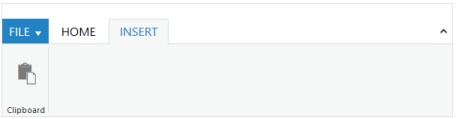
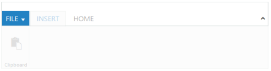
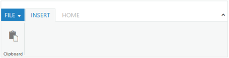
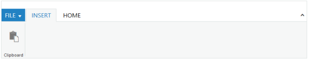
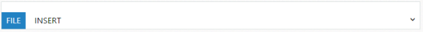
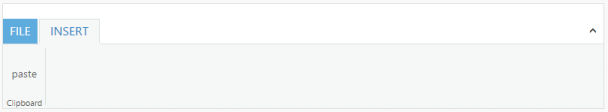
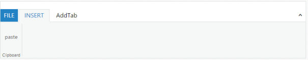
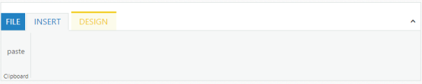

# Appearance and Styling

## SelectedItemIndex

Specifies the index of the _Ribbon_ tab to select the given index tab item in the _Ribbon_ control.



@(Html.EJ().Ribbon("Ribbon")

.Width("600px")

.ApplicationTab(apptab =>

{

apptab.Type(ApplicationTabType.Menu).MenuItemID("ribbonmenu").MenuSettings(new MenuProperties()

{

OpenOnClick = false

});

})

.RibbonTabs(tab =>

{

tab.Id("home").Text("HOME").TabGroups(tabgrp =>

{

tabgrp.Text("New").AlignType(RibbonAlignType.Rows).Type("custom").ContentID("content").Add();

}).Add();

tab.Id("insert").Text("INSERT").TabGroups(tabgrp =>

{

tabgrp.Text("Clipboard").AlignType(RibbonAlignType.Columns).Content(cnt =>

{

cnt.ContentGroups(cntgrp =>

{

cntgrp.Id("paste").Text("Paste").ToolTip("Paste").ButtonSettings(new ButtonProperties()

{

ContentType = ContentType.ImageOnly,

PrefixIcon = "e-ribbon e-ribbonpaste"

}).Add();

}).ContentDefaults(df => df.Type(RibbonButtonType.Button).Width("50px").Height("70px")).Add();

}).Add();

}).Add();

})

)

    <ul id="ribbonmenu">
    
    <li><a>FILE</a>
    
    <ul>
    
    <li><a>New</a></li>
    
    </ul>
    
    </li>
    
    </ul>
    
    
Home control



The following output is displayed as a result of the above code example.

### DisabledItemIndex

Specifies the index or indexes to disable the corresponding tabs in the _Ribbon_ control.



@(Html.EJ().Ribbon("Ribbon")

.Width("600px")

.ApplicationTab(apptab =>

{

apptab.Type(ApplicationTabType.Menu).MenuItemID("ribbonmenu").MenuSettings(new MenuProperties()

{

OpenOnClick = false

});

})

.RibbonTabs(tab =>

{

tab.Id("insert").Text("INSERT").TabGroups(tabgrp =>

{

tabgrp.Text("Clipboard").AlignType(RibbonAlignType.Columns).Content(cnt =>

{

cnt.ContentGroups(cntgrp =>

{

cntgrp.Id("paste").Text("Paste").ToolTip("Paste").ButtonSettings(new ButtonProperties()

{

ContentType = ContentType.ImageOnly,

PrefixIcon = "e-ribbon e-ribbonpaste"

}).Add();

}).ContentDefaults(df => df.Type(RibbonButtonType.Button).Width("50px").Height("70px")).Add();

}).Add();

}).Add();

tab.Id("home").Text("HOME").TabGroups(tabgrp =>

{

tabgrp.Text("New").AlignType(RibbonAlignType.Rows).Type("custom").ContentID("content").Add();

}).Add();

})

)

    
    <ul id="ribbonmenu">
    
    <li><a>FILE</a>
    
    <ul>
    
    <li><a>New</a></li>
    
    </ul>
    
    </li>
    
    </ul>
    
    
Home control



The following output is displayed as a result of the above code example

## EnableItemIndex

Specifies the index or indexes to enable the corresponding tabs in the _Ribbon_ control.



@(Html.EJ().Ribbon("Ribbon")

.Width("600px")

.ApplicationTab(apptab =>

{

apptab.Type(ApplicationTabType.Menu).MenuItemID("ribbonmenu").MenuSettings(new MenuProperties()

{

OpenOnClick = false

});

})

.RibbonTabs(tab =>

{

tab.Id("insert").Text("INSERT").TabGroups(tabgrp =>

{

tabgrp.Text("Clipboard").AlignType(RibbonAlignType.Columns).Content(cnt =>

{

cnt.ContentGroups(cntgrp =>

{

cntgrp.Id("paste").Text("Paste").ToolTip("Paste").ButtonSettings(new ButtonProperties()

{

ContentType = ContentType.ImageOnly,

PrefixIcon = "e-ribbon e-ribbonpaste"

}).Add();

}).ContentDefaults(df => df.Type(RibbonButtonType.Button).Width("50px").Height("70px")).Add();

}).Add();

}).Add();

tab.Id("home").Text("HOME").TabGroups(tabgrp =>

{

tabgrp.Text("New").AlignType(RibbonAlignType.Rows).Type("custom").ContentID("content").Add();

}).Add();

})

)

    <ul id="ribbonmenu">
    
    <li><a>FILE</a>
    
    <ul>
    
    <li><a>New</a></li>
    
    </ul>
    
    </li>
    
    </ul>
    
    
Home control



The following output is displayed as a result of the above code example.

## HideTab

This method is used to hide the given text tab in the _Ribbon_ control.



@(Html.EJ().Ribbon("Ribbon")

.Width("600px")

.ApplicationTab(apptab =>

{

apptab.Type(ApplicationTabType.Menu).MenuItemID("ribbonmenu").MenuSettings(new MenuProperties()

{

OpenOnClick = false

});

})

.RibbonTabs(tab =>

{

tab.Id("insert").Text("INSERT").TabGroups(tabgrp =>

{

tabgrp.Text("Clipboard").AlignType(RibbonAlignType.Columns).Content(cnt =>

{

cnt.ContentGroups(cntgrp =>

{

cntgrp.Id("paste").Text("Paste").ToolTip("Paste").ButtonSettings(new ButtonProperties()

{

ContentType = ContentType.ImageOnly,

PrefixIcon = "e-ribbon e-ribbonpaste"

}).Add();

}).ContentDefaults(df => df.Type(RibbonButtonType.Button).Width("50px").Height("70px")).Add();

}).Add();

}).Add();

tab.Id("home").Text("HOME").TabGroups(tabgrp =>

{

tabgrp.Text("New").AlignType(RibbonAlignType.Rows).Type("custom").ContentID("content").Add();

}).Add();

})

)

    
    <ul id="ribbonmenu">
    
    <li><a>FILE</a>
    
    <ul>
    
    <li><a>New</a></li>
    
    </ul>
    
    </li>
    
    </ul>
    
    
Home control



The following output is displayed as a result of the above code example.

## ShowTab

This method is used to show the given text tab in the _Ribbon_ control.



@(Html.EJ().Ribbon("Ribbon")

.Width("600px")

.ApplicationTab(apptab =>

{

apptab.Type(ApplicationTabType.Menu).MenuItemID("ribbonmenu").MenuSettings(new MenuProperties()

{

OpenOnClick = false

});

})

.RibbonTabs(tab =>

{

tab.Id("insert").Text("INSERT").TabGroups(tabgrp =>

{

tabgrp.Text("Clipboard").AlignType(RibbonAlignType.Columns).Content(cnt =>

{

cnt.ContentGroups(cntgrp =>

{

cntgrp.Id("paste").Text("Paste").ToolTip("Paste").ButtonSettings(new ButtonProperties()

{

ContentType = ContentType.ImageOnly,

PrefixIcon = "e-ribbon e-ribbonpaste"

}).Add();

}).ContentDefaults(df => df.Type(RibbonButtonType.Button).Width("50px").Height("70px")).Add();

}).Add();

}).Add();

tab.Id("home").Text("HOME").TabGroups(tabgrp =>

{

tabgrp.Text("New").AlignType(RibbonAlignType.Rows).Type("custom").ContentID("content").Add();

}).Add();

})

)

    
    <ul id="ribbonmenu">
    
    <li><a>FILE</a>
    
    <ul>
    
    <li><a>New</a></li>
    
    </ul>
    
    </li>
    
    </ul>
    
    
Home control



The following output is displayed as a result of the above code example.

## RemoveTab

This method is used to remove the given index tab item from the _Ribbon_ control.



@(Html.EJ().Ribbon("Ribbon")

.Width("600px")

.ApplicationTab(apptab =>

{

apptab.Type(ApplicationTabType.Menu).MenuItemID("ribbonmenu").MenuSettings(new MenuProperties()

{

OpenOnClick = false

});

})

.RibbonTabs(tab =>

{

tab.Id("insert").Text("INSERT").TabGroups(tabgrp =>

{

tabgrp.Text("Clipboard").AlignType(RibbonAlignType.Columns).Content(cnt =>

{

cnt.ContentGroups(cntgrp =>

{

cntgrp.Id("paste").Text("Paste").ToolTip("Paste").ButtonSettings(new ButtonProperties()

{

ContentType = ContentType.ImageOnly,

PrefixIcon = "e-ribbon e-ribbonpaste"

}).Add();

}).ContentDefaults(df => df.Type(RibbonButtonType.Button).Width("50px").Height("70px")).Add();

}).Add();

}).Add();

tab.Id("home").Text("HOME").TabGroups(tabgrp =>

{

tabgrp.Text("New").AlignType(RibbonAlignType.Rows).Type("custom").ContentID("content").Add();

}).Add();

})

)

    <ul id="ribbonmenu">
    
    <li><a>FILE</a>
    
    <ul>
    
    <li><a>New</a></li>
    
    </ul>
    
    </li>
    
    </ul>
    
    
Home control



The following output is displayed as a result of the above code example.

## Width

Specifies the _width_ to the _Ribbon_ control.



  @(Html.EJ().Ribbon("Ribbon")

     .Width("800px")

     .ApplicationTab(apptab =>

    {

        apptab.Type(ApplicationTabType.Menu).MenuItemID("ribbonmenu").MenuSettings(new MenuProperties()

               {

                   OpenOnClick = false

               });

    })

    .RibbonTabs(tab =>

    {

        tab.Id("insert").Text("INSERT").TabGroups(tabgrp =>

      {

          tabgrp.Text("Clipboard").AlignType(RibbonAlignType.Columns).Content(cnt =>

          {

              cnt.ContentGroups(cntgrp =>

              {

                  cntgrp.Id("paste").Text("Paste").ToolTip("Paste").ButtonSettings(new ButtonProperties()

                  {

                      ContentType = ContentType.ImageOnly,

                      PrefixIcon = "e-ribbon e-ribbonpaste"

                  }).Add();

              }).ContentDefaults(df => df.Type(RibbonButtonType.Button).Width("50px").Height("70px")).Add();

          }).Add();

      }).Add();

        tab.Id("home").Text("HOME").TabGroups(tabgrp =>

        {

            tabgrp.Text("New").AlignType(RibbonAlignType.Rows).Type("custom").ContentID("content").Add();

        }).Add();

    })

    )

                    <ul id="ribbonmenu">
    
    <li><a>FILE</a>
    
    <ul>
    
    <li><a>New</a></li>
    
    </ul>
    
    </li>
    
    </ul>
    
    
Home control



The following output is displayed as a result of the above code example.

## Add Tab Group

This method is used to add Ribbon Group dynamically in the _Ribbon_ control. This method needs three arguments _addTabGroup(Tab index, Groupcollection, Group index)_

_Tab index_: Index of tab, where the group is to be added.

_TabGroup collection_: Collection of the groups that group needs to add.

_Group Index_: Index of ribbon group, where the group is to be added. It is optional argument, when this argument is not given, group is added at last position by default.



@(Html.EJ().Ribbon("Ribbon")

     .Width("100%")     

     .ApplicationTab(apptab =>

    {

        apptab.Type(ApplicationTabType.Menu).MenuItemID("ribbonmenu");

    })

    .RibbonTabs(tab =>

    {

        tab.Id("home").Text("HOME").TabGroups(tabgrp =>

        {

            tabgrp.Text("One").AlignType(RibbonAlignType.Rows).Content(cnt =>

            {

                cnt.ContentGroups(cntgrp =>

                {

                    cntgrp.Id("one").Text("one").ToolTip("One").Add();

                    cntgrp.Id("two").Text("two").ToolTip("two").Add();

                }).ContentDefaults(df => df.Type(RibbonButtonType.Button).Width("60px").Height("70px")).Add();

            }).Add();

        }).Add();

    })

    )            <ul id="ribbonmenu">

                <li><a>FILE</a></li>

            </ul>



The following output is displayed as a result of the above code example.

## Add Tab Group Content

This method is used to add group content dynamically in the ribbon. This method contains five arguments _addTabGroupContent(Tab index, Group index, Subgroup index, Content, Content index)_

_Tab index_: Ribbon Tab index.

_Group index_: Ribbon group index.

_Subgroup Index_: Sub group index. Content to be added belongs to this sub group index.

_Content_: Collection of the group content that is added as Ribbon group content. 

_Content Index_: Ribbon content index, this is optional argument. When this argument is not given, the Group content is added at last position by default.



@(Html.EJ().Ribbon("Ribbon")

     .Width("100%")     

     .ApplicationTab(apptab =>

    {

        apptab.Type(ApplicationTabType.Menu).MenuItemID("ribbonmenu");

    })

    .RibbonTabs(tab =>

    {

        tab.Id("home").Text("HOME").TabGroups(tabgrp =>

        {

            tabgrp.Text("One").AlignType(RibbonAlignType.Rows).Content(cnt =>

            {

                cnt.ContentGroups(cntgrp =>

                {

                    cntgrp.Id("one").Text("one").ToolTip("One").Add();

                    cntgrp.Id("two").Text("two").ToolTip("two").Add();

                }).ContentDefaults(df => df.Type(RibbonButtonType.Button).Width("60px").Height("70px")).Add();

            }).Add();

        }).Add();

    })

    )            <ul id="ribbonmenu">

                <li><a>FILE</a></li>

            </ul>



The following output is displayed as a result of the above code example.

## Collapse and Expand

### Collapse

_Collapse_ method is used to minimize the ribbon control tab contents.You can minimize the_Ribbon_ tab content by using the client side method _collapse()._



@(Html.EJ().Ribbon("Ribbon")

     .Width("800")

     .ApplicationTab(apptab =>

    {

        apptab.Type(ApplicationTabType.Menu).MenuItemID("ribbonmenu");

    })

    .RibbonTabs(tab =>

    {

        tab.Id("insert").Text("INSERT").TabGroups(tabgrp =>

      {

          tabgrp.Text("Clipboard").AlignType(RibbonAlignType.Columns).Content(cnt =>

          {

              cnt.ContentGroups(cntgrp =>

              {

                  cntgrp.Id("paste").Type(RibbonButtonType.Custom).ContentID("paste").Add();

              }).Add();

          }).Add();

      }).Add();

         })

    )

            <ul id="ribbonmenu">

                <li><a>FILE</a></li>

            </ul>

     
Paste



The following screenshot displays the output of the above code example.

### Expand

_Expand_ method is used to expand the minimized ribbon control tab contents.You can expand the_Ribbon_ tab content by using the client side method _expand()_ .



@(Html.EJ().Ribbon("Ribbon")

     .Width("800")

     .ApplicationTab(apptab =>

    {

        apptab.Type(ApplicationTabType.Menu).MenuItemID("ribbonmenu");

    })

    .RibbonTabs(tab =>

    {

        tab.Id("insert").Text("INSERT").TabGroups(tabgrp =>

      {

          tabgrp.Text("Clipboard").AlignType(RibbonAlignType.Columns).Content(cnt =>

          {

              cnt.ContentGroups(cntgrp =>

              {

                  cntgrp.Id("paste").Type(RibbonButtonType.Custom).ContentID("paste").Add();

              }).Add();

          }).Add();

      }).Add();

         })

    )

            <ul id="ribbonmenu">

                <li><a>FILE</a></li>

            </ul>

     
Paste



The following screenshot displays the output of the above code example.

## AddTab

This method is used to add tab dynamically in the _Ribbon_ control. This method requires three arguments _addTab(Tabname,TabGroupcollection,index)_

* _Tabname_: Name of the tab.
* _TabGroupcollection_: Collection of the tab groups that tab needs to add.
* _Index_: Index in which the tab is to be added.It is an optional argument. When this argument is not given, by default the tab is added at the last position.



    @(Html.EJ().Ribbon("Ribbon")

     .Width("800")

     .ApplicationTab(apptab =>

    {

        apptab.Type(ApplicationTabType.Menu).MenuItemID("ribbonmenu");

    })

    .RibbonTabs(tab =>

    {

        tab.Id("insert").Text("INSERT").TabGroups(tabgrp =>

      {

          tabgrp.Text("Clipboard").AlignType(RibbonAlignType.Columns).Content(cnt =>

          {

              cnt.ContentGroups(cntgrp =>

              {

                  cntgrp.Id("paste").Type(RibbonButtonType.Custom).ContentID("paste").Add();

              }).Add();

          }).Add();

      }).Add();

         })

    )

            <ul id="ribbonmenu">

                <li><a>FILE</a></li>

            </ul>

     
Paste

     
AddTab



The following screenshot displays the output of the above code example.

### AddContextualTabs

This method is used to add contextual tabs dynamically.This method has two arguments _addContextualTabs(Contextualtabs,index)_

* _Contextualtabs_: Collection of the contextual tabs that contextual tab needs to add.
* _Index_: Index in which the tab is to be added.It is optional argument. When this argument is not given, by default the tab is added at the last position.



    @(Html.EJ().Ribbon("Ribbon")

     .Width("800")

     .ApplicationTab(apptab =>

    {

        apptab.Type(ApplicationTabType.Menu).MenuItemID("ribbonmenu");

    })

    .RibbonTabs(tab =>

    {

        tab.Id("insert").Text("INSERT").TabGroups(tabgrp =>

      {

          tabgrp.Text("Clipboard").AlignType(RibbonAlignType.Columns).Content(cnt =>

          {

              cnt.ContentGroups(cntgrp =>

              {

                  cntgrp.Id("paste").Type(RibbonButtonType.Custom).ContentID("paste").Add();

              }).Add();

          }).Add();

      }).Add();

         })

    )

            <ul id="ribbonmenu">

                <li><a>FILE</a></li>

            </ul>

    
Paste

    
ContextualTab



The following screenshot displays the output of the above code example.

