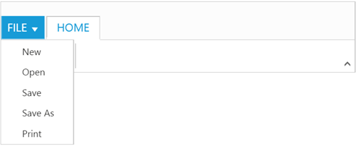
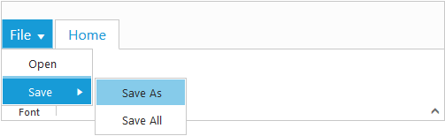
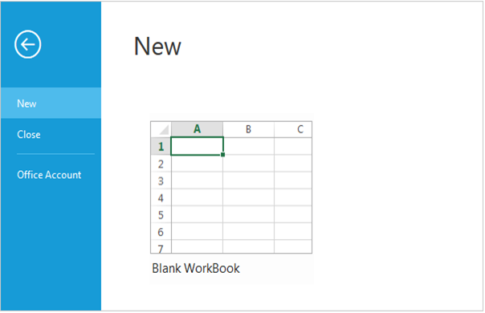

# Application Tab 

The Application Tab is used to represent a `Menu` that do some operations, such as File Menu to create, open, and print documents. Application Tab classified by `Type` property with the following:

*	Menu
*	Backstage

## Application Menu

The Application Menu is similar to traditional file Menu options and Syncfusion `Menu` control is used internally to render this. To show Application Menu in Ribbon, set the `Type` as `Menu` and [`MenuSettings`](http://help.syncfusion.com/aspnetmvc/menu/getting-started) to customize properties of `ejMenu`.

### _Create Using Template_

Set the UL element `Id` to `MenuItemID` property to create Application Menu and it will acts as template to render Menu.



    @(Html.EJ().Ribbon("defaultRibbon")
    .Width("500")
    .ApplicationTab(apptab => {
        apptab.Type(ApplicationTabType.Menu).MenuItemID("Ribbonmenu").MenuSettings(new MenuProperties() {
            OpenOnClick = false
        });
    })
    .RibbonTabs(tab => {
        tab.Id("home").Text("HOME").TabGroups(tabgrp => {
            tabgrp.Text("New").ContentID("Contents").Type("custom").AlignType(RibbonAlignType.Rows).Content(cnt => {
                cnt.ContentGroups(cntgrp => {
                    cntgrp.Id("new").Text("New").ButtonSettings(new ButtonProperties() {
                        ContentType = ContentType.ImageOnly,
                            ImagePosition = ImagePosition.ImageTop,
                            PrefixIcon = "e-Ribbon e-new",
                            Click = "executeAction"
                    }).Add();
                }).Add();
            }).Add();
        }).Add();
    }))
    
Custom control

    <ul id="Ribbonmenu">
        <li>
            <a>FILE</a>
            <ul>
                <li><a>New</a></li>
                <li><a>Open</a></li>
                <li><a>Save</a></li>
                <li><a>Save As</a></li>
                <li><a>Print</a></li>
            </ul>
        </li>
    </ul>



### _Binding Data Source_

Application Menu can be rendered using JSON Data Source. Please refer [`this`](http://help.syncfusion.com/aspnetmvc/menu/data-binding) page to set data source to `ejMenu`.





      @(Html.EJ().Ribbon("MenuJson")
         .Width("500")
         .ApplicationTab(apptab => {
             apptab.Type(ApplicationTabType.Menu).MenuItemID("Ribbonmenu").MenuSettings(new MenuProperties() {
                 OpenOnClick = true,
                     MenuFields = new MenuFields() {

                         DataSource = (IEnumerable < MenuJson > ) ViewBag.datasource,
                             Text = "text",
                             ParentId = "parentid",
                             Id = "id"
                     }
             });
         })
         .RibbonTabs(tab => {
             tab.Id("home").Text("HOME").TabGroups(tabgrp => {
                 tabgrp.Text("New").AlignType(RibbonAlignType.Rows).Content(cnt => {
                     cnt.ContentGroups(cntgrp => {
                         cntgrp.Id("new").Text("New").ButtonSettings(new ButtonProperties() {
                             ContentType = ContentType.ImageOnly,
                                 ImagePosition = ImagePosition.ImageTop,
                                 PrefixIcon = "e-Ribbon e-new",
                                 Click = "executeAction"
                         }).Add();
                     }).ContentDefaults(df => df.Type(RibbonButtonType.Button).Width("60px").Height("70px")).Add();
                 }).Add();
             }).Add();
         })
    <ul id="Ribbonmenu"></ul>
    }
    @section StyleSection{
    <link href="~/Content/ej/Ribbon-css/ej.icons.css" rel="stylesheet" />
    }





    public partial class RibbonController : Controller
    {
        List<MenuJson> Ribbon = new List<MenuJson>();
        public ActionResult Methods()
        {

            Ribbon.Add(new MenuJson { id = 1, parentid = null, text = "File" });
            Ribbon.Add(new MenuJson { id = 11, parentid = "1", text = "Open" });
            Ribbon.Add(new MenuJson { id = 12, parentid = "1", text = "Save" });
            Ribbon.Add(new MenuJson { id = 121, parentid = "12", text = "Save As" });
            Ribbon.Add(new MenuJson { id = 122, parentid = "12", text = "Save All" });
            ViewBag.datasource = Ribbon;
            return View();
        }
        public class MenuJson
        {
            public string text { get; set; }
            public int id { get; set; }
            public string parentid { get; set; }
        }
    }
   
    }



  

## Backstage Page

The Backstage page is where documents and related data of those can be managed, such as Create, Save and other information.

The Backstage page has a feature to add custom Control in left side of the page which contains menu items and the right side contains corresponding user controls. 

You can set Application Tab `Type` as `Backstage` and set `Id` , `Text` to Backstage items. Backstage `Pages` can be added with required `ItemType` and `ContentID` as template id to render template into Backstage.
  
Separator between Backstage items can be enabled by setting `EnableSeparator` as true. Width of backstage side header can be customized using `HeaderWidth`, If not set based on content given width will be considered.

To render the Ribbon with the Backstage page, refer to the following code snippet. 



       @(Html.EJ().Ribbon("defaultRibbon")
    .Width("500")
    .ApplicationTab(apptab => {
        apptab.Type(ApplicationTabType.Backstage).BackstageSettings(bsSettings => {
            bsSettings.Text("FILE").Height("350").Width("100%").HeaderWidth("120").Pages(bsPage => {
                bsPage.Id("new").Text("New").ContentID("newCon").Add();
                bsPage.Id("close").Text("Close").EnableSeparator(true).ItemType(ItemType.Button).Add();
                bsPage.Id("account").Text("Office Account").ContentID("accountCon").Add();
            });
        });
    })
    .RibbonTabs(tab => {
        tab.Id("home").Text("HOME").TabGroups(tabgrp => {
            tabgrp.Text("New").AlignType(RibbonAlignType.Rows).Content(cnt => {
                cnt.ContentGroups(cntgrp => {
                    cntgrp.Id("new").Text("New").ButtonSettings(new ButtonProperties() {

                        ContentType = ContentType.ImageOnly,
                            ImagePosition = ImagePosition.ImageTop,
                            PrefixIcon = "e-ribbon e-new",
                            Click = "executeAction"
                    }).Add();
                }).Add();
            }).Add();
        }).Add();
    })
    .ClientSideEvents(evt => evt.Create("createControl")))
         

         <table>
                <tr>
                        <td><button id="btn1" class="e-bsnewbtnstyle">Blank WorkBook</button></td>
                </tr>
        </table>
        

    @section ScriptSection{
    
    }
    @section StyleSection{
    <link href="~/Content/ej/ribbon-css/ej.icons.css" rel="stylesheet" />
    
    }



N> Height & Width of backstage can be set using `Height` and `Width`, if these are not set, Ribbon’s Height & Width will be considered