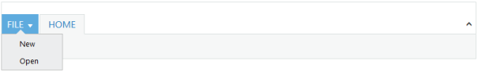

# Application Tab

The _Application Menu_ support is provided in the _Ribbon_ control _Application tab_. Use _ApplicationTab_ property to define the application tab with menu. In _ApplicationTab_ definition, _Type_ property defines the application menu and the value is _Menu_,_MenuItemID_ property to specify the ID of _UL_ list for the application menu and _MenuSettings_ property to specify all the members and events of the menu.



@(Html.EJ().Ribbon("Ribbon")

.Width("800px")

.ApplicationTab(apptab =>

{

apptab.Type(ApplicationTabType.Menu).MenuItemID("ribbonmenu").MenuSettings(new MenuProperties()

{

OpenOnClick = false

});

})

.RibbonTabs(tab =>

{

tab.Id("home").Text("HOME").TabGroups(tabgrp =>

{

tabgrp.Text("CustomControls").Type("custom").ContentID("Contents").Add();

}).Add();

})

)

	<ul id="ribbonmenu">
	
	<li><a>FILE</a>
	
	<ul>
	
	<li><a>New</a></li>
	
	<li><a>Open</a></li>
	
	</ul>
	
	</li>
	
	</ul>
	
	
Custom control



The following screenshot illustrates _Ribbon_ with application menu.

