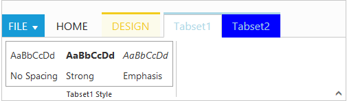

# Contextual Tab And Tab Set

Contextual Tabs are collection of Tabs that extended styling and can be shown based on some criteria. Contextual Tabs can be added like `RibbonTabs` including TabGroup and TabContent section. You can set `BackGroundColor` and `BorderColor` to highlight them as Tab set. Contextual tabs can be added or set dynamically in ribbon control using [`addContextualTabs`](https://help.syncfusion.com/api/js/ejribbon#methods:addcontextualtabs) with it's object and index position.



     @(Html.EJ().Ribbon("Ribbon")
     .Width("500")
         .ApplicationTab(app => {
                 app.Type(ApplicationTabType.Menu).MenuItemID("ribbon").MenuSettings(new MenuProperties()
                       {
                             OpenOnClick = false
                       });
          })
         .RibbonTabs(tab => {
         tab.Id("home").Text("HOME").TabGroups(tabGroup => {
                 tabGroup.Text("CustomControls").Type("custom").ContentID("Contents").Add();
         }).Add();
         })
         .ContextualTabs(contextualTab => {
         contextualTab.BackgroundColor("#FCFBEB").BorderColor("#F2CC1C").RibbonTabs(ribbonTab => {
         ribbonTab.Id("Design").Text("DESIGN").TabGroups(contextTabGroup => {
                  contextTabGroup.Text("Table Style Options").Type("custom").ContentID("contextualTab").Add();
     }).Add();
     });
         contextualTab.BackgroundColor("blue").BorderColor("lightblue").RibbonTabs(ribbonTab => {
         ribbonTab.Id("tabset1").Text("Tabset1").TabGroups(contextTabGroup => {
                contextTabGroup.Text("Tabset1 Style").Type("custom").ContentID("headings").Add();
     }).Add();
         ribbonTab.Id("tabset2").Text("Tabset2").TabGroups(contextTabGroup => {
                contextTabGroup.Text("Tabset2 Styles").Type("custom").ContentID("contextualTabset2").Add();
     }).Add();
     });
     })
     )
    <ul id="ribbon">
    <li>
            <a>FILE</a>
            <ul>
                <li><a>New</a></li>
                <li><a>Open</a></li>
           </ul>
        </li>
    </ul>
    

        

            
First Heading

            
No Spacing

        

        

            
Second Heading

            
Strong

        

        

            
Third Heading

            
Emphasis

        

    

    
Custom Control

    

    <button id="contextualBtn">Contextual Tab</button>
    

    

    <button id="contextualTabsetBtn2">Contextual Tabset2</button>
    

    @section StyleSection{
    <link href="~/Content/ej/ribbon-css/ej.icons.css" rel="stylesheet" />
    }



