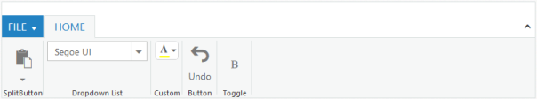

# Controls Support

In _Ribbon_ control, Button,SplitButton,DropDownList Toggle button, Gallery and Custom controls provide support to the groups.

* _Type_ property is used to define the controls.

* RibbonButtonType.SplitButton -to add Split button control.

* RibbonButtonType.Button -to add Button control.

* RibbonButtonType.DropDownList-to add Dropdown List control.

* RibbonButtonType.ToggleButton -to add Toggle button control.

* RibbonButtonType.Custom -to add custom controls.

The _default_ _type_ is _button_.



@(Html.EJ().Ribbon("defaultRibbon")

.Width("800px")

.ApplicationTab(apptab =>

{

apptab.Type("ApplicationMenu").ItemID("menu").MenuSettings(new MenuProperties()

{

OpenOnClick = false

});

})

.RibbonTabs(tab =>

{

tab.Id("home").Text("HOME").TabGroups(tabgrp =>

{

tabgrp.Text("SplitButton").AlignType(RibbonAlignType.Columns).Content(cnt =>

{

cnt.ContentGroups(cntgrp =>

{

cntgrp.Id("paste").Text("Paste").ToolTip("Paste").SplitButtonSettings(new SplitButtonProperties()

{

ContentType = ContentType.ImageOnly,

PrefixIcon = "e-ribbon e-ribbonpaste",

TargetID = "pasteSplit",

ArrowPosition = ArrowPosition.Bottom,

ButtonMode = ButtonMode.Dropdown,

Click = "executeAction"

}).Add();

}).ContentDefaults(df => df.Type(RibbonButtonType.SplitButton).Width("50px").Height("70px")).Add();

}).Add();

tabgrp.Text("Dropdown List").AlignType(RibbonAlignType.Rows).Content(cnt =>

{

cnt.ContentGroups(cntgrp =>

{

cntgrp.Id("fontfamily").ToolTip("Font").Type(RibbonButtonType.DropDownList).DropdownSettings(new DropDownListProperties()

{

DataSource = (IEnumerable<FontFamily>)ViewBag.datasource,

Value = "1",

Width = "150px"

}).Add();

}).Add();

}).Add();

tabgrp.Text("Custom").AlignType(RibbonAlignType.Rows).Content(cnt =>

{

cnt.ContentGroups(cntgrp =>

{

cntgrp.Id("fontcolor").Text("Font Color").ToolTip("Font Color").Type(RibbonButtonType.Custom).ContentID("fontcolor").Add();

}).ContentDefaults(df => df.IsBig(false)).Add();

}).Add();

tabgrp.Text("Button").AlignType(RibbonAlignType.Rows).Content(cnt =>

{

cnt.ContentGroups(cntgrp =>

{

cntgrp.Id("undo").Text("Undo").ToolTip("Undo").ButtonSettings(new ButtonProperties()

{

ContentType = ContentType.TextAndImage,

ImagePosition = ImagePosition.ImageTop,

PrefixIcon = "e-ribbon e-undo"

}).Add();

}).ContentDefaults(df => df.Type(RibbonButtonType.Button).Width("40px").Height("70px")).Add();

}).Add();

tabgrp.Text("Toggle").AlignType(RibbonAlignType.Rows).Content(cnt =>

{

cnt.ContentGroups(cntgrp =>

{

cntgrp.Id("bold").Text("Bold").ToolTip("Bold").ToggleButtonSettings(new ToggleButtonProperties()

{

ContentType = ContentType.ImageOnly,

DefaultText="Bold",

ActiveText="Bold",

DefaultPrefixIcon="e-ribbon e-bold",

ActivePrefixIcon = "e-ribbon e-bold"

}).Add();

}).ContentDefaults(df => df.Type(RibbonButtonType.ToggleButton).Width("40px").Height("70px")).Add();

}).Add();

}).Add();

})

.ClientSideEvents(evt=>evt.ClientSideOnCreate("createControl"))

)

<ul id="menu">

<li><a>FILE</a>

<ul>

<li><a>New</a></li>

<li><a>Open</a></li>

<li><a>Save</a></li>

<li><a>Save as</a></li>

<li><a>Print</a></li>

</ul>

</li>

</ul>

<ul id="pasteSplit">

<li><a>Paste</a></li>

</ul>

<input id="fontcolor"/>





namespace MVCSampleBrowser.Controllers

{

public partial class RibbonController : Controller

{

//

// GET: /Sample/

List<FontFamily> fontFamilySample = new List<FontFamily>();

public ActionResult Sample()

{

fontFamilySample.Add(new FontFamily { text = "Segoe UI" });

fontFamilySample.Add(new FontFamily { text = "Arial" });

fontFamilySample.Add(new FontFamily { text = "Times New Roman" });

fontFamilySample.Add(new FontFamily { text = "Tahoma" });

fontFamilySample.Add(new FontFamily { text = "Helvetica" });

ViewBag.datasource = fontFamilySample;

return View();

}

}

}



The following output is displayed as a result of the above code example.

