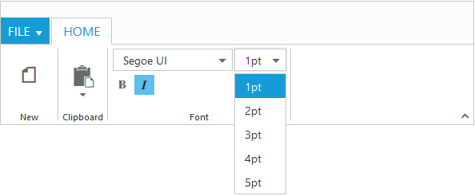

# Controls Support

Button, SplitButton, DropDownList, ToggleButton, Gallery and Custom controls can be added to each groups. You can set `Type` property in group to define the controls. Default `Type` is `Button`. 

## Built in Controls

The following table describes about the built in controls `Type` and their corresponding control settings.

<table class="params">
<thead>
<tr>
<th>Type</th>
<th>Control Settings</th>
<th class="last">Example</th>
</tr>
</thead>                     
<tbody>
<tr>
<td class="type">Button</td>
<td class="control settings">Button - ButtonSettings</td><td class="example last">
	ButtonSettings: {
					Width: 70,
					ContentType: ej.ContentType.ImageOnly,
					PrefixIcon: "e-ribbon e-new"
				    }
 </td>
</tr>
<tr>
<td class="type">SplitButton</td>
<td class="control settings">SplitButton - SplitButtonSettings</td>
<td class="example last">
	SplitButtonSettings: {
                          ContentType: ej.ContentType.ImageOnly,
                          TargetID: "pasteSplit",
                          ButtonMode: "dropdown",
                          ArrowPosition: ej.ArrowPosition.Bottom
                          }
 </td>
</tr>
<tr>
<td class="type">ToggleButton</td>
<td class="control settings">ToggleButton - ToggleButtonSettings</td>
<td class="example last">
	ToggleButtonSettings: {
                           ContentType: ej.ContentType.ImageOnly,
                           DefaultText: "Italic",
                           ActiveText: "Italic"
                           }
 </td>
</tr>
<tr>
<td class="type">DropDownList</td>
<td class="control settings">DropDownList - DropDownSettings</td>
<td class="example last">
	DropDownSettings: {
                      DataSource: size,
                      Text: "1pt",
                      Width: 65
                      }
 </td>
</tr>
</tbody>
</table>

N> 1. You can specify type either to group’s collection or to each group.
N> 2. For `Type` property you can assign either string value (“SplitButton”) or enum value (RibbonButtonType.SplitButton).



    @(Html.EJ().Ribbon("defaultRibbon")
                        .Width("100%")
                        .ApplicationTab(apptab =>
                        {
                            apptab.Type(ApplicationTabType.Menu).MenuItemID("ribbonmenu").MenuSettings(new MenuProperties()
                            {
                                OpenOnClick = false
                            });
                        })
                        .RibbonTabs(tab =>
                        {
                            tab.Id("home").Text("HOME").TabGroups(tabgrp =>
                            {
                                tabgrp.Text("New").AlignType(RibbonAlignType.Rows).Content(cnt =>
                                {
                                    cnt.ContentGroups(cntgrp =>
                                    {
                                        cntgrp.Id("new").Text("New").ToolTip("New").ButtonSettings(new ButtonProperties()
                                        {
                                            ContentType = ContentType.ImageOnly,
                                            ImagePosition = ImagePosition.ImageTop,
                                            PrefixIcon = "e-ribbon e-new",      
                                        }).Add();
                                    }).ContentDefaults(df => df.Type(RibbonButtonType.Button).Width("60px").Height("70px")).Add();
                                }).Add();
                                tabgrp.Text("Clipboard").AlignType(RibbonAlignType.Columns).Content(cnt =>
                                {
                                    cnt.ContentGroups(cntgrp =>
                                    {
                                        cntgrp.Id("paste").Text("Paste").ToolTip("Paste").SplitButtonSettings(new SplitButtonProperties()
                                        {
                                            ContentType = ContentType.ImageOnly,
                                            PrefixIcon = "e-ribbon e-ribbonpaste",
                                            TargetID = "pasteSplit",
                                            ButtonMode= ButtonMode.Dropdown,
                                            ArrowPosition = ArrowPosition.Bottom,
                                        }).Add();
                                    }).ContentDefaults(df => df.Type(RibbonButtonType.SplitButton).Width("50px").Height("70px")).Add();
                                }).Add();
                                tabgrp.Text("Font").AlignType(RibbonAlignType.Rows).Content(cnt =>
                                {
                                    cnt.ContentGroups(cntgrp =>
                                    {
                                        cntgrp.Id("fontfamily").ToolTip("Font").DropdownSettings(new DropDownListProperties()
                                        {
                                            DataSource = (IEnumerable<FontFamily>)ViewBag.datasource,
                                            Text = "Segoe UI",
                                            Width = "150px"
                                        }).Add();
                                        cntgrp.Id("fontsize").ToolTip("FontSize").DropdownSettings(new DropDownListProperties()
                                        {
                                            DataSource = (IEnumerable<FontPoint>)ViewBag.datasource1,
                                            Text = "1pt",
                                            Width = "65px"
                                        }).Add();
                                    }).ContentDefaults(df => df.Type(RibbonButtonType.DropDownList).Height("28px")).Add();
                                    cnt.ContentGroups(cntgrp =>
                                    {
                                        cntgrp.Id("bold").ToolTip("Bold").Type(RibbonButtonType.ToggleButton).ToggleButtonSettings(new ToggleButtonProperties()
                                        {
                                            ContentType = ContentType.ImageOnly,
                                            DefaultText = "Bold",
                                            ActiveText = "Bold",
                                            DefaultPrefixIcon = "e-ribbon bold",
                                            ActivePrefixIcon = "e-ribbon bold",
                                        }).Add();
                                        cntgrp.Id("italic").ToolTip("Italic").Type(RibbonButtonType.ToggleButton).ToggleButtonSettings(new ToggleButtonProperties()
                                        {
                                            ContentType = ContentType.ImageOnly,
                                            DefaultText = "Italic",
                                            ActiveText = "Italic",
                                            DefaultPrefixIcon = "e-ribbon e-ribbonitalic",
                                            ActivePrefixIcon = "e-ribbon e-ribbonitalic",
                                        }).Add();
                                    }).ContentDefaults(df => df.IsBig(false)).Add();
                                }).Add();
                            }).Add();
                        })
    )
    <ul id="ribbonmenu">
    <li>
        <a>FILE</a>
        <ul>
            <li>
                <a>New</a>
            </li>
        </ul>
    </li>
    </ul>
    <ul id="pasteSplit">
    <li>
        <a>Paste</a>
    </li>
    </ul>


## Custom

You can set `Type` as `custom` to render custom controls and Custom element id has to be specified as `ContentID`.You can change the element defined in the custom template to appropriate Syncfusion control in the event of Ribbon `Create`.



    @(Html.EJ().Ribbon("defaultRibbon")
                .Width("600")
                .ApplicationTab(apptab =>
                {
                    apptab.Type(ApplicationTabType.Menu).MenuItemID("ribbonmenu");
                })
                .RibbonTabs(tab =>
                {
                    tab.Id("home").Text("HOME").TabGroups(tabgrp =>
                    {
                        tabgrp.Text("Font").Content(cnt =>
                        {
                            cnt.ContentGroups(cntgrp =>
                            {
                                cntgrp.Id("fontcolor").ToolTip("Font Color").ContentID("fontcolor").Add();
                            }).ContentDefaults(df => df.Type(RibbonButtonType.Custom).Height("30px")).Add();
                        }).Add();
                        tabgrp.Text("Operators").Type("custom").ContentID("design").Add();
                    }).Add();
                })
                .ClientSideEvents(evt => evt.Create("createControl"))    )
    <ul id="ribbonmenu">
        <li>
            <a>FILE</a>
            <ul>
                <li><a>New</a></li>
                <li><a>Print</a></li>
            </ul>
        </li>
    </ul>
    <input id="fontcolor" />
    <table id="design" class="e-designtablestyle">
        <tr>
            <td><input type="checkbox" id="check1" /><label for="check1">Header Row</label></td>
            <td><input type="checkbox" id="Check2" checked="checked" /><label for="Check2">First Column</label></td>
        </tr>
        <tr><td><input type="checkbox" id="check4" checked="checked" /><label for="check4">Total Row</label></td>
            <td><input type="checkbox" id="Check5" /><label for="Check5">Last Column</label></td>
        </tr>
    </table>
    



