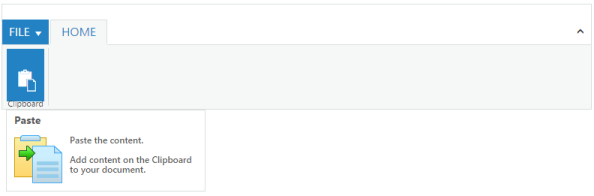

# Custom Tooltip

The _Ribbon_ control has _Custom Tooltip_ support that is displayed when you move the mouse over the control elements. You can define the CustomTooltip under the ContentGroups, GalleryItems, and CustomGalleryItems etc... CustomTooltip contains _Title, Content, PrefixIcon_ properties that are used to set Title, Content and placing the icon into this.



@(Html.EJ().Ribbon("defaultRibbon")

.Width("100%")

.ApplicationTab(apptab =>

{

apptab.Type(ApplicationTabType.Menu).MenuItemID("ribbonmenu");

})

.RibbonTabs(tab =>

{

tab.Id("home").Text("HOME").TabGroups(tabgrp =>

{

tabgrp.Text("Clipboard").AlignType(RibbonAlignType.Columns).Content(cnt =>

{

cnt.ContentGroups(cntgrp =>

{

	cntgrp.Id("paste").Text("Paste")

.CustomToolTip(new CustomToolTip()

	{

		Content = "<h6>Paste the content.  Add content on the Clipboard to your document.</h6>",

		Title = "Paste",

		PrefixIcon = "e-pastetip"

	})

		.ButtonSettings(new ButtonProperties(){

		ContentType=ContentType.ImageOnly,

		PrefixIcon = "e-ribbon e-ribbonpaste"

	}).Add();                

}).Add();

}).Add();

}).Add();

})

)

<ul id="ribbonmenu">

	<li><a>FILE</a>

		<ul>

			<li><a>New</a></li>

			</ul>

	</li>

</ul>



The following output is displayed as a result of the above code example.

