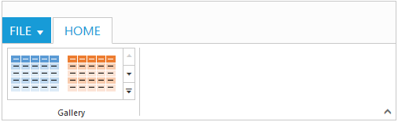

# Gallery

The Ribbon control has _Gallery_ support. By using the _Gallery_in Ribbon, items are displayed with good look and feel and it also enables to classify the items as groups for easy navigation.Gallery can be included in the tabgroups.

To use the _Gallery feature_, include the following properties under tabgroups.

* _Id_ –defines the id of the gallery.
* _Type_- defines the type of the item and it must be of type RibbonButtonType.Gallery.
* _Columns_ –defines the number of columns to be displayed in a row at intial without gallery expand operation.
* _ExpandedColumns_-defines the number of columns to be displayed in a row at gallery expand operation.
* _ItemHeight_ –defines the height of the  contents.
* _ItemWidth_ –defines the width of contents.
* _GalleryItems_ –defines the collection of the items to be included in the gallery.
* _CustomGalleryItems_- defines the additional items to be  displayed at gallery expand operation. It can be of _CustomItemType_ CustomItemType.Button orCustomItemType.Menu. By default value it isCustomItemType.Button.



@(Html.EJ().Ribbon("defaultRibbon")

     .Width("800")

     .ApplicationTab(apptab =>

    {

        apptab.Type("ApplicationMenu").ItemID("ribbonmenu");

    })

    .RibbonTabs(tab =>

    {

        tab.Id("home").Text("HOME").TabGroups(tabgrp =>

        {

            tabgrp.Text("Clipboard").AlignType(RibbonAlignType.Columns).Content(cnt =>

            {

                cnt.ContentGroups(cntgrp =>

                {

                    cntgrp.Id("paste").Type(RibbonButtonType.Custom).ContentID("paste").Add();

                }).Add();

            }).Add();

            tabgrp.Text("Gallery").AlignType(RibbonAlignType.Rows).Content(cnt =>

            {

                cnt.ContentGroups(cntgrp =>

                {

                    cntgrp.Id("Galleryribbon").Type(RibbonButtonType.Gallery).ItemWidth(68).ItemHeight(54).Columns(2).ExpandedColumns(3)

					.GalleryItems(gi =>

                    {

                        gi.Text("Content1").ToolTip("Content1").Add();

                        gi.Text("Content2").ToolTip("Content2").Add();

                        gi.Text("Content3").ToolTip("Content3").Add();

                        gi.Text("Content4").ToolTip("Content4").Add();

                        gi.Text("Content5").ToolTip("Content5").Add();

                    }).CustomGalleryItems(gleit =>

                    {

                        gleit.Text("Save Selection as new quick style").ToolTip("Save").CustomItemType(CustomItemType.Button).Add();

                                                       gleit.CustomItemType(CustomItemType.Menu).MenuId("custommenu").Add();

                    }).Add();

                }).Add();

            }).Add();

        }).Add();

    })

        )

    <ul id="ribbonmenu">

        <li><a>FILE</a> </li>

    </ul>

    
Paste

    <ul id="custommenu">

        <li><a>New Quick Step</a>

            <ul>

                <li><a>Move to new folder</a></li>

            </ul>

        </li>

    </ul>



The following output is displayed as a result of the above code example.

