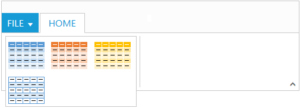

# Gallery 

Galleries are used to display items that can be arranged in a grid-type layout. Items in the gallery can be customized as `Button/Menu` to display images, text, or both images and text. You can set `Type` of group as `Gallery`.

## Gallery Items

Gallery items are collection of the items to be included in the main gallery. You can set `Text` and `ToolTip` to gallery item which can also be customized with `ButtonSettings`. 

Number of `Columns` to display in gallery for each row should be specified and the Number of columns in Expanded State (`ExpandedColumns`) can be customized, if not set, `Columns` count will be set as default.
 
N> The `ItemHeight` and `ItemWidth` for gallery item can be set, if not set default values will be used.



    @(Html.EJ().Ribbon("defaultRibbon")
                .Width("500")
                .ApplicationTab(apptab =>
                {
                    apptab.Type(ApplicationTabType.Menu).MenuItemID("ribbonmenu");
                })
                .RibbonTabs(tab =>
                {
                    tab.Id("home").Text("HOME").TabGroups(tabgrp =>
                    {
                        tabgrp.Text("Gallery").Type("galary").Content(cnt =>
                        {
                            cnt.ContentGroups(cntgrp =>
                            {
                                cntgrp.Id("Gallery").Type(RibbonButtonType.Gallery).ItemWidth("73").ItemHeight("54").Columns(2).ExpandedColumns(3).GalleryItems(gi =>
                                {
                                    gi.Text("GalleryContent1").ToolTip("GalleryContent1").ButtonSettings(new ButtonProperties()
                                    {
                                        ContentType = ContentType.ImageOnly,
                                        PrefixIcon = "e-gallerycontent1 e-gbtnimg",
                                        CssClass = "e-gbtnposition"
                                    }).Add();
                                    gi.Text("GalleryContent2").ToolTip("GalleryContent2").ButtonSettings(new ButtonProperties()
                                    {
                                        ContentType = ContentType.ImageOnly,
                                        PrefixIcon = "e-gallerycontent2 e-gbtnimg",
                                        CssClass = "e-gbtnposition"
                                    }).Add();
                                    gi.Text("GalleryContent3").ToolTip("GalleryContent3").ButtonSettings(new ButtonProperties()
                                    {
                                        ContentType = ContentType.ImageOnly,
                                        PrefixIcon = "e-gallerycontent3 e-gbtnimg",
                                        CssClass = "e-gbtnposition"
                                    }).Add();
                                    gi.Text("GalleryContent4").ToolTip("GalleryContent4").ButtonSettings(new ButtonProperties()
                                    {
                                        ContentType = ContentType.ImageOnly,
                                        PrefixIcon = "e-gallerycontent4 e-gbtnimg",
                                        CssClass = "e-gbtnposition"
                                    }).Add();
                                }).Add();
                            }).Add();
                        }).Add();
                    }).Add();
                })
    )
    <ul id="ribbonmenu">
        <li>
            <a>FILE</a>
            <ul>
                <li><a>Open</a></li>
            </ul>
        </li>
    </ul>
    @section StyleSection{
    <link href="~/Content/ej/ribbon-css/ej.icons.css" rel="stylesheet" />
    
    }



Ribbon Gallery.
{:.caption}

Gallery at Expanded State
{:.caption}

## Custom Gallery Items

Custom gallery items are the additional items to be displayed at gallery expanded state. You can set `CustomItemType` as `Button` or `Menu`, Default is `Button`.

You can also set `Text` and `ToolTip` to custom gallery item which can also be customized with ButtonSettings/MenuSettings based on the CustomItemType specified.



    @(Html.EJ().Ribbon("defaultRibbon")
     .Width("500")
     .ApplicationTab(apptab =>
    {
        apptab.Type(ApplicationTabType.Menu).MenuItemID("ribbonmenu");
    })
    .RibbonTabs(tab =>
    {
        tab.Id("home").Text("HOME").TabGroups(tabgrp =>
        {
            tabgrp.Text("Gallery").Type("galary").Content(cnt =>
            {
                cnt.ContentGroups(cntgrp =>
                {
                    cntgrp.Id("Gallery").Type(RibbonButtonType.Gallery).ItemWidth("73").ItemHeight("54").Columns(2).ExpandedColumns(3).GalleryItems(gi =>
                    {
                        gi.Text("GalleryContent1").ToolTip("GalleryContent1").ButtonSettings(new ButtonProperties(){
                        ContentType=ContentType.ImageOnly,
                        PrefixIcon="e-gallerycontent1 e-gbtnimg",
                        CssClass="e-gbtnposition"
                        }).Add();
                        gi.Text("GalleryContent2").ToolTip("GalleryContent2").ButtonSettings(new ButtonProperties()
                        {
                            ContentType = ContentType.ImageOnly,
                            PrefixIcon = "e-gallerycontent2 e-gbtnimg",
                            CssClass = "e-gbtnposition"
                        }).Add();
                        gi.Text("GalleryContent3").ToolTip("GalleryContent3").ButtonSettings(new ButtonProperties()
                        {
                            ContentType = ContentType.ImageOnly,
                            PrefixIcon = "e-gallerycontent3 e-gbtnimg",
                            CssClass = "e-gbtnposition"
                        }).Add();
                        gi.Text("GalleryContent4").ToolTip("GalleryContent4").ButtonSettings(new ButtonProperties()
                        {
                            ContentType = ContentType.ImageOnly,
                            PrefixIcon = "e-gallerycontent4 e-gbtnimg",
                            CssClass = "e-gbtnposition"
                        }).Add();
                    }).CustomGalleryItems(gleit =>
                    {
                        gleit.CustomItemType(CustomItemType.Menu).MenuId("custommenu").MenuSettings(new MenuProperties()
                        {
                            OpenOnClick = false
                        }).Add();
                        gleit.Text("Clear Formatting").ToolTip("Clear Formatting").CustomItemType(CustomItemType.Button).ButtonSettings(new ButtonProperties()
                        {
                            CssClass = "e-extrabtnstyle"
                        }).Add();
                    }).Add();
                }).Add();
            }).Add();
        }).Add();
    })
    )
       <ul id="ribbonmenu">
    <li>
        <a>FILE</a>
    </li>
    </ul>
    <ul id="custommenu">
    <li>
        <a>New Quick Step</a>
        <ul>
            <li>
                <a>Flag & Move</a>
            </li>
        </ul>
    </li>
    </ul>      
    @section StyleSection{
     <link href="~/Content/ej/ribbon-css/ej.icons.css" rel="stylesheet" />
    



