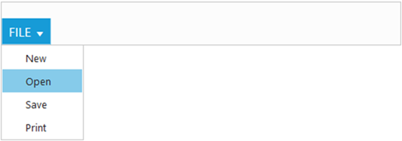
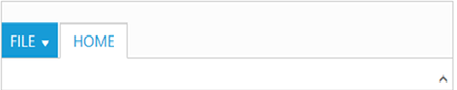
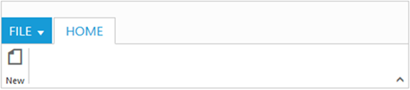
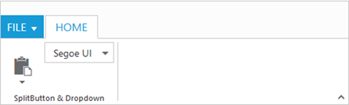
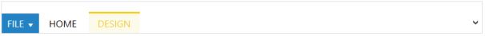
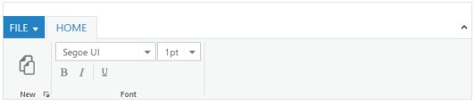

# Getting Started

This section explains briefly how to create a _Ribbon_ in your application with _ASP.NET MVC_.

## Create your Ribbon in MVC

The _Ribbon_ can be easily configured to the DOM element, such as _
_. You can create a _Ribbon_ with a highly customizable look and feel. The _Ribbon_control displays the controls in multiple tabs. This section explains about the ribbon tabs, adding controls to the groups, expand/collapse ribbon option, and the control separator.

###  Create Ribbon Control                     

1. Create _Syncfusion ASP.NET MVC_ Application. Refer to the [common](http://help.syncfusion.com/ug/js/Documents/gettingstartedwithmv.htm) document.
2. Add a _Ribbon_ control in the index.cshtml page.The _Width_ property allows you to define the width of the _Ribbon_. In _ApplicationTab_ definition, the _ItemID_ property allows you to specify the ID of the ul list to create the application menu. In tabs definition, the _TabGroups_ property allows you to create one or more groups in the tab. In _ContextualTabs_ definition, the _BackgroundColor_ property allows you to define the background color of the contextual tab and _BorderColor_ property allows you to define the border color of the contextual tab.

   ~~~ html

		@(Html.EJ().Ribbon("Ribbon")

		.Width("500px")

		.ApplicationTab(apptab =>

		{

		apptab.Type("ApplicationMenu").ItemID("menu").MenuSettings(new MenuProperties()

		{

		OpenOnClick = false

		});

		})

		.RibbonTabs(tab =>

		{

		tab.Id("home").Text("HOME").TabGroups(tabgrp =>

		{

		tabgrp.Text("New").Type("custom").ContentID("ribbonContent").Add();

		}).Add();

		tab.Id("calculator").Text("CALCULATOR").TabGroups(tabgrp =>

		{

		tabgrp.Text("Numbers").Type("custom").ContentID("inserttab").Add();

		}).Add();

		})

		.ContextualTabs(ctabs => {

		ctabs.BackgroundColor("#FCFBEB").BorderColor("#F2CC1C").RibbonTabs(ctab =>

		{

		ctab.Id("Design").Text("DESIGN").TabGroups(ctabgrp =>

		{

		ctabgrp.Text("Table Style").Type("custom").ContentID("designtab").Add();

		}).Add();

		});

		})

		)

		<ul id="menu">

		<li><a>FILE</a>

		<ul>

		<li><a>New</a></li>

		<li><a>Open</a></li>

		</ul>

		</li>

		</ul>

		
Ribbon control

		
Insert Tab

		
Design Tab

   ~~~
   {:.prettyprint }

4. The following screenshot illustrates the _Ribbon_ control.

###  Add Controls

Add controls to each _Ribbon_ tab by using the property _Content_. You can also add _custom_ controls by using the property _ContentID_. The property _AlignType_ is used to align the groups in row or column order. The_Ribbon_ control has _Button_, _Split button, DropdownList, Toggle button, Gallery, and Custom_ controls support.The default _AlignType_ is RibbonAlignType.Rows.



@(Html.EJ().Ribbon("Ribbon")

.Width("800px")

.ApplicationTab(apptab =>

{

apptab.Type("ApplicationMenu").ItemID("menu").MenuSettings(new MenuProperties()

{

OpenOnClick = false

});

})

.RibbonTabs(tab =>

tab.Id("home").Text("HOME").TabGroups(tabgrp =>

{

tabgrp.Text("New").AlignType(RibbonAlignType.Rows).Content(cnt =>

{

cnt.ContentGroups(cntgrp =>

{

cntgrp.Id("new").Text("New").ToolTip("New").ButtonSettings(new ButtonProperties()

{

ContentType = ContentType.ImageOnly,

ImagePosition = ImagePosition.ImageTop,

PrefixIcon = "e-ribbon e-new"

}).Add();

}).ContentDefaults(df => df.Type(RibbonButtonType.Button).Width("60px").Height("70px")).Add();

}).Add();

tabgrp.Text("Font").AlignType(RibbonAlignType.Rows).Content(cnt =>

{

cnt.ContentGroups(cntgrp =>

{

cntgrp.Id("fontfamily").ToolTip("Font").DropdownSettings(new DropDownListProperties()

{

DataSource = (IEnumerable<FontFamily>)ViewBag.datasource,

Value = "Segoe UI",

Width = "150px"

}).Add();

cntgrp.Id("fontsize").ToolTip("FontSize").DropdownSettings(new DropDownListProperties()

{

DataSource = (IEnumerable<FontPoint>)ViewBag.datasource1,

Value = "1pt",

Width = "65px"

}).Add();

}).ContentDefaults(df => df.Type(RibbonButtonType.DropDownList).Height("28px").IsBig(false)).Add();

cnt.ContentGroups(cntgrp =>

{

cntgrp.Id("bold").Text("Bold").ToolTip("Bold").ButtonSettings(new ButtonProperties()

{

ContentType = ContentType.ImageOnly,

PrefixIcon = "e-ribbon bold"

}).Add();

cntgrp.Id("italic").Text("Italic").ToolTip("Italic").ButtonSettings(new ButtonProperties()

{

ContentType = ContentType.ImageOnly,

PrefixIcon = "e-ribbon e-ribbonitalic"

}).Add();

}).ContentDefaults(df => df.Type(RibbonButtonType.Button).IsBig(false)).Add();

}).Add();

tabgrp.Text("CustomControls").Type("custom").ContentID("Contents").Add();

}).Add();

})

)

<ul id="menu">

<li><a>FILE</a>

<ul>

<li><a>New</a></li>

<li><a>Open</a></li>

</ul>

</li>

</ul>

<button id="custom">Custom Control</button>





namespace MVCSampleBrowser.Controllers

{

public partial class RibbonController : Controller

{

//

// GET: /Sample/

List<FontFamily> fontFamilySample = new List<FontFamily>();

List<FontPoint> fontPointSample = new List<FontPoint>();

public ActionResult Sample()

{

fontFamilySample.Add(new FontFamily { text = "Segoe UI" });

fontFamilySample.Add(new FontFamily { text = "Arial" });

fontFamilySample.Add(new FontFamily { text = "Times New Roman" });

fontFamilySample.Add(new FontFamily { text = "Tahoma" });

fontFamilySample.Add(new FontFamily { text = "Helvetica" });

ViewBag.datasource = fontFamilySample;

fontPointSample.Add(new FontPoint { text = "1pt" });

fontPointSample.Add(new FontPoint { text = "2pt" });

fontPointSample.Add(new FontPoint { text = "3pt" });

fontPointSample.Add(new FontPoint { text = "4pt" });

fontPointSample.Add(new FontPoint { text = "5pt" });

ViewBag.datasource1 = fontPointSample;

return View();

}

}

}



The following screenshot illustrates Ribbon with controls.

### Expand/Collapse

The _Ribbon_ has expand/collapse support. The following screenshot illustrates _Ribbon_ in the expanded state.

The following screenshot illustrates _Ribbon_ in the collapsed state,

### Separator for Controls

_Control Separator_ support has been provided in the _Ribbon_ control. Set _EnableSeparator_ value to _true_ to enable the separator after a control. _Control Separator_ supports only row type group.



@(Html.EJ().Ribbon("Ribbon")

.Width("700px")

.ApplicationTab(apptab =>

{

apptab.Type("ApplicationMenu").ItemID("menu").MenuSettings(new MenuProperties()

{

OpenOnClick = false

});

})

.RibbonTabs(tab =>

{

tab.Id("home").Text("HOME").TabGroups(tabgrp =>

{

tabgrp.Text("New").AlignType(RibbonAlignType.Rows).EnableGroupExpander(true).Content(cnt =>

{

cnt.ContentGroups(cntgrp =>

{

cntgrp.Id("new").Text("New").ToolTip("New").ButtonSettings(new ButtonProperties()

{

ContentType = ContentType.ImageOnly,

ImagePosition = ImagePosition.ImageTop,

PrefixIcon = "e-ribbon e-new"

}).Add();

}).ContentDefaults(df => df.Type(RibbonButtonType.Button).Width("60px").Height("70px")).Add();

}).Add();

tabgrp.Text("Font").AlignType(RibbonAlignType.Rows).Content(cnt =>

{

cnt.ContentGroups(cntgrp =>

{

cntgrp.Id("fontfamily").ToolTip("Font").DropdownSettings(new DropDownListProperties()

{

DataSource = (IEnumerable<FontFamily>)ViewBag.datasource,

Value = "Segoe UI",

Width = "150px"

}).Add();

cntgrp.Id("fontsize").ToolTip("FontSize").DropdownSettings(new DropDownListProperties()

{

DataSource = (IEnumerable<FontPoint>)ViewBag.datasource1,

Value = "1pt",

Width = "65px"

}).Add();

}).ContentDefaults(df => df.Type(RibbonButtonType.DropDownList).Height("28px").IsBig(false)).Add();

cnt.ContentGroups(cntgrp =>

{

cntgrp.Id("bold").Text("Bold").ToolTip("Bold").ButtonSettings(new ButtonProperties()

{

ContentType = ContentType.ImageOnly,

PrefixIcon = "e-ribbon bold"

}).Add();

cntgrp.Id("italic").Text("Italic").ToolTip("Italic").EnableSeparator(true).ButtonSettings(new ButtonProperties()

{

ContentType = ContentType.ImageOnly,

PrefixIcon = "e-ribbon e-ribbonitalic"

}).Add();

cntgrp.Id("underline").Text("Underline").ToolTip("Underline").ButtonSettings(new ButtonProperties()

{

ContentType = ContentType.ImageOnly,

PrefixIcon = "e-ribbon e-ribbonunderline"

}).Add();

}).ContentDefaults(df => df.Type(RibbonButtonType.Button).IsBig(false)).Add();

}).Add();

}).Add();

})

)

<ul id="menu">

<li><a>FILE</a>

<ul>

<li><a>New</a></li>

<li><a>Open</a></li>

</ul>

</li>

</ul>




namespace MVCSampleBrowser.Controllers

{

public partial class RibbonController : Controller

{

//

// GET: /Sample/

List<FontFamily> fontFamilySample = new List<FontFamily>();

List<FontPoint> fontPointSample = new List<FontPoint>();

public ActionResult Sample()

{

fontFamilySample.Add(new FontFamily { text = "Segoe UI" });

fontFamilySample.Add(new FontFamily { text = "Arial" });

fontFamilySample.Add(new FontFamily { text = "Times New Roman" });

fontFamilySample.Add(new FontFamily { text = "Tahoma" });

fontFamilySample.Add(new FontFamily { text = "Helvetica" });

ViewBag.datasource = fontFamilySample;

fontPointSample.Add(new FontPoint { text = "1pt" });

fontPointSample.Add(new FontPoint { text = "2pt" });

fontPointSample.Add(new FontPoint { text = "3pt" });

fontPointSample.Add(new FontPoint { text = "4pt" });

fontPointSample.Add(new FontPoint { text = "5pt" });

ViewBag.datasource1 = fontPointSample;

return View();

}

}

}



The following screenshot illustrates the control separator after the Italic Button control.

