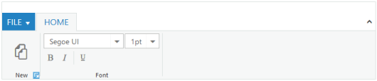

# Group Expander

The _Ribbon_ control has _group expander_ support. Set _EnableGroupExpander_ value to _true_ to enable the group expander for each group in the ribbon tab. The event for _group expander_ is _ClientSideOnGroupExpand_.



@(Html.EJ().Ribbon("Ribbon")

.Width("700px")

.ApplicationTab(apptab =>

{

apptab.Type("ApplicationMenu").ItemID("menu").MenuSettings(new MenuProperties()

{

OpenOnClick = false

});

})

.RibbonTabs(tab =>

{

tab.Id("home").Text("HOME").TabGroups(tabgrp =>

{

tabgrp.Text("New").AlignType(RibbonAlignType.Rows).EnableGroupExpander(true).Content(cnt =>

{

cnt.ContentGroups(cntgrp =>

{

cntgrp.Id("new").Text("New").ToolTip("New").ButtonSettings(new ButtonProperties()

{

ContentType = ContentType.ImageOnly,

ImagePosition = ImagePosition.ImageTop,

PrefixIcon = "e-ribbon e-new"

}).Add();

}).ContentDefaults(df => df.Type(RibbonButtonType.Button).Width("60px").Height("70px")).Add();

}).Add();

tabgrp.Text("Font").AlignType(RibbonAlignType.Rows).Content(cnt =>

{

cnt.ContentGroups(cntgrp =>

{

cntgrp.Id("fontfamily").ToolTip("Font").DropdownSettings(new DropDownListProperties()

{

DataSource = (IEnumerable<FontFamily>)ViewBag.datasource,

Value = "Segoe UI",

Width = "150px"

}).Add();

cntgrp.Id("fontsize").ToolTip("FontSize").DropdownSettings(new DropDownListProperties()

{

DataSource = (IEnumerable<FontPoint>)ViewBag.datasource1,

Value = "1pt",

Width = "65px"

}).Add();

}).ContentDefaults(df => df.Type(RibbonButtonType.DropDownList).Height("28px").IsBig(false)).Add();

cnt.ContentGroups(cntgrp =>

{

cntgrp.Id("bold").Text("Bold").ToolTip("Bold").ButtonSettings(new ButtonProperties()

{

ContentType = ContentType.ImageOnly,

PrefixIcon = "e-ribbon bold"

}).Add();

cntgrp.Id("italic").Text("Italic").ToolTip("Italic").EnableSeparator(true).ButtonSettings(new ButtonProperties()

{

ContentType = ContentType.ImageOnly,

PrefixIcon = "e-ribbon e-ribbonitalic"

}).Add();

cntgrp.Id("underline").Text("Underline").ToolTip("Underline").ButtonSettings(new ButtonProperties()

{

ContentType = ContentType.ImageOnly,

PrefixIcon = "e-ribbon e-ribbonunderline"

}).Add();

}).ContentDefaults(df => df.Type(RibbonButtonType.Button).IsBig(false)).Add();

}).Add();

}).Add();

})

)

<ul id="menu">

<li><a>FILE</a>

<ul>

<li><a>New</a></li>

<li><a>Open</a></li>

</ul>

</li>

</ul>





namespace MVCSampleBrowser.Controllers

{

public partial class RibbonController : Controller

{

//

// GET: /Sample/

List<FontFamily> fontFamilySample = new List<FontFamily>();

List<FontPoint> fontPointSample = new List<FontPoint>();

public ActionResult Sample()

{

fontFamilySample.Add(new FontFamily { text = "Segoe UI" });

fontFamilySample.Add(new FontFamily { text = "Arial" });

fontFamilySample.Add(new FontFamily { text = "Times New Roman" });

fontFamilySample.Add(new FontFamily { text = "Tahoma" });

fontFamilySample.Add(new FontFamily { text = "Helvetica" });

ViewBag.datasource = fontFamilySample;

fontPointSample.Add(new FontPoint { text = "1pt" });

fontPointSample.Add(new FontPoint { text = "2pt" });

fontPointSample.Add(new FontPoint { text = "3pt" });

fontPointSample.Add(new FontPoint { text = "4pt" });

fontPointSample.Add(new FontPoint { text = "5pt" });

ViewBag.datasource1 = fontPointSample;

return View();

}

}

}



The following screenshot illustrates the group New with the group expander.

