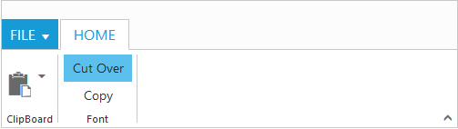

# Group

Group is a collection of logical content groups that are combined under related Tab. Each group can be defined using content groups or custom content.

## Adding Tab Groups

Group items can be added to Tabs by specifying `Text` and corresponding `Content` to be displayed. The content of group can be specified as either with `Content` collection, `ContentID` or `CustomContent`.

### Adding Content

Add content to Group item which is based on `Type` of content specified. The available types are `Button` , `SplitButton`, `ToggleButton`,`Gallery`, and `DropDownList`.

Groups and defaults settings can be added with the `Content`.

#### _Defaults_

The `Height`, `Width`, `Type`, `IsBig` property to the controls in the `ContentGroups` can be specified commonly.

The `Height` & `Width` applicable to Button, SplitButton, DropDownList ,ToggleButton controls and `IsBig` applicable to only button controls ( button, split , toggle)

#### _Adding Content Groups_

Controls such as button, split button, dropdown list, toggle button, gallery in the subgroup of the Ribbon Tab can be rendered. All of these can be customized using its corresponding settings property such as `ButtonSettings`, `DropdownSettings`, etc.

Custom controls or items (such as table, div etc.) can be added when the `Type` set as `Custom`. `Defaults` control settings of group can be specified for an `individual group` instead of specifying them to Content `Groups ` collection commonly.

`ToolTip` and `CustomTooltip` can be specified for each group controls.



    @(Html.EJ().Ribbon("defaultRibbon")
        .Width("500px")
        .ApplicationTab(app =>
        {
            app.Type(ApplicationTabType.Menu).MenuItemID("ribbon");
        })
        .RibbonTabs(tab =>
        {
            tab.Id("home").Text("HOME").TabGroups(tabgroup =>
            {
                tabgroup.Text("Clipboard").Content(ctn =>
                {
                    ctn.ContentGroups(contentGroup =>
                    {  contentGroup.Id("paste").Text("Paste").ToolTip("Paste").IsBig(true).Type(RibbonButtonType.SplitButton).SplitButtonSettings(new SplitButtonProperties()
                                                {
                                                    ContentType = ContentType.ImageOnly,
                                                    PrefixIcon = "e-icon e-ribbon e-ribbonpaste",
                                                    TargetID = "pasteSplit",
                                                }).Add();
                    }).Add();
                }).Add();
                tabgroup.Text("Font").AlignType(RibbonAlignType.Columns).Content(ctn =>
                {
                    ctn.ContentGroups(contentGroup =>
                    {
                        contentGroup.Id("cut").ToggleButtonSettings(new ToggleButtonProperties()
                        {
                            DefaultText = "Cut",
                            ActiveText = "Cut Over"
                        }).Add();
                        contentGroup.Id("copy").ToggleButtonSettings(new ToggleButtonProperties()
                        {
                            DefaultText = "Copy",
                            ActiveText = "Copy Over"
                        }).Add();
                    }).ContentDefaults(df => df.Type(RibbonButtonType.Button).Width("75px").Height("30px").Type(RibbonButtonType.ToggleButton)).Add();
                }).Add();
            }).Add();
        })
    )
    <ul id="ribbon">
        <li>
            <a>FILE</a>
            <ul>
                <li><a>Open</a></li>
            </ul>
        </li>
    </ul>
    <ul id="pasteSplit">
        <li><a>Paste Special</a></li>
    </ul>
    


#### _Enable Separator_ 

Separates the control from the next control in the group when group `AlignType` is `Rows`. Set “true” to `EnableSeparator`.

 

    @(Html.EJ().Ribbon("defaultRibbon")
        .Width("500px")
        .ApplicationTab(app =>
        {
            app.Type(ApplicationTabType.Menu).MenuItemID("ribbon");
        })
        .RibbonTabs(tab =>
        {
            tab.Id("home").Text("HOME").TabGroups(tabgroup =>
            {
                tabgroup.Text("New").AlignType(RibbonAlignType.Rows).Content(ctn =>
                {
                    ctn.ContentGroups(contentGroup =>
                    {                        contentGroup.Id("new").Text("New").ToolTip("New").EnableSeparator(true).ButtonSettings(new ButtonProperties()
                        {
                            Width = "100",
                        }).Add();
                        contentGroup.Id("font").Text("Font").ToolTip("Font").ButtonSettings(new ButtonProperties()
                        {
                            Width = "150",
                        }).Add();
                    }).ContentDefaults(df => df.Type(RibbonButtonType.Button).Height("70px")).Add();
                }).Add();
            }).Add();
        })
    )
    <ul id="ribbon">
        <li>
            <a>FILE</a>
            <ul>
                <li><a>New</a></li>
                <li><a>Open</a></li>
            </ul>
        </li>
    </ul>

 
 
 
 
### Adding Custom Content 
 
Set group `Type` as `custom` to add custom items such as div, table and custom controls. With type as custom, content can be added in two ways as specified below.

*	HTML contents can be directly added into the groups as string content using `CustomContent`. property

*	Custom template id can be specified to render those specific custom template using `ContentID` property



    @(Html.EJ().Ribbon("defaultRibbon")
                .Width("500")
                .ApplicationTab(app =>
                {
                    app.Type(ApplicationTabType.Menu).MenuItemID("ribbon");
                })
                .RibbonTabs(tab =>
                {
                    tab.Id("home").Text("HOME").TabGroups(tabgroup =>
                    {
                        tabgroup.Text("New").Type("custom").CustomContent("<button id='customContent'>Using Custom Content</button>").Add();
                        tabgroup.Text("Data").Type("custom").ContentID("btn").Add();
                    }).Add();
                })
    )
    <ul id="ribbon">
    <li>
        <a>FILE</a>
        <ul>
            <li><a>New</a></li>
            <li><a>Open</a></li>
        </ul>
    </li>
    </ul>
    <button id='btn'>Using Content ID</button>


 

## Group Expander

  Set `EnableGroupExpander` as true to show Group Expander for each group in Tab. These expanders can be customized using `GroupExpand` event, such as to show popup dialog.
  
  
  
    @(Html.EJ().Ribbon("defaultRibbon")
                .Width("500")
                .ApplicationTab(app =>
                {
                    app.Type(ApplicationTabType.Menu).MenuItemID("ribbon");
                })
                .RibbonTabs(tab =>
                {
                    tab.Id("home").Text("HOME").TabGroups(tabgroup =>
                    {
                        tabgroup.Text("New").AlignType(RibbonAlignType.Rows).Type("custom").EnableGroupExpander(true).ContentID("btn").Add();
                })
                .ClientSideEvents(event => event.GroupExpand("groupExpand"))
    )
      <ul id="ribbon">
        <li>
            <a>FILE</a>
            <ul>
                <li><a>New</a></li>
            </ul>
        </li>
    </ul>
    <button id='btn'>Home button</button>   
          
      
  
  
  