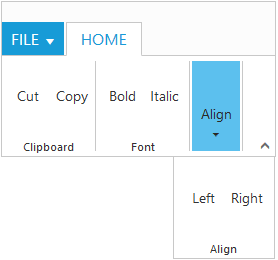

# Resize 

Ribbon control dynamically resizes to display possible number of controls in the optimal layout as the application window size changes.

As the window is narrowed, controls in the Ribbon will be combined as group button with dropdown arrow, in which controls can be expanded with dropdown arrow.

## Enable Resizing 

Set `AllowResizing` as true to enable resizing in Ribbon.



    @(Html.EJ().Ribbon("defaultRibbon").AllowResizing(true)
        .Width("40%")
        .ApplicationTab(apptab =>
        {
            apptab.Type(ApplicationTabType.Menu).MenuItemID("ribbonmenu");
        })
        .RibbonTabs(tab =>
        {
            tab.Id("home").Text("HOME").TabGroups(tabgrp =>
            {
                tabgrp.Text("Clipboard").Content(cnt =>
                {
                    cnt.ContentGroups(cntgrp =>
                    {
                        cntgrp.Id("cut").Text("Cut").Add();
                        cntgrp.Id("copy").Text("Copy").Add();
                    }).ContentDefaults(df => df.Width("40px").Height("70px")).Add();
                }).Add();
                tabgrp.Text("Font").Content(cnt =>
                {
                    cnt.ContentGroups(cntgrp =>
                    {
                        cntgrp.Id("bold").Text("Bold").Add();
                        cntgrp.Id("italic").Text("Italic").Add();
                    }).ContentDefaults(df => df.Width("40px").Height("70px")).Add();
                }).Add();
                tabgrp.Text("Align").Content(cnt =>
                {
                    cnt.ContentGroups(cntgrp =>
                    {
                        cntgrp.Id("left").Text("Left").Add();
                        cntgrp.Id("right").Text("Right").Add();
                    }).ContentDefaults(df => df.Width("40px").Height("70px")).Add();
                }).Add();
            }).Add();
        })
    )
        <ul id="ribbonmenu">
				<li><a>FILE</a>
            <ul>
                <li><a>New</a></li>
                <li><a>Open</a></li>
            </ul>
			    </li>
                </ul>



## Group Button Customization
 
Based on window size, detailed group is shrined into single button and you can expand group items with group button click.

For each group shirked for resizing, Custom Class will be added based on group text.For example, `e-Action` whereas `Action` is group text. Using this custom class, group button can be customized such as to set icons etc.



    @section ControlsSection{
    

        @(Html.EJ().Ribbon("defaultRibbon").AllowResizing(true)
     .Width("36%")
     .ApplicationTab(apptab =>
    {
        apptab.Type(ApplicationTabType.Menu).MenuItemID("ribbonmenu");
    })
     .RibbonTabs(tab =>
    {
        tab.Id("home").Text("HOME").TabGroups(tabgrp =>
        {
            tabgrp.Text("Clipboard").AlignType(RibbonAlignType.Columns).EnableGroupExpander(true).Content(cnt =>
               {
                   cnt.ContentGroups(cntgrp =>
                   {
                       cntgrp.Id("paste").Text("Paste").ToolTip("Paste").ButtonSettings(new ButtonProperties()
                       {
                           ContentType = ContentType.ImageOnly,
                           PrefixIcon = "e-ribbon e-ribbonpaste",
                       }).Add();
                   }).ContentDefaults(df => df.IsBig(true).Width("50px").Height("70px")).Add();
                   cnt.ContentGroups(cntgrp =>
                   {
                       cntgrp.Id("cut").Text("Cut").ToolTip("Cut").ButtonSettings(new ButtonProperties()
                       {
                           ContentType = ContentType.TextAndImage,
                           PrefixIcon = "e-ribbon e-ribboncut",
                       }).Add();
                       cntgrp.Id("copy").Text("Copy").ToolTip("Copy").ButtonSettings(new ButtonProperties()
                       {
                           ContentType = ContentType.TextAndImage,
                           PrefixIcon = "e-ribbon e-ribboncopy",
                       }).Add();
                   }).ContentDefaults(df => df.Type(RibbonButtonType.Button).Width("60px").Height("40px").IsBig(false)).Add();
               }).Add();
            tabgrp.Text("Font").AlignType(RibbonAlignType.Rows).Content(cnt =>
            {
                cnt.ContentGroups(cntgrp =>
                {
                    cntgrp.Id("fontfamily").ToolTip("Font").DropdownSettings(new DropDownListProperties()
                    {
                        DataSource = (IEnumerable<FontFamily>)ViewBag.datasource,
                        Text = "Segoe UI",
                        Width = "150px"
                    }).Add();
                    cntgrp.Id("fontsize").ToolTip("FontSize").DropdownSettings(new DropDownListProperties()
                    {
                        DataSource = (IEnumerable<FontPoint>)ViewBag.datasource1,
                        Text = "1pt",
                        Width = "65px"
                    }).Add();
                }).ContentDefaults(df => df.Type(RibbonButtonType.DropDownList).Height("28px").IsBig(false)).Add();
            }).Add();
            tabgrp.Text("New").AlignType(RibbonAlignType.Rows).Content(cnt =>
            {
                cnt.ContentGroups(cntgrp =>
                {
                    cntgrp.Id("new").Text("New").ToolTip("New").ButtonSettings(new ButtonProperties()
                    {
                        ContentType = ContentType.ImageOnly,
                        ImagePosition = ImagePosition.ImageTop,
                        PrefixIcon = "e-ribbon e-new",
                    }).Add();
                }).ContentDefaults(df => df.Type(RibbonButtonType.Button).Width("60px").Height("40px")).Add();
            }).Add();
            tabgrp.Text("Actions").AlignType(RibbonAlignType.Rows).Content(cnt =>
            {
                cnt.ContentGroups(cntgrp =>
                {
                    cntgrp.Id("undo").Text("Undo").ToolTip("Undo").ButtonSettings(new ButtonProperties()
                    {
                        ContentType = ContentType.TextAndImage,
                        ImagePosition = ImagePosition.ImageTop,
                        PrefixIcon = "e-ribbon e-undo",
                    }).Add();
                    cntgrp.Id("redo").Text("Redo").ToolTip("Redo").ButtonSettings(new ButtonProperties()
                    {
                        ContentType = ContentType.TextAndImage,
                        ImagePosition = ImagePosition.ImageTop,
                        PrefixIcon = "e-ribbon e-redo",
                    }).Add();
                }).ContentDefaults(df => df.Type(RibbonButtonType.Button).Width("40px").Height("70px")).Add();
            }).Add();
        }).Add();
        tab.Id("layout").Text("LAYOUT").TabGroups(tabgrp =>
        {
            tabgrp.Text("Print Layout").AlignType(RibbonAlignType.Rows).Content(cnt =>
            {
                cnt.ContentGroups(cntgrp =>
                {
                    cntgrp.Id("printlayout").Text("Print Layout").ToolTip("Print Layout").ButtonSettings(new ButtonProperties()
                    {
                        ContentType = ContentType.TextAndImage,
                        ImagePosition = ImagePosition.ImageTop,
                        PrefixIcon = "e-ribbon e-printlayout",
                    }).Add();
                }).ContentDefaults(df => df.Type(RibbonButtonType.Button).Width("80px").Height("70px")).Add();
            }).Add();
        }).Add();
    })
        )
    

    <ul id="ribbonmenu">
        <li>
            <a>FILE</a>
            <ul>
                <li><a>New</a></li>
                <li><a>Open</a></li>
            </ul>
        </li>
    </ul>
    }

    @section StyleSection{
    <link href="~/Content/ej/ribbon-css/ej.icons.css" rel="stylesheet" />
    
     }
     


