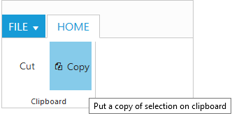
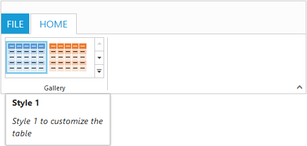

# Screen Tips 

ScreenTip/Tooltip is used to reduce the controls related Help that are needed to the end user to do control related actions.

## HTML Tooltip

Standard `html tooltip` can be set using `ToolTip` property of each group item.



      @(Html.EJ().Ribbon("defaultRibbon")
                .Width("20%")
                .ApplicationTab(app =>
                {
                    app.Type(ApplicationTabType.Menu).MenuItemID("ribbon");
                })
                .RibbonTabs(tab =>
                {
                    tab.Id("home").Text("HOME").TabGroups(tabgroup =>
                    {
                        tabgroup.Text("Clipboard").Content(ctn =>
                        {
                            ctn.ContentGroups(contentGroup =>
                            {
                                contentGroup.Id("cut").Text("Cut").ToolTip("Remove the selection and put it on clipboard").Add();
                                contentGroup.Id("copy").Text("Copy").ToolTip("Put a copy of selection on clipboard").ButtonSettings(new ButtonProperties()
                                {
                                    ContentType = ContentType.TextAndImage,
                                    PrefixIcon = "e-icon e-ribbon e-ribboncopy",
                                }).Add();
                            }).ContentDefaults(df => df.Width("70px").Height("60px")).Add();
                        }).Add();
                    }).Add();
                })
    )
    <ul id="ribbon">
        <li>
            <a>FILE</a>
            <ul>
                <li><a>New</a></li>
                <li><a>Open</a></li>
            </ul>
        </li>
    </ul>



## Custom Tooltip

Custom Tooltip is used to set detailed help to the user about the controls. You can set`Title`, `Content` and `PrefixIcon` class to customize the tooltip with icons.

### For Groups
 
`CustomTooltip` for each group controls can be specified. Such as to the controls Button, SplitButton, DropDownList etc.



    @section ControlsSection {
    @(Html.EJ().Ribbon("defaultRibbon")
                .Width("450")
                .ApplicationTab(app =>
                {
                    app.Type(ApplicationTabType.Menu).MenuItemID("ribbon");
                })
                .RibbonTabs(tab =>
                {
                    tab.Id("home").Text("HOME").TabGroups(tabgroup =>
                    {
                        tabgroup.Text("Clipboard").Content(ctn =>
                        {
                            ctn.ContentGroups(contentGroup =>
                            {
                                contentGroup.Id("paste").Text("Paste").CustomToolTip(new CustomToolTip()
                                {
                                    Title = "Paste",
                                    Content = "<h6>Paste the content.  Add content on the Clipboard to your document.</h6>",
                                    PrefixIcon = "e-icon e-pastetip",
                                }).Add();
                                contentGroup.Id("copy").Text("Copy").CustomToolTip(new CustomToolTip()
                                {
                                    Title = "Copy",
                                    Content = "<h6>Copy the content.</h6>",
                                }).ButtonSettings(new ButtonProperties()
                                {
                                    ContentType = ContentType.TextAndImage,
                                    PrefixIcon = "e-icon e-ribbon e-ribboncopy",
                                }).Add();
                            }).ContentDefaults(df => df.Type(RibbonButtonType.Button).Width("70px").Height("60px")).Add();
                        }).Add();
                    }).Add();
                })
    )
    <ul id="ribbon">
     <li>
        <a>FILE</a>
        <ul>
            <li><a>New</a></li>
            <li><a>Open</a></li>
        </ul>
     </li>
    </ul>
    }
  
     @section StyleSection{
        <link href="~/Content/ej/ribbon-css/ej.icons.css" rel="stylesheet" />
        
    }



### For Gallery

`CustomTooltip` for each `Gallery` and `CustomGalleryItems` button control can be specified. 

N> Custom gallery item `Menu` is not supported to Custom tooltip.



    @section ControlsSection {
    @(Html.EJ().Ribbon("defaultRibbon")
                .Width("500")
                .ApplicationTab(app =>
                {
                    app.Type(ApplicationTabType.Menu).MenuItemID("ribbon");
                })
                .RibbonTabs(tab =>
                {
                    tab.Id("home").Text("HOME").TabGroups(tabgroup =>
                    {

                        tabgroup.Text("Gallery").Type("Gallery").Content(ctn =>
                        {
                            ctn.ContentGroups(contentGroup =>
                            {
                                contentGroup.Id("Gallery").Type(RibbonButtonType.Gallery).ItemWidth("73").ItemHeight("54").Columns(2).ExpandedColumns(3).GalleryItems(gallery =>
                                {
                                    gallery.Text("Style 1").CustomToolTip(new CustomToolTip()
                                    {
                                        Title = "Style 1",
                                        Content = "<I>Style 1 to customize the table</I>",
                                    }).ButtonSettings(new ButtonProperties()
                                    {
                                        ContentType = ContentType.ImageOnly,
                                        PrefixIcon = "e-icon e-gallerycontent1 e-gbtnimg",
                                        CssClass = "e-gbtnposition"
                                    }).Add();
                                    gallery.Text("Style 2").CustomToolTip(new CustomToolTip()
                                    {
                                        Title = "Style 2",
                                        Content = "<I>Style 2 to customize the table</I>",
                                    }).ButtonSettings(new ButtonProperties()
                                    {
                                        ContentType = ContentType.ImageOnly,
                                        PrefixIcon = "e-icon e-gallerycontent2 e-gbtnimg",
                                        CssClass = "e-gbtnposition"
                                    }).Add();
                                    gallery.Text("Style 3").CustomToolTip(new CustomToolTip()
                                    {
                                        Title = "Style 3",
                                        Content = "<I>Style 3 to customize the table</I>",
                                    }).ButtonSettings(new ButtonProperties()
                                    {
                                        ContentType = ContentType.ImageOnly,
                                        PrefixIcon = "e-icon e-gallerycontent3 e-gbtnimg",
                                        CssClass = "e-gbtnposition"
                                    }).Add();
                                    gallery.Text("Style 4").CustomToolTip(new CustomToolTip()
                                    {
                                        Title = "Style 4",
                                        Content = "<I>Style 4 to customize the table</I>",
                                    }).ButtonSettings(new ButtonProperties()
                                    {
                                        ContentType = ContentType.ImageOnly,
                                        PrefixIcon = "e-icon e-gallerycontent4 e-gbtnimg",
                                        CssClass = "e-gbtnposition"
                                    }).Add();
                                }).CustomGalleryItems(galleryItems =>
                                {

                                    galleryItems.Text("Clear Formatting").ToolTip("Clear Formatting").CustomItemType(CustomItemType.Button).CustomToolTip(new CustomToolTip()
                                    {
                                        Title="Clear Format",
                                        Content = "<I>To clear formatting</I>"
                                    }).ButtonSettings(new ButtonProperties()
                                    {
                                        CssClass="e-extrabtnstyle"
                                    }).Add();
                                    galleryItems.CustomItemType(CustomItemType.Menu).MenuId("extraMenu").MenuSettings(new MenuProperties()
                                    {
                                        OpenOnClick = false
                                    }).Add();
                                }).Add();
                            }).Add();
                        }).Add();
                    }).Add();
                })
    )
    <ul id="ribbon">
        <li>
            <a>FILE</a>
        </li>
    </ul>
    <ul id="extraMenu">
        <li>
            <a>New Quick Step</a>
            <ul>
                <li><a>Flag and Move</a></li>
            </ul>
        </li>
    </ul>
    }
    
    @section StyleSection{
    <link href="~/Content/ej/ribbon-css/ej.icons.css" rel="stylesheet" />
    
    }



