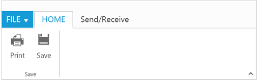

# Tab

RibbonTabs is a collection of control `TabGroup` which enables you to organize related commands into single view. Tabs can be added to Ribbon using `RibbonTabs` property. `Id` & `Text` properties are used to set unique ID and header text to RibbonTabs.
The manipulation of given text tab in the ribbon control can be done by using  [`addTab`](https://help.syncfusion.com/api/js/ejribbon#methods:addtab), [`removeTab`](https://help.syncfusion.com/api/js/ejribbon#methods:removetab), [`hideTab`](https://help.syncfusion.com/api/js/ejribbon#methods:hidetab),
[`showTab`](https://help.syncfusion.com/api/js/ejribbon#methods:showtab) methods and [`tabAdd`](https://help.syncfusion.com/api/js/ejribbon#events:tabadd), [`tabCreate`](https://help.syncfusion.com/api/js/ejribbon#events:tabcreate), [`tabRemove`](https://help.syncfusion.com/api/js/ejribbon#events:tabremove), [`tabClick`](https://help.syncfusion.com/api/js/ejribbon#events:tabclick) and [`tabSelect`](https://help.syncfusion.com/api/js/ejribbon#events:tabselect) events.



      @(Html.EJ().Ribbon("defaultRibbon")
      .Width("500")
      .ApplicationTab(app => {
          app.Type(ApplicationTabType.Menu).MenuItemID("Ribbon").MenuSettings(new MenuProperties() {
              OpenOnClick = false
          });
      })
      .RibbonTabs(tab => {
          tab.Id("home").Text("HOME").TabGroups(tabgroup => {
              tabgroup.Text("Save").AlignType(RibbonAlignType.Rows).Content(ctn => {
                  ctn.ContentGroups(contentGroup => {
                      contentGroup.Id("print").Text("Print").ButtonSettings(new ButtonProperties() {
                          ContentType = ContentType.TextAndImage,
                              ImagePosition = ImagePosition.ImageTop,
                              PrefixIcon = "e-icon e-Ribbon e-print"
                      }).Add();
                      contentGroup.Id("save").Text("Save").ButtonSettings(new ButtonProperties() {
                          ContentType = ContentType.TextAndImage,
                              ImagePosition = ImagePosition.ImageTop,
                              PrefixIcon = "e-icon e-Ribbon e-save"
                      }).Add();
                  }).ContentDefaults(df => df.Type(RibbonButtonType.Button).Width("50px").Height("70px")).Add();
              }).Add();
          }).Add();
          tab.Id("sendRec").Text("Send/Receive").TabGroups(tabgroup => {
              tabgroup.Text("Send/Receive").Type("custom").ContentID("sendReceive").AlignType(RibbonAlignType.Columns).Content(ctn => {

              }).Add();
          }).Add();
      })
     )
    

        Send/Receive All Folders
    

    <ul id="Ribbon">
        <li>
            <a>FILE</a>
            <ul>
                <li><a>New</a></li>
                <li><a>Open</a></li>
                <li><a>Save</a></li>
                <li><a>Save As</a></li>
                <li><a>Print</a></li>
            </ul>
        </li>
    </ul>
     @section StyleSection{
    <link href="~/Content/ej/Ribbon-css/ej.icons.css" rel="stylesheet" />
    }



