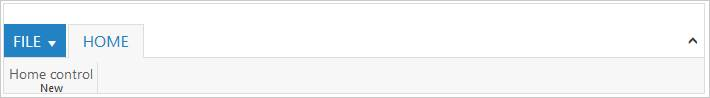

# How to Initialize ejRibbon

In this section, you can learn about Ribbon’s mandatory property to render a simple Ribbon. To initialize Ribbon, it needs ApplicationTab, RibbonTabs and its inner properties. In ApplicationTab definition, Type is to define the type of ApplicationTab and ItemID is the ID of ul list to create menu. In the RibbonTabs definition ID of tab, Text of tab, TabGroups of the tab are mandatory. In TabGroups definition, Text of the group is mandatory. For default button, split button, and dropdownlist, toggle button, gallery and custom controls Content and AlignType are mandatory. For custom controls, Type and ContentID are mandatory.

 


@(Html.EJ().Ribbon("Ribbon")
.Width("800px")
.ApplicationTab(apptab =>
{
apptab.Type("ApplicationMenu").ItemID("menu").MenuSettings(new MenuProperties()
{
OpenOnClick = false
});
})
.RibbonTabs(tab =>
{
tab.Id("home").Text("HOME").TabGroups(tabgrp =>
{
tabgrp.Text("New").Type("custom").ContentID("ribbonContent").Add();
}).Add();
})
)
 
<ul id="menu">
<li><a>FILE</a>
<ul>
<li><a>New</a></li>
</ul>
</li>
</ul>

Home control

 

The following output is displayed as a result of the above code example.

