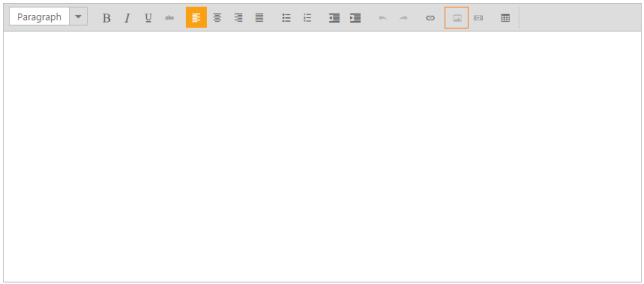
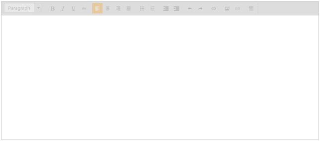

## Enable or disable

You can enable or disable the tool items that are available in the RTE toolbar. Intermittently, it is not possible to allow some tool item actions in the editing area. To avoid mistakes in such a situation, you can disable the unnecessary tool items. Later, you can enable the disabled tool items, and when you are not using the images in your blog, you can disable the image tool item by using the “disableToolbarItem” method. The following example illustrates how to disable the “image” tool. 

You can also enable or disable the entire RTE control by using “enabled” property.

1. Add the following code in your CSHTML page.

<table>
<tr>
<td>
[_cshtml]@*Add the following code in your view page.*@    @{Html.EJ().RTE("rteSample").Width("850px").ContentTemplate(@

).Render(); }</td></tr>
<tr>
<td>
[JavaScript]\\ Add the following code in your script section to render RTE with disabled image iconvar rteobj = $("#rteSample").data("ejRTE");rteobj.disableToolbarItem("rteSampleimage");</td></tr>
</table>

The following screenshot displays the output.

{{ '' | markdownify }}
{:.image }

You can also enable or disable the entire RTE control by using “enabled” property.

1. Add the following code in your CSHTML page.

[_cshtml]

@*Add the following code in your view page.*@

    @{Html.EJ().RTE("rteSample").Width("850px").ContentTemplate(@

).Enabled(false).Render(); }

The following screenshot displays the output.

{{ '' | markdownify }}
{:.image }

