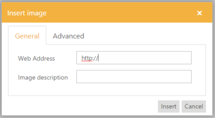
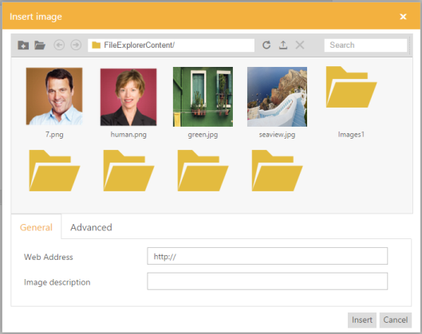
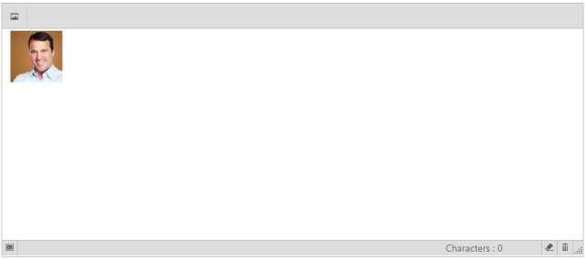
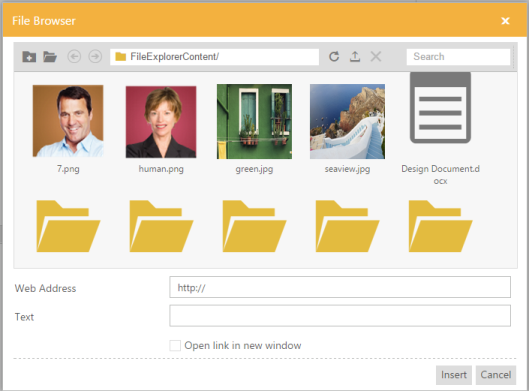
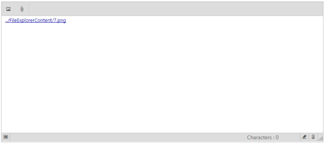

# File and Image Browser

## Image Browser

The RTE control normally allows you to insert the images based on the online URL only, optionally specifies the tooltip support.

A new feature is added, in that you can include an image by browsing a list of predefined files and directories. And also supports to showcase the dynamically uploaded images in the directory. 

To retrieve or upload the images in the image browser, it requires a server side implementation.

Add the following code to initialize the RTE control in the page.



	//the FileActionDefault is method to perform the all file related operations. 

	@{ List<String> images = new List<string>() { "images" };

	List<String> image = new List<string>() { "image" };}

    @{Html.EJ().RTE("rteSample").Width("850px").ToolsList(images).ShowFooter(true).Tools(tool => tool.Images(image)).ImageBrowser(img => img.FilePath("~/FileExplorerContent/").ExtensionAllow("*.png,*.gif,*.jpg,*.jpeg").AjaxAction(@Url.Content("FileActionDefault"))).Render();}



Add the following code example to the corresponding controller page. FileActionDefault method is triggered, when the Ajax request is made on the client side. This FileActionDefault method finds out the specific operation by using ActionType property and calls the FileExplorerOperations methods according to that.



	//Add the following method in the controller page 

	public ActionResult FileActionDefault(FileExplorerParams args)

        {

            switch (args.ActionType)

            {

                case "Read":

                    return Json(FileExplorerOperations.Read(args.Path,                        args.ExtensionsAllow));

                case "CreateFolder":

                    return Json(FileExplorerOperations.CreateFolder(args.Path, args.Name));

                case "Paste":

                    FileExplorerOperations.Paste(args.LocationFrom, args.LocationTo, args.Name, args.Type, args.Action);

                    break;

                case "Delete":

                    FileExplorerOperations.Delete(args.Name.Split(','), args.Path);

                    break;

                case "Rename":

                    FileExplorerOperations.Rename(args.Path, args.PreviousName, args.NewName, args.Type);

                    break;

                case "GetDetails":

                    return Json(FileExplorerOperations.GetDetails(args.Path, args.Name, args.Type));

                case "Download":

                    FileExplorerOperations.Download(args.Path);

                    break;

                case "GetImage":

                    return File(FileExplorerOperations.GetImage(args.Path), "*");

                case "Upload":

                    FileExplorerOperations.Upload(args.FileUpload, args.Path);

                    break;

            }

            return Json("");

        }
		


### filePath

This filePath property is used to define the initial folder to be displayed in the image browser, relative to the root. 

### extensionAllow

This property allows to showcase the specified file types in the image browser. Other types of files are restricted from view.

### ajaxAction

This property specifies the settings for loading and saving data. This property includes the actions such as Read, CreateFolder, Paste, Delete, Rename, GetDetails, Download and Upload.

The following screenshot displays the output.

## File Browser

The RTE control provides the supports file browsing that is same as image browsing, instead of image the selected file path is displayed in the RTE.

Add the following code to initialize the RTE control in the page.



	//the FileActionDefault is method to perform the all file related operations. 
	
	@{ List<String> images = new List<string>() { "images" };
    List<String> image = new List<string>() { "image" };}
    @{Html.EJ().RTE("rteSample").Width("850px")
	.ToolsList(images).ShowFooter(true).Tools(tool => tool.Images(image))
	.ImageBrowser(img => img.FilePath("~/FileExplorerContent/")
	.ExtensionAllow("*.png,*.gif,*.jpg,*.jpeg")
	.AjaxAction(@Url.Content("FileActionDefault")))
	.FileBrowser(file => file.FilePath("~/FileExplorerContent/")
	.ExtensionAllow("*.png,*.txt,*.jpg,*.docx")
	.AjaxAction("FileActionDefault")).Render();} 



Add the following code example to the corresponding controller page. FileActionDefault method is triggered, when ajax request is made on client side. This FileActionDefault method finds out the specific operation by using ActionType property and calls the FileExplorerOperations methods according to that.



	//Add the following method in the controller page 
	public ActionResult FileActionDefault(FileExplorerParams args)

        {

            switch (args.ActionType)

            {

                case "Read":

                    return Json(FileExplorerOperations.Read(args.Path,                        args.ExtensionsAllow));

                case "CreateFolder":

                    return Json(FileExplorerOperations.CreateFolder(args.Path, args.Name));

                case "Paste":

                    FileExplorerOperations.Paste(args.LocationFrom, args.LocationTo, args.Name, args.Type, args.Action);

                    break;

                case "Delete":

                    FileExplorerOperations.Delete(args.Name.Split(','), args.Path);

                    break;

                case "Rename":

                    FileExplorerOperations.Rename(args.Path, args.PreviousName, args.NewName, args.Type);

                    break;

                case "GetDetails":

                    return Json(FileExplorerOperations.GetDetails(args.Path, args.Name, args.Type));

                case "Download":

                    FileExplorerOperations.Download(args.Path);

                    break;

                case "GetImage":

                    return File(FileExplorerOperations.GetImage(args.Path), "*");

                case "Upload":

                    FileExplorerOperations.Upload(args.FileUpload, args.Path);

                    break;

            }

            return Json("");

        }



### filePath

This filePath property used to define the initial folder to be displayed in the file browser, relative to the root. 

### extensionAllow

This property allows to showcase the specified file types in the file browser. Other types of files are restricted from view.

### ajaxAction

This property specifies the settings for loading and saving data. This property includes the actions such as Read, CreateFolder, Paste, Delete, Rename, GetDetails, Download and Upload.

The following screenshot displays the output.

