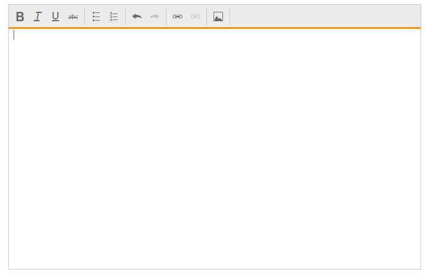

# Getting Started

This section explains the step-by-step instructions to create RichTextEditor in an ASP.NET MVC application.

## Create your first RichTextEditor in MVC

1.  Create Syncfusion ASP.NET MVC application. You can refer [MVC Getting Started](http://help.syncfusion.com/aspnetmvc/getting-started) documentation to create new project and add necessary dll’s and script files.
2.	Add the following code example to the corresponding view page to render the RichTextEditor.


    
@Html.EJ().RTE("rteSample").Width("820px")
    	


## Toolbar–Configuration

You can configure the toolbar with the tools as your application requires.



@{
    List<String> toolsList = new List<string>() { "style", "lists", "doAction", "links", "images" };
    List<String> style = new List<string>() { "bold", "italic", "underline", "strikethrough" };
    List<String> lists = new List<string>() { "unorderedList", "orderedList" };
    List<String> doAction = new List<string>() { "undo", "redo" };
    List<String> links = new List<string>() { "createLink" };
    List<String> images = new List<string>() { "image" };
}
@Html.EJ().RTE("rteSample").Width("820px").ToolsList(toolsList).Tools(tool => tool.Styles(style).Lists(lists).DoAction(doAction).Links(links).Images(images))



## Setting and Getting Content

You can set the content of the editor as follows.



@Html.EJ().RTE("rteSample").Width("820px").ContentTemplate(@

    The Rich Text Editor (RTE) control is an easy to render in client side.
    Customer easy to edit the contents and get the HTML content for the displayed content.
    A rich text editor control provides users with a toolbar that helps them to apply rich text formats to the text entered in the text area.

)
   


To retrieve the editor contents using Value property in Post Back action,



[HttpPost]
[ValidateInput(false)]
public ActionResult RichTextEditorFeatures(string rteSample)
{
    ViewBag.data = rteSample;
    return View();
} 
   


    