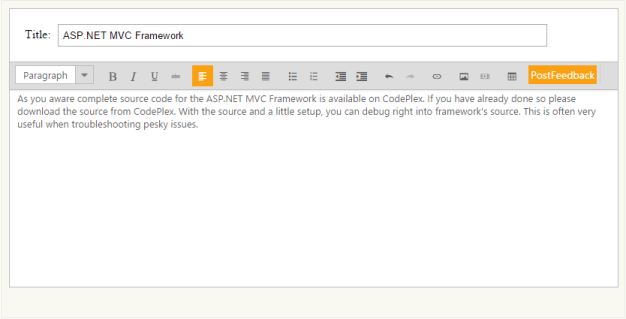
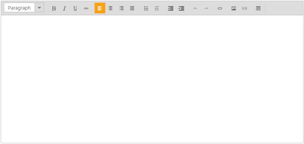
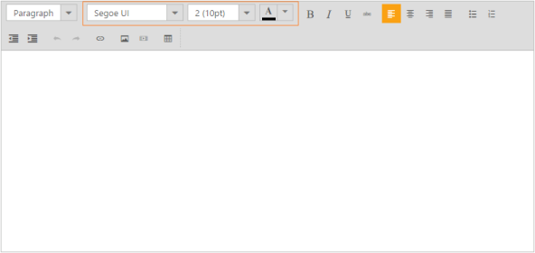
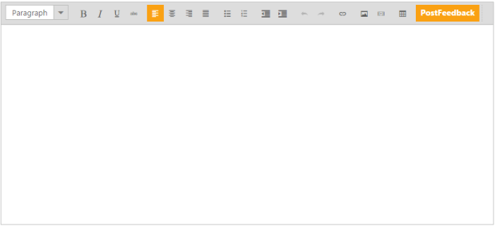
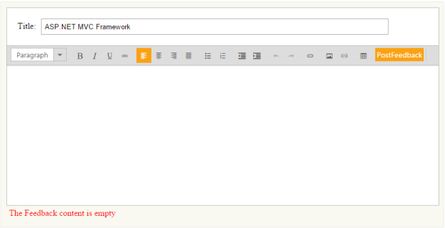

# Getting Started

This section briefly describes how to create and use RichTextEditor control using MVC in your application.

## Create your first RichTextEditor in MVC

The ASP.NET MVC RichTextEditor (RTE) control allows you to edit contents, insert tables, images and to get the HTML content. In this section you can learn how to use RichTextEditor in order to get Feedback from the user. 

The following screenshot demonstrates how the RTE control is used in Feedback form.

In the above screenshot , the RTE consists of content editable area with Feedback title.In this RTE application, you can click the PostFeedback toolbar item to send the Feedback information.

### Create a RichTextEditor 

ASP.NET MVC RTE widget basically renders by using the simple text area element. 

1. You can create a MVC Project and add the necessary Dll’s and scripts with the help of the given [MVC-Getting Started](http://help.syncfusion.com/aspnetmvc/richtexteditor/getting-started) Documentation.
2. Add the following code example to the corresponding view page to render the RichTextEditor.

   ~~~ cshtml

	@Html.EJ().RTE("FeedbackEditor")

   ~~~
   

	

	The following RTE screenshot renders the output of the above steps.

### Configure the Toolbar

The RichTextEditor configures the toolbar items to provide editing and styling functionalities. In this scenario, you can use the default RTE toolbar item to provide Feedback form support. 

### Add the Toolbar Item

The additional functionality toolbar item is necessary to perform the required operation. The RTE provides some additional toolbar items that are already predefined, but not rendered in without specifying the toolbar items.  

The following code example renders the additional inbuilt toolbar items to RTE toolbar list.



@{

    List<string> font = new List<string>() { "fontName", "fontSize","fontColor"  };

}

@Html.EJ().RTE("FeedbackEditor").Tools(tool => tool.Font(font)) 



The following screenshot displays the RTE with inbuilt toolbar item.

### Remove the ToolbarItem

Sometimes, an existing toolbar item is not necessary to perform the required operation. You can remove the particular toolbar item by using the remove ToolbarItem method. 

For example, consider ‘create table’ toolbar item is not necessary for the Feedback scenario. You can easily remove the ‘create table’ toolbar item by using the following code example.



@Html.EJ().RTE("FeedbackEditor")



The following screenshot displays ‘create table’ toolbar item is removed from the toolbar list.

### Configure Custom Toolbar item

To post the Feedback directly, you need additional Toolbar item. The RTE control provides support to create the custom toolbar item for custom action. 

The following code example creates the custom toolbar item in the RTE control. 



@Html.EJ().RTE("FeedbackEditor").Width("820px").Tools(tool => tool.CustomTool(custom =>

custom.Name("PostFeedback").Tooltip("click to Post Feedback messages").Css("Feedback").Add()))

Add the following styles for the customtoolbaritem.

 



The following screenshot displays RTE with custom toolbar item.

### Validate the Content

In some cases, to send the Feedback form without contents you can validate them before submitting the Feedback contents. To achieve this validation, you can use getText() method in RTE control.

When the content area is empty, you can set the notification message displayed in the 
 element area in order to give an alert message. The following HTML code example creates the Feedback form editor with the support of RTE control.

During the Feedback sending time, you can validate whether the content area is empty or not. To achieve this validation, you can use RTE client-side events. RTE provides the ‘action’ function to perform the client-side events to custom tool.

You can specify the custom tool same as previous section with validation operations.



	

		<label>Title:</label>

		<input type="text" class="input ejinput" />

	

    <!--RTE element section-->

	@Html.EJ().RTE("FeedbackEditor").Width("100%").ClientSideEvents(cs=>cs.Change("change")).Tools(tool => tool.CustomTool(custom =>

				custom.Name("PostFeedback").Tooltip("click to Post Feedback messages").Css("Feedback").Action("validate").Add()))

	<!-- validation message display area-->

	



You can add the following styles to achieve the Feedback form editor application.





The following screenshot displays the Feedback sending without content.

