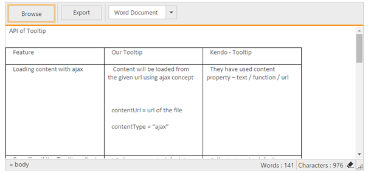
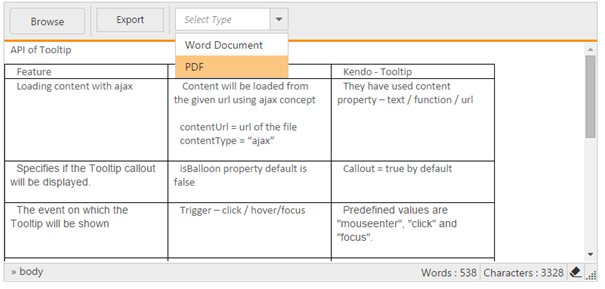
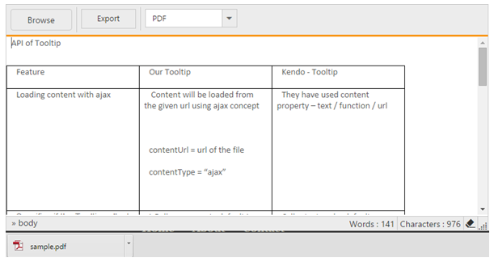

# How to

## Render the RichTextEditor in Partial View 

While rendering a control in the partial view, we need to specify @Html.EJ().ScriptManager() in the partial view page after the initializing the control.

Create a Partial View and define as follows 



@Html.EJ().RTE("RTE1").Value("Model Binding allows you to map and bind the HTTP request data with a model. If you want to work with the form data, Model Binding makes it easier because the requested data is submitted automatically into a data model that we specify.").Width("650px")
@Html.EJ().ScriptManager()



Render the partial view into parental view.



@Html.Partial("~/Views/Temp.cshtml");



N> When unobtrusive is set to true in the application, then the script manager can be excluded, as the control is initialized using HTML5 attributes.
If suppose, you require the Unobtrusive to set to true in your application, then you need to include the ej.unobtrusive.min.js file as a reference to your application and set the value of UnobtrusiveJavaScriptEnabled to true in Root directory web.config file.

## Import word document to the RichTextEditor and Export to word document/pdf

Using customTools property in the RichTextEditor to specify which tools to be displayed in the toolbars or create your own command elements, be it Buttons or DropDownList. 

In controller, defines the property for the RichTextEditor as well as define your custom tools as follows as.



public ActionResult RichTextEditorFeatures()
{
    Syncfusion.JavaScript.Models.RTEproperties property = new Syncfusion.JavaScript.Models.RTEproperties();

    List<Syncfusion.JavaScript.Models.CustomTools> customTool = new List<Syncfusion.JavaScript.Models.CustomTools>();
    customTool.Add(new Syncfusion.JavaScript.Models.CustomTools { Name = "Import", Text = "Import", Css = "codeCheck", Action = "OnCheck" });
    customTool.Add(new Syncfusion.JavaScript.Models.CustomTools { Name = "Export", Text = "Export", Css = "codeCheck", Action = "OnCheck" });
    customTool.Add(new Syncfusion.JavaScript.Models.CustomTools { Name = "DropType", Text = "DropType", Css = "codeCheck", Action = "OnCheck" });

    Syncfusion.JavaScript.Models.RTEtools tools = new Syncfusion.JavaScript.Models.RTEtools();
    tools.CustomTools = customTool;

    property.PreRender = "OnRender";
    List<String> toolsList = new List<string>() { "customTools" };

    property.ToolsList = toolsList;
    property.Tools = tools;
    property.Value = "Please load the file";
    property.ShowFooter = true;
    property.EnableXHTML = true;

    ViewBag.property = property;

    return View();
}



Add the following code snippet to the corresponding view page to render the RichTextEditor.



@using (Html.BeginForm())
{ 
    @Html.EJ().RTE("rte2", (Syncfusion.JavaScript.Models.RTEproperties)ViewBag.property)
}

    <ul>
        <li>Word Document</li>
        <li>PDF</li>
    </ul>



In RichTextEditor’s preRender event, define your custom Tools as follows.



function OnRender(args) {

    var importDocs = $("#Import");
    $("#Import").find("div").remove();
    var target = $("

");
    importDocs.append(target);

    var exportDocs = $("#Export");
    $("#Export").find("div").remove();
    var export = $("<button id='exportFiles'></button>");
    exportDocs.append(export);

    var drop = $("#DropType");
    $("#DropType").find("div").remove();
    var dropTarget = $("<input id='selectType'>
");
    drop.append(dropTarget);

    $("#importFiles").ejUploadbox({
        saveUrl: "/saveFiles.ashx",
        removeUrl: "/removeFiles.ashx",
        extensionsAllow: ".doc, .docx, .pdf",
        autoUpload: true,
        showFileDetails: false,
        dialogAction: { content: "body" },
        complete: "onComplete"
    });

    $("#exportFiles").ejButton({
        size: "small",
        text: "Export",
        type : "submit",
    });

    $('#selectType').ejDropDownList({
        watermarkText: 'Select Type',
        targetID: "TargetList",
        width: "150px",
        selectedIndex: 0
    });
}





function onComplete(args) {
    var fileName = args.files.name;
    var extension = args.files.extension;
    $.ajax({
        type: "POST",
        contentType: 'application/json; charset=utf-8',
        url: '@(Url.Action("Extract"))',
        data: JSON.stringify({ name : fileName, ext : extension }),
        dataType: "html",
        success: function (result) {
            if (result != null) {
                $("#rte2").ejRTE({ value: result });
            }
        },
        error: function (jqXHR, textStatus, errorThrown) {
            alert("Request failed: " + jqXHR.responseStart + "-" + textStatus + "-" + errorThrown);
        }
    });
}
	


In AJAX post back, Retrieve the content from the uploaded files and set the extracted text to the RichTextEditor.



public string Extract(string name, string ext)
{
    string value = " ";
    if (ext == ".pdf")
    {
        String path = HttpContext.Server.MapPath("~/uploadfiles/" + name);
        
        Stream sfile1 = new FileStream(path, FileMode.Open, FileAccess.Read, FileShare.Read);
        PdfLoadedDocument loadDocument = new PdfLoadedDocument(sfile1);
        // Loading Page collections
        PdfLoadedPageCollection loadedPages = loadDocument.Pages;
        // Extract text from PDF document pages
        foreach (PdfLoadedPage loadPage in loadedPages)
        {
            value += loadPage.ExtractText();
        }

    }
    else
    {
        WordDocument document = new WordDocument();
        String path = HttpContext.Server.MapPath("~/uploadfiles/" + name);
        document.Open(path);
        MemoryStream stream = new MemoryStream();
        document.Save(stream, FormatType.Html);
        stream.Position = 0;
        StreamReader reader = new StreamReader(stream);
        value = reader.ReadToEnd();

    }
    return xhtmlValidation(value);
}
		




public string xhtmlValidation(string value)
{
    if (value != null)
    {
        if (value.Contains("<html"))
        {
            int number = value.IndexOf("<body>");
            value = value.Remove(0, number + 6);
            value = value.Replace("</body></html>", "");
        }
        value = value.Replace("\"", "'");
        value = value.Replace("\r", " ");
        value = value.Replace("\n", "  ");
        value = value.Replace("\r\n", " ");
        value = value.Replace("( )+", " ");
        value = value.Replace("&nbsp;", " ");
        value = value.Replace("&bull;", "*");
        value = value.Replace("&lsaquo;", "<");
        value = value.Replace("&rsaquo;", ">");
        value = value.Replace("&trade;", "(tm)");
        value = value.Replace("&copy;", "(c)");
        value = value.Replace("&reg;", "(r)");
    }
    return value;
}



N> If you have selected the document in .pdf format, the text only extracted from the document and set as value to the RichTextEditor.

In above screenshot, use Browse options to browse your files and upload the content to RichTextEditor.

Use DropDownList control in the toolbar to choose the any one type be it is PDF or word document and click Export button to export the content of the RichTextEditor to the selected type.

Upon clicking to the Export button, the post back action has been raised, in that content from the RichTextEditor retrieved and stored as the corresponding format.



[HttpPost]
[ValidateInput(false)]
public void RichTextEditorFeatures(string rte2, string selectType)
{
    if (selectType == "PDF")
    {
        PdfDocument document = new PdfDocument();
        ThreadStart starter = () => CreateDocument(rte2);
        Thread t = new Thread(starter);
        t.SetApartmentState(ApartmentState.STA);
        t.Start();
        t.Join();
    }
    else
    {

        WordDocument document = new WordDocument();
        MemoryStream stream = new MemoryStream();
        StreamWriter writer = new StreamWriter(stream, System.Text.Encoding.Default);
        string htmlText = rte2;
        writer.Write(htmlText);
        writer.Flush();
        stream.Position = 0;
        document = new WordDocument(stream, FormatType.Html, XHTMLValidationType.Strict);
        document.Save("Sample.docx", FormatType.Docx, HttpContext.ApplicationInstance.Response, HttpContentDisposition.Attachment);
    }
}
    




public void CreateDocument(string rte2)
{

    PdfDocument pdfDocument = new PdfDocument();

    pdfDocument.PageSettings.Margins.All = 0;

    PdfPage page = pdfDocument.Pages.Add();
    SizeF pageSize = page.GetClientSize().ToSize();
    AspectRatio dimension = AspectRatio.KeepWidth;

    HtmlConverter html = new HtmlConverter();
    PdfUnitConvertor converter = new PdfUnitConvertor();

    float width = converter.ConvertToPixels(pageSize.Width, PdfGraphicsUnit.Point);
    float height = converter.ConvertToPixels(pageSize.Height, PdfGraphicsUnit.Point);

    PdfMetafileLayoutFormat metafileFormat = new PdfMetafileLayoutFormat();
    metafileFormat.Break = PdfLayoutBreakType.FitPage;
    metafileFormat.Layout = PdfLayoutType.Paginate;
    metafileFormat.SplitTextLines = false;
    metafileFormat.SplitImages = false;

    string htmlText = @"<html><head><title></title></head><body>
" + rte2 + "
</body></html>";

    HtmlToPdfResult result = html.Convert(htmlText,"",Syncfusion.HtmlConverter.ImageType.Metafile, (int)width, (int)height, dimension);
    result.Render(page, metafileFormat);
    pdfDocument.Save("sample.pdf", HttpContext.ApplicationInstance.Response, HttpReadType.Save);

}
    


## Enable the Browser Spell checker in RTE

Currently we do not have in-built spell checker support in RTE. But we can use the Browser spell checker. 

1. First, disable the context menu option from RTE. To do this, please refer the below code snippet.  



@{Html.EJ().RTE("rteSample").Width("100%").EnableRTL(true).ShowContextMenu(false).IFrameAttributes(parameters).Locale("en-US").ContentTemplate(@

    Description:
    The Rich Text Editor (RTE) control is an easy to render in client side. Customer easy to edit the contents and get the HTML content for the displayed content. A rich text editor control provides users with a toolbar that helps them to apply rich text formats to the text entered in the text area.

).Render();}



2. Enable the `spellcheck` property in RTE iframe element. To do this, please refer the below code snippet.



IDictionary<string, object> parameters = new Dictionary<string, object>();
parameters.Add("spellcheck", "true");



In the above sample, we have disabled the RTE content menu by setting “ShowContextMenu” property as false, so that on right click to the RTE we can get the browser spell check suggestion after enabling the `spell checker` in Iframe by setting the `spellcheck` as true in [iframeAttributes](https://help.syncfusion.com/js/api/ejrte#members:iframeattributes) property.

## Pass the RTE from partial view to main view using AJAX call

In main view, the Button control is rendered, upon clicking to the Button, the AJAX call is initiated.



@Html.EJ().Button("button1").Text("Load RTE").ShowRoundedCorner(true).Size(ButtonSize.Small).ClientSideEvents(e => e.Click("onClick"))



The controller returns the partial view to the AJAX call. In the success function of the AJAX, the returned HTML appended to the div element. In this case, the Syncfusion widgets need to be initiated.



public ActionResult RichTextEditorFeatures()
{
    return View();
}
public ActionResult LoadRTE(string value)
{
    RTEModel.text = value;
    return PartialView("~/Views/RichTextEditor/RTE.cshtml");
}



In the partial view, the RTE is rendered as follows



@model  RTEPartialView.Models.RTEModel

@{Html.EJ().RTE("Id1").Width("100%").ContentTemplate(@
  
).ShowHtmlSource(true).ShowFooter(true).Value(RTEPartialView.Models.RTEModel.text).Render();}



## Render RichTextEditor from code behind

RichTextEditor can be rendered from the code behind by initializing the required properties in controller and passing those properties via ViewData or Model to the client side

The following code illustrates the rendering of RichTextEditor using RichTextEditor properties from code behind.




    
       @model  Syncfusion.JavaScript.Models.RTEproperties

    @{

        Html.EJ().RTE("rteSample", (Syncfusion.JavaScript.Models.RTEproperties)ViewData["RTEModel"]).Render();   // render the RTE in view

    }
			



	
    public ActionResult Index()
        {
            RTEproperties RTEObj = new RTEproperties();
            RTEObj.ContentTemplate = new MvcTemplate<object>
            {
                RazorViewTemplate = (data) =>
                {
                    return "This is RTE content";
                }
            };
            RTEObj.Width = "550";
            RTEObj.IsResponsive = true;
            ViewData["RTEModel"] = RTEObj;
            return View(RTEObj);
        }
	


