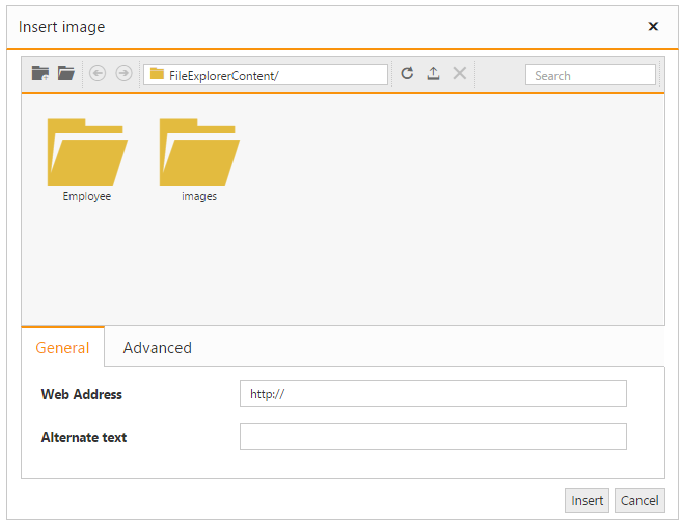
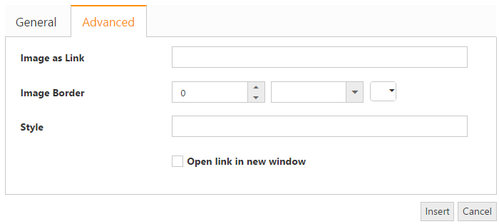
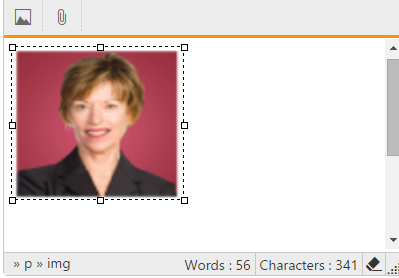
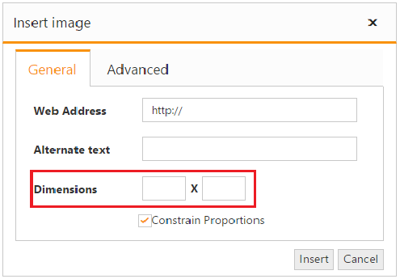

# Image and File browser

The editor allows you to manage the images and files using **FileExplorer**. The FileExplorer enables you to insert images from online source as well as local computer where you want to insert the image in your content. The Image and file browser is the ability to upload pictures and link file to the editor. 

## Insert an Image from Online Source

If you want to insert an image from online source like google, ping, etc., you need to enable images tool on the editor’s toolbar. By default, the images tool is open a simple dialog which allows you to inserting an image from online source.



    @{
        List<String> toolsList = new List<string>() { "images" };
        List<String> images = new List<string>() { "image" };
    }
    @{Html.EJ().RTE("rteSample").Width("100%").ContentTemplate(@

        The Rich Text Editor (RTE) control is an easy to render in client side.
        Customer easy to edit the contents and get the HTML content for the displayed content.
        A rich text editor control provides users with a toolbar that helps them to apply rich text formats to the text entered in the text area.

    
)
    .ShowFooter(true)
    .ToolsList(toolsList)
    .Tools(tool => tool.Images(images)).Render();}
      


## Insert an Image from Your Computer

Configure the ImageBrowser and FileBrowser property to insert an image from your computer. You can specify the settings required by the FileExplorer to create, read, upload, and destroy the files and images from the explorer. 



    @{
        List<String> toolsList = new List<string>() { "images" };
        List<String> images = new List<string>() { "image" };
    }
    @{Html.EJ().RTE("rteSample").Width("100%").ContentTemplate(@

        The Rich Text Editor (RTE) control is an easy to render in client side.
        Customer easy to edit the contents and get the HTML content for the displayed content.
        A rich text editor control provides users with a toolbar that helps them to apply rich text formats to the text entered in the text area.
    
)
    .ShowFooter(true)
    .Tools(tool => tool.Images(images))
    .ToolsList(toolsList)
    .ImageBrowser(img => img.FilePath("~/FileExplorerContent/")
        .ExtensionAllow("*.png,*.gif,*.jpg,*.jpeg")
        .AjaxAction(@Url.Content("FileActionMethods")))
    .FileBrowser(file => file.FilePath("~/FileExplorerContent/")
        .ExtensionAllow("*.png,*.txt,*.jpg,*.docx")
        .AjaxAction("FileActionMethods"))
    .Render();}





        public ActionResult FileActionMethods(Syncfusion.JavaScript.FileExplorerParams args)
        {
                Syncfusion.JavaScript.FileExplorerOperations opeartion = new Syncfusion.JavaScript.FileExplorerOperations();
                    switch (args.ActionType)
                    {
                        case "Read":
                            return Json(opeartion.Read(args.Path, args.ExtensionsAllow));
                        case "CreateFolder":
                            return Json(opeartion.CreateFolder(args.Path, args.Name));
                        case "Paste":
                            return Json(opeartion.Paste(args.LocationFrom, args.LocationTo, args.Names, args.Action, args.CommonFiles));
                        case "Remove":
                            return Json(opeartion.Remove(args.Names, args.Path));
                        case "Rename":
                            return Json(opeartion.Rename(args.Path, args.Name, args.NewName, args.CommonFiles));
                        case "GetDetails":
                            return Json(opeartion.GetDetails(args.Path, args.Names));
                        case "Download":
                            opeartion.Download(args.Path, args.Names);
                            break;
                        case "Upload":
                            opeartion.Upload(args.FileUpload, args.Path);
                            break;
                    }
                return Json("");
        }

 

N> FileExplorer component has been implemented and integrated with the editor in Volume 1, 2015 release. For more information about FileExplorer component, see [here](http://helpjs.syncfusion.com/js/fileexplorer/overview#).

## Image Properties

You can set or modify the properties of an image by using the image dialog. It allows you to add links, apply border and set additional styles to the images. The editor provides an option to specify the alternate text for an image, if the image cannot be displayed.

## Resize an Image

You can resize an image either manually or by setting width and height in the image dialog.  

### Resize Manually

You can resize an image manually by selecting an image. And drag the handle until the image is resized to the desired size.  

### Set Width and Height

The editor provides you to set the Width and Height properties to change the size of an image (rather than forcing you to set in style attributes) using ShowDimensions property. By default, the Constrain Proportion checkbox is selected to resize an image to an exact proportion. To apply the exact width and height that you specify into the Height and Width textboxes, uncheck the Constrain Proportions checkbox.



	
    @{
        List<String> toolsList = new List<string>() { "images" };
        List<String> images = new List<string>() { "image" };
    }
    @{Html.EJ().RTE("rteSample").Width("100%").ContentTemplate(@

        The Rich Text Editor
        (RTE) control is an easy to render in client side. Customer easy to edit the contents
        and get the HTML content for the displayed content. A rich text editor control provides
        users with a toolbar that helps them to apply rich text formats to the text entered
        in the text area.
    
).ShowFooter(true)
    .ToolsList(toolsList)
    .Tools(tool => tool.Images(images))
    .ShowDimensions(true)
    .Render();}
  



