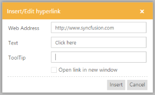
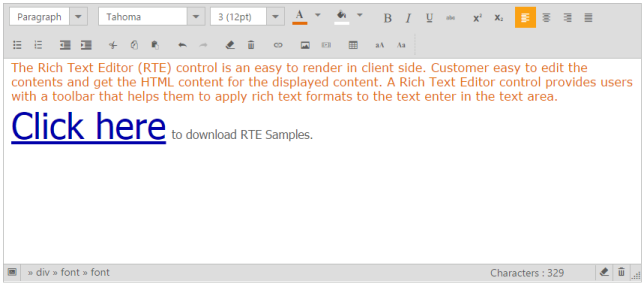

# Insert Hyperlink

RTE control provides the option to insert hyperlink in the editing area. Consider your blog needs to give a product’s download link, then you can include the download link by using the “insert or edit hyperlink” tool item. 

By clicking this tool item, you can add Text, with hyperlink, and Tooltip, where a message appears when a cursor is positioned over a hyperlink. 

Also, this tool item enables you to add or edit the hyperlink, text, tooltip for selected text in the editing area. The following screenshot illustrates the hyperlink of the “Click here” text.

1. Add the following code in your CSHTML page to initialize the RTE.

   ~~~ html

			@*Add the following code in your view page to render the RTE.*@

			@{List<String> font = new List<string>() { "fontName", "fontSize", "fontColor", "backgroundColor" };

			List<String> style = new List<string>() { "bold", "italic", "underline", "strikethrough" };

			List<String> alignment = new List<string>() { "justifyLeft", "justifyCenter", "justifyRight", "justifyFull" };

			List<String> lists = new List<string>() { "unorderedList", "orderedList" };

			List<String> copyPaste = new List<string>() { "cut", "copy", "paste" };

			List<String> doAction = new List<string>() { "undo", "redo" };

			List<String> clear = new List<string>() { "clearFormat", "clearAll" };

			List<String> tables = new List<string>() { "createTable", "addRowAbove", "addRowBelow", "addColumnLeft", "addColumnRight", "deleteRow", "deleteColumn", "deleteTable" };

			List<String> links = new List<string>() { "createLink" };

			List<String> images = new List<string>() { "image", "video" };

			List<String> scripts = new List<string>() { "superscript", "subscript" };

			List<String> casing = new List<string>() { "upperCase", "lowerCase" };

			List<String> formatStyle = new List<string>() { "format" };}

			@{Html.EJ().RTE("rteSample").Width("850px").ContentTemplate(@

).ShowFooter(true).Tools(tool => tool.Clear(clear).FormatStyle(formatStyle).Tables(tables).Links(links).Images(images).Scripts(scripts).Casing(casing).Font(font).Styles(style).Alignment(alignment).Lists(lists).CopyPaste(copyPaste).DoAction(doAction)).Render();}

   ~~~
   {:.prettyprint }

2. Add the hyperlink to selected text by using the “insert Hyperlink” tool item.

	This popup window contains options to add the hyperlink, text, tooltip to selected text.

	

	The following screenshot displays the output.

	