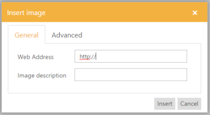
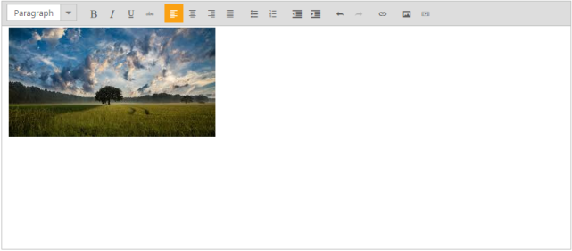

## Insert Image

You can insert all types of images from a defined pathin the Rich Text Editor control. You can even insert your company’s logo in the page. When you explain about your product, insert images related to the product, for more interaction with the viewers. And it also provides some additional features such as border support, navigation link support and custom styles for images.

Steps to Insert the Image

1. Specify the URL of the image.

{{ '' | markdownify }}
{:.image }
2. Description of the images is mandatory.

{{ '' | markdownify }}
{:.image }

