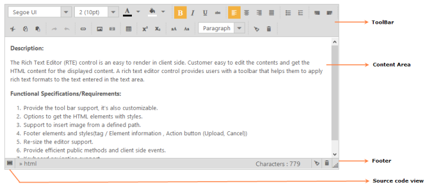

# Overview

RichTextEditor (RTE) control enables you to visually edit HTML content. It enables you to edit the contents with insert table and images, and can get the HTML content for the displayed content. A RichTextEditor control provides a toolbar that helps to apply rich text formats to the text entered in the text area.  

## Control structure

## Key Feature

1. ToolBar Support:-Provides the tool bar support, it’s also customizable.
   1. Formatting Tool – Left, right, center, and justify
   2. Undo & Redo
   3. Clipboard action
   4. Color palette – Fore and back color
   5. Bullet List – ordered and un-ordered
   6. Style – Bold, Italic, Underline
   7. Subscript and Superscript 
   8. Upper & lower case conversion
   9. Indent
   10. Font options
   11. Hyperlink options
   12. Table - insert, delete row, column and table.
   13. Images insert form web URL.
   14. Embed Video insert.
   15. Format option.
2. Source code view: Options to get the HTML elements with styles.
3. Tool item template: Toolbar item template support.
4. Image insert: Support to insert image from a defined path.
5. Localization: Localization support. 
6. Footer: Footer elements and styles(tag / Element information , Action button (Upload, Cancel))
7. Resizing: Resize the editor support. 
8. Methods / Events: Provide efficient public methods and client side events.
9. Keyboard navigation: Keyboard navigation support.
