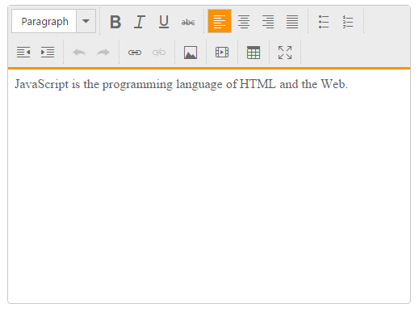

# Strongly types HTML helper 

The RTEFor control supports strongly typed HTML helpers which use lambda expressions to reference models or view models passed to a view template. These helpers allow you to define the value of the RichTextEditorFor from the model. The following steps explain how to use the strongly typed helpers to create RichTextEditorFor.

Add a class named "RTE" in the Models folder and replace the code with the following code:



    public class RTE
    {
            public string value { get; set; }
    }



In the controller, pass the model to the View.



    using UserInterface.Models;
    public ActionResult RichTextEditorFeatures()
    {
        RTE obj = new RTE ();    
        obj.value = "JavaScript is the programming language of HTML and the Web.";
        return View(obj);
    }



In View, invoke the strongly typed RichTextEditor helper with the lambda expression to set the default value.



    @model UserInterface.Models.RTE

    @using (Html.BeginForm())
    { 
               @Html.EJ().RTEFor(model => model.value )
    
    }



