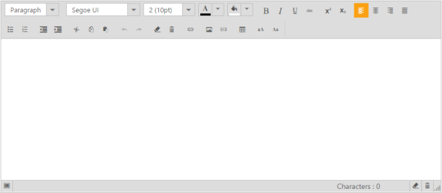
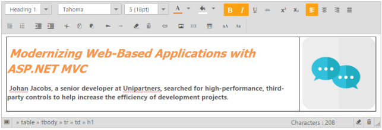
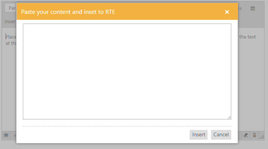
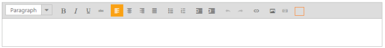

## Toolbar Support

The Rich Text Editor control provides a number of tool items that provide a rich look to the text entered in the editing area. It brings to the Web popular editing features found in desktop word processors such as Microsoft Word and OpenOffice.org Writer.

Text Formatting 

The formatting tools allow you to change the appearance of the text. Formatted text is visually interested and easy for the visitor to read. Formatting tags provide emphasis or act as markers to help the visitor, find information. Some text styling options are also available as a drop-down list. By clicking them, the list opens and you can select a styling option.

  List of Toolbar Items

* Alignment Formatting Tools: Left, right, center, and justify.
* Color palette: 
  * Fore-color: To change the color of text in editing area
  * Back-color: To change the background color of editing area
* Bulleting: Ordered and un-ordered list
* Style: Bold, Italic, Underline, and Strikethrough
* Subscript and Superscript 
* Text with subscript and superscript placed after or before the baseline respectively.
* Font options
  * [Font Name](http://docs.cksource.com/CKEditor_3.x/Users_Guide/Styling/Font) – Typeface that is applied to the document text.
  * [Font Size](http://docs.cksource.com/CKEditor_3.x/Users_Guide/Styling/Size) – Determines how big or small the text will be.
* Format
* Predefined sets of formatting features that can be applied to block and to make elements of the document inline.
* Upper & lower case conversion
* Indent

Undo and Redo

As the name explains, the undo function allows you to undo a number of recent actions in an editing area. To go along with Undo is Redo. By using this tool, you can avoid mistakes while editing.

Clipboard action

Most used clipboard actions are cut, copy, and paste. These tools are used to rearrange the content within your editing area. You can copy and paste the images or text from locations other than the editing area.

1. To render Rich Text Editor with the above toolbar options, include the following code in your CSHTML page.

[cshtml]

\\ Add the following code in your view page

@{List<String> font = new List<string>() { "fontName", "fontSize", "fontColor", "backgroundColor" };

List<String> style = new List<string>() { "bold", "italic", "underline", "strikethrough" };

List<String> alignment = new List<string>() { "justifyLeft", "justifyCenter", "justifyRight", "justifyFull" };

List<String> lists = new List<string>() { "unorderedList", "orderedList" };

List<String> copyPaste = new List<string>() { "cut", "copy", "paste" };

List<String> doAction = new List<string>() { "undo", "redo" };

List<String> clear = new List<string>() { "clearFormat", "clearAll" };

List<String> tables = new List<string>() { "createTable", "addRowAbove", "addRowBelow", "addColumnLeft", "addColumnRight", "deleteRow", "deleteColumn", "deleteTable" };

List<String> links = new List<string>() { "createLink" };

List<String> images = new List<string>() { "image", "video" };

List<String> scripts = new List<string>() { "superscript", "subscript" };

List<String> casing = new List<string>() { "upperCase", "lowerCase" };

List<String> formatStyle = new List<string>() { "format" };

}

@{Html.EJ().RTE("rteSample").Width("850px").ContentTemplate(@&lt;p&gt;&lt;/p&gt;).ShowFooter(true).Tools(tool => tool.Clear(clear).FormatStyle(formatStyle).Tables(tables).Links(links).Images(images).Scripts(scripts).Casing(casing).Font(font).Styles(style).Alignment(alignment).Lists(lists).CopyPaste(copyPaste).DoAction(doAction)).Render();} 

{  | markdownify }
{:.image }
The following screenshot displays the List of Toolbar items with RTE control.

The following image consists of formatted content by using the available toolbar items in RTE control.

{  | markdownify }
{:.image }

### Customized tools option

In Rich Text Editor, toolbars are customizable. When you want to include a new tool item with new functionality that is not available in the existing RTE toolbar items, it is possible to create a new tool item by using the custom tool option. 

The following example illustrates how to insert an HTML, JavaScript, or CSS code in the editing area as a code block.

<table>
<tr>
<td>
[_cshtml]\\ Add the following code in your view page&lt;div class="rte"&gt;    @*initialization of RTE*@@(Html.EJ().RTE("rteSample").Width("700px").ContentTemplate(@&lt;p&gt;Place the content in this RTE Text area.By Clicking the "AddText" toolbar item in the RTE toolbar,you can add the text at the place of cursor.&lt;/p&gt;).ShowFooter(true)        .Tools(tool => tool.CustomTool(custom =>        {            custom.Name("insert code").Tooltip("Insert Code Snippets").Css("codeInsert").Action("click").Add();        })))    @*Dialog option code for adding the text*@    &lt;div id="cutomSourceCode" title="Paste your content and inset to RTE"&gt;        &lt;table&gt;            &lt;tr&gt;                &lt;td colspan="2"&gt;                    &lt;textarea id="srcCode" style="width: 550px; height: 250px"&gt;                        &lt;div id="srcArea"&gt;&lt;/div&gt;                    &lt;/textarea&gt;                &lt;/td&gt;            &lt;/tr&gt;            &lt;tr&gt;                &lt;td colspan="2"&gt;                    &lt;div class="e-rte-button e-fieldseparate"&gt;                        <button id="src_insert" class="e-rte-btn" tabindex="">Insert</button>                        <button id="src_cancel" class="e-rte-btn" tabindex="">Cancel</button>                    &lt;/div&gt;                &lt;/td&gt;            &lt;/tr&gt;        &lt;/table&gt;    &lt;/div&gt;&lt;/div&gt;</td></tr>
<tr>
<td>
[JavaScript]\\ Add the following code in your script section to render RTE and set the action of the new tool item.     var rteObj;    $(function () {        $("#cutomSourceCode").ejDialog({ enableResize: false, enableModal: true, showOnInit: false, width: "auto" }); //dialog initialization        $("#cutomSourceCode").find(".e-rte-btn").ejButton({ click: "allowText" });    });    function click() {        $("#srcCode").val("").show();        $("#cutomSourceCode").ejDialog("open"); @*dialog initialization*@        }    function allowText() {        rteObj = $("#rteSample").data("ejRTE");        if (this._id == "src_insert") {            rteObj.executeCommand("inserthtml", $("#srcCode")[0].value); @*add the text in RTE*@            }        $("#cutomSourceCode").ejDialog("close");    }</td></tr>
</table>
The following screenshot demonstrates the functionality of new tool item.

{  | markdownify }
{:.image }

Remove the tool item

In some cases, you may have to remove a particular item from existing toolbar item of RTE. It can easily be done by using the property removeToolBarItem in RTE. Consider a content blog that does not require "insert table" option. In that case, you can remove the “createTable” tool item from the toolbar. The following code illustrates how to remove the “createTable” tool item from list of toolbars.

1. Add the following code in your CSHTML page.

<table>
<tr>
<td>
[_cshtml]@*Add the following code in your view page.*@@{Html.EJ().RTE("rteSample").Width("850px").ContentTemplate(@&lt;p&gt;&lt;/p&gt;).Render(); }</td></tr>
<tr>
<td>
[JavaScript]@*Add the following code in script section*@.var rteeObj  = $("#rteSample").data("ejRTE");rteeObj.removeToolbarItem("rteSamplecreateTable"); // remove toolbar item</td></tr>
</table>

The following screenshot demonstrates the functionality of removing tool item.

{  | markdownify }
{:.image }

