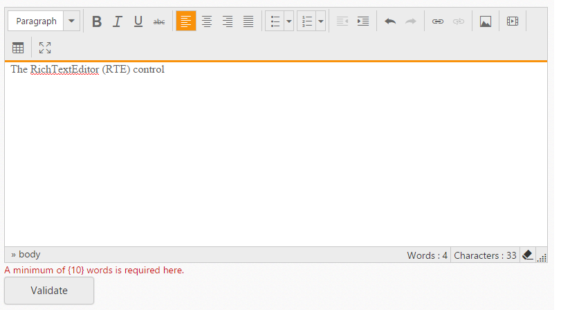

# Validation 

It's easy to validate the RichTextEditor’s value on form submission by applying ValidationRules and ValidationMessage to the RichTextEditor.

N> [jquery.validate.min](http://cdn.syncfusion.com/js/assets/external/jquery.validate.min.js) script file should be referred for validation, for more details, refer [here](http://jqueryvalidation.org/documentation).

## jQuery Validation Methods

The following are jQuery validation methods.

_List of jQuery validation methods_

<table>
<tr>
<th>
Rules</th><th>
Description</th></tr>
<tr>
<td>
required</td><td>
 Requires value for the RichTextEditor control.</td></tr>
<tr>
<td>
minWordCount</td><td>
 Requires the value to be of given minimum words count.</td></tr>
<tr>
<td>
minlength</td><td>
 Requires the value to be of given minimum characters count.</td></tr>
<tr>
<td>
maxlength</td><td>
 Requires the value to be of given maximum characters count.</td></tr>
</table>

### Validation Rules

The validation rules help you to verify the content by adding validation attributes to the text area. This can be set by using ValidationRules property.

### Validation Messages 

You can set your own custom error message by using ValidationMessage property. To display the error message, specify the corresponding annotation attribute followed by the message to display.

N> jQuery predefined error messages to that annotation attribute will be shown when this property is not defined. 

When you initialize the RichTextEditor widget, it creates a text area hidden element which is used to store the value. Hence, the validation is performed based on the value stored in this hidden element.

Required field and minWordCount values validation is demonstrated in the below given example.



    @using (Html.BeginForm())
    {
         
        @Html.EJ().RTE("RTE1").ValidationRules(new Dictionary<string, object> { { "required", "true" }, { "minWordCount", 15 } }).ValidationMessage(new Dictionary<string, object> { { "minWordCount", "A minimum of {10} words is required here" }, { "Required", "Please enter the content" } })
         
        @Html.EJ().Button("Btn1").Text("Validate")
    
    }
 


## Client Side Validation

In the Client Side Validation you can provide a better user experience by responding quickly at the browser level. When you perform a Client Side Validation, all the user inputs validated in the user's browser itself. Client Side validation does not require a round trip to the server, so the network traffic which will help your server perform better.

ASP.NET MVC supports client side validation. First of all you need to take a reference of two JavaScript files from Scripts folder, jquery.validate.min.js and jquery.validate.unobtrusive.min.js in your layout file as shown below.



    
    
    


Now, add following two settings in &lt;appSettings&gt; section of web.config, if it is not there.
    


    <appSettings>
        <add key="ClientValidationEnabled" value="true" />
        <add key="UnobtrusiveJavaScriptEnabled" value="true" />
    </appSettings>



1.	DataAnnotations provides a built-in set of validation attributes that you can apply declaratively to any class or property. Create RTE class to take advantage of the built-in Required validation attributes. 
       
    
    
        using System.ComponentModel.DataAnnotations;
        public class RTE
        {
            [Required(ErrorMessage = "RTE value is Required")]
            public string value { get; set; }
        }
        
    

2.  After that you need to create the controller's action methods. These render views on the UI and bind a model with the view. So let's create a controller as follows.

    
    
        public ActionResult RichTextEditorFeatures()
        {
    
            controlInitialization();
            return View();
        }
        [HttpPost]
        public ActionResult RichTextEditorFeatures(RTE model)
        {
            if (ModelState.IsValid)
            {
                //perform some action
                return RedirectToAction("Home");
            }
            controlInitialization();
            return View(model);
        }
        public void controlInitialization()
        {
            RTEproperties property = new RTEproperties();
            List<String> toolsList = new List<string>() { "alignment" };
    
            List<String> alignment = new List<string>() { "justifyLeft", "justifyCenter" };
    
            property.ToolsList = toolsList;
            RTEtools tools = new RTEtools();
            tools.Alignment = alignment;
    
            ViewData["edit"] = property;
        }
    
    

    In our example, the form is not posted to the server when there are validation errors detected on the client side.

3.	Below is the RichTextEditorFeatures.cshtml view and It's used by the action methods shown above both to display the initial form and to redisplay it in the event of an error.

     
    
        @using (Html.BeginForm())
        {
            @Html.ValidationSummary(true)
            @Html.EJ().RTEFor(model => model.value, (Syncfusion.JavaScript.Models.RTEproperties)ViewData["edit"])
        
            
            
            
            @Html.ValidationMessageFor(model => model.value)
             
            @Html.EJ().Button("btn").Size(ButtonSize.Small).Text("Post").Type(ButtonType.Submit)
        }
        
     
     
 
## Server side Validation

In the Server Side Validation, the input submitted by the user is being sent to the server and validated using one of server side scripting languages. After the validation process on the Server Side, the feedback is sent back to the client.

ASP.NET MVC uses Data Annotations attributes to implement validations. Data Annotations includes built-in validation attributes for different validation rules, which can be applied to the properties of model class. ASP.NET MVC Framework will automatically enforce these validation rules and display validation messages in the view.

1.	First of all, apply DataAnnotation attribute on the properties of RTE model class. Here, we have validate the value of the RichTextEditor should not be empty. 

    
    
        using System.ComponentModel.DataAnnotations;
        public class RTE
        {
                [Required(ErrorMessage = "RTE value is Required")]
                public string value { get; set; }
        }
    
    

2.	Create an action method in the controller that returns a view with a model after the post request.

    
    
        public ActionResult RichTextEditorFeatures()
        {
    
            controlInitialization();
            return View();
        }
    
        [HttpPost]
        public ActionResult RichTextEditorFeatures(RTE model)
        {
            if (ModelState.IsValid)
            {
                //perform some action
                return RedirectToAction("Home");
            }
            controlInitialization();
            return View(model);
        }
    
        public void controlInitialization()
        {
            RTEproperties property = new RTEproperties();
            List<String> toolsList = new List<string>() { "alignment" };
    
          List<String> alignment = new List<string>() { "justifyLeft", "justifyCenter" };
    
            property.ToolsList = toolsList;
            RTEtools tools = new RTEtools();
            tools.Alignment = alignment;
    
            ViewData["edit"] = property;
        }
        
    
    
    As you can see in the POST Edit method, we first check if the ModelState is valid or not. If ModelState is valid then perform some action, if not then return RichTextEditorFeatures view again with the same RTE data.
    
    ModelState.IsValid determines that whether submitted values satisfy all the DataAnnotation validation attributes applied to model properties.

3.	After that, created a view for RichTextEditor.

    
    
            @model ClientValidation.Models.RTE
        
            @{
                ViewBag.Title = "RTE";
                Layout = "~/Views/Shared/_Layout.cshtml";
            }
            <h2>RTE Features:</h2>
             
            @using (Html.BeginForm())
            {
                @Html.EJ().RTEFor(model => model.value, (Syncfusion.JavaScript.Models.RTEproperties)ViewData["edit"])
            
                @Html.ValidationMessageFor(model => model.value)
                 
                @Html.EJ().Button("btn").Size(ButtonSize.Small).Text("Post").Type(ButtonType.Submit)
            }
        
    

    As you can see in the above RichTextEditorFeatures.cshtml, it calls HTML Helper method ValidationMessageFor for every field. ValidationMessageFor is responsible to display error message for the specified field.
    So now, it will display default validation message when you submit the form without entering a value for the RichTextEditor.

