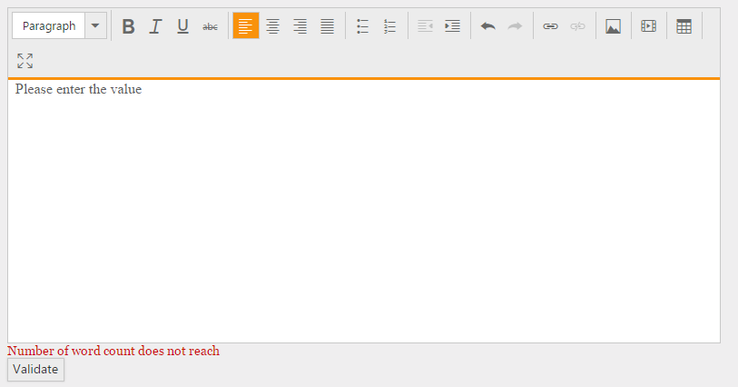
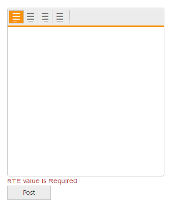

# Working with Content

## Submit Content

The editor allows you to process its content before it is being submitted to the server on form submit event. You can use this option to validate content on the client side to prevent invalid data from being submitted to the server.

This example shows how to encode the HTML content before form submit event.



   
    <form>
        @{Html.EJ().RTE("rteSample").Width("100%").ContentTemplate(@

                The Rich Text Editor
                (RTE) control is an easy to render in client side. Customer easy to edit the contents
                and get the HTML content for the displayed content. A rich text editor control provides
                users with a toolbar that helps them to apply rich text formats to the text entered
                in the text area.
            
)
                .ShowFooter(true)
                .ShowHtmlSource(true)
                .Render();}
         
        @{Html.EJ().Button("Submit").Text("Submit").Type(ButtonType.Submit).Render();}
        
    </form>
       
    
    


## Refresh

When you move the editor’s wrapper element into another DOM element, the editor needs to be reinitialized by the [refresh](http://help.syncfusion.com/js/api/ejrte#methods:refresh) method to retain its content. The method reload the content area and rebind the events of the editor. 



  
    @{Html.EJ().RTE("rteSample").Width("100%").ContentTemplate(@

        The Rich Text Editor
        (RTE) control is an easy to render in client side. Customer easy to edit the contents
        and get the HTML content for the displayed content. A rich text editor control provides
        users with a toolbar that helps them to apply rich text formats to the text entered
        in the text area.

    
)
        .Render();}
     
    @{Html.EJ().Dialog("Target").Width("600px").Render();}
    @{Html.EJ().Button("Append").Text("Append").ClientSideEvents(e => e.Click("appendTo")).Render();}
    @{Html.EJ().Button("Refresh").Text("Refresh").ClientSideEvents(e => e.Click("refresh")).Render();}

    
    



## Editing and Formatting 

The editor’s [toolbar](/js/richtexteditor/user-interface#toolbar) contains buttons and dropdowns that allow you to editing and formatting in your content.
 
* Font name, Font size, and color
* Bold, Italic, Underline, and Strikethrough
* Text Alignment – left, right, center, and justify
* Indent – left and right
* Styles – quotation, normal,  headings, and sub-headings
* Superscript and Subscript
* Casing – convert to lower case and upper case
* List – create ordered and unordered list



    
    @{List<String> toolsList = new List<string>() { "formatStyle", "font", "style", "effects", "alignment", "lists", "indenting", "clipboard", "doAction", "clear", "links", "images", "media", "tables", "casing", "customTool", "view" };
    List<String> font = new List<string>() { "fontName", "fontSize", "fontColor", "backgroundColor" };
    List<String> style = new List<string>() { "bold", "italic", "underline", "strikethrough" };
    List<String> alignment = new List<string>() { "justifyLeft", "justifyCenter" };
    List<String> lists = new List<string>() { "unorderedList", "orderedList" };
    List<String> indenting = new List<string> { "outdent", "indent" };
    List<String> clipboard = new List<string>() { "cut", "copy", "paste" };
    List<String> doAction = new List<string>() { "undo", "redo" };
    List<String> clear = new List<string>() { "clearFormat", "clearAll" };
    List<String> tables = new List<string>() { "createTable", "addRowAbove", "addRowBelow", "addColumnLeft", "addColumnRight", "deleteRow", "deleteColumn", "deleteTable" };
    List<String> links = new List<string>() { "createLink", "removeLink" };
    List<String> images = new List<string>() { "image" };
    List<String> media = new List<string>() { "video" };
    List<String> effects = new List<string>() { "superscript", "subscript" };
    List<String> casing = new List<string>() { "upperCase", "lowerCase" };
    List<String> formatStyle = new List<string>() { "format" };
    List<String> view = new List<string>() { "fullScreen" };
    }
    @{Html.EJ().RTE("rteSample").Width("800px").ContentTemplate(@

        The Rich Text Editor
        (RTE) control is an easy to render in client side. Customer easy to edit the contents
        and get the HTML content for the displayed content. A rich text editor control provides
        users with a toolbar that helps them to apply rich text formats to the text entered
        in the text area.
    
)
    .ToolsList(toolsList)
    .Tools(tool => tool.Clear(clear).FormatStyle(formatStyle).Tables(tables).Links(links).Images(images).Effects(effects).Casing(casing).Font(font).Styles(style).Media(media).Alignment(alignment).Lists(lists).Clipboard(clipboard).DoAction(doAction).Indenting(indenting).View(view))
    .Render();}
     



## Undo and Redo 

Undo and Redo buttons allow you to editing the text by disregard/cancel the recently made changes and restore it to previous state. It is a useful tool to restore the performed action which got changed by mistake. Up to 50 actions can be undo/redo in the editor by default. 

To undo and redo operations, do one of the following:

* Press the undo/redo button on the toolbar
* Press the <kbd> Ctrl </kbd> + <kbd> Z </kbd> ,  <kbd>Ctrl </kbd> + <kbd> Y </kbd> combination on the keyboard



    @{
        List<String> toolsList = new List<string>() { "doAction" };
        List<String> doAction = new List<string>() { "undo", "redo" };

    }
    @{Html.EJ().RTE("rteSample").Width("800px").ContentTemplate(@

        The Rich Text Editor
        (RTE) control is an easy to render in client side. Customer easy to edit the contents
        and get the HTML content for the displayed content. A rich text editor control provides
        users with a toolbar that helps them to apply rich text formats to the text entered
        in the text area.
    
)
            .ToolsList(toolsList).Tools(tool => tool.DoAction(doAction))
            .Render();}
     



## Clipboard Operations

The editor provides support for the clipboard operations (cut, copy, and paste) in all text and images using the toolbar buttons and the keyboard shortcuts. Toolbar includes buttons through which the clipboard operations, such as Cut, Copy, and Paste can be accessed.

You can use the keyboard shortcuts to perform the clipboard operations.

* Cut - <kbd>CTRL</kbd> + <kbd>X</kbd>  
* Copy - <kbd>CTRL</kbd> + <kbd>C</kbd> 
* Paste - <kbd>CTRL</kbd> + <kbd>V</kbd> 

Some browsers block the clipboard access from JavaScript. If you want to use the Cut, Copy, and Paste buttons on the toolbar, you need to allow JavaScript to use the clipboard. If you don’t want to do this configuration, use CTRL+C, CTRL+X, and CTRL+V keyboard commands.



    @{
        List<String> toolsList = new List<string>() { "clipboard" };
        List<String> clipboard = new List<string>() { "cut", "copy", "paste" };

    }
    @{Html.EJ().RTE("rteSample").Width("800px").ContentTemplate(@

        The Rich Text Editor
        (RTE) control is an easy to render in client side. Customer easy to edit the contents
        and get the HTML content for the displayed content. A rich text editor control provides
        users with a toolbar that helps them to apply rich text formats to the text entered
        in the text area.
    
)
            .ToolsList(toolsList).Tools(tool => tool.Clipboard(clipboard))
            .Render();}



## Persistence

The editor is capable to persist its content with HTML format. By default, the persistence support is disabled in the editor. When you set the EnablePersistence property to true, the persistence will be enabled in the editor.

N>  [localstorage](http://www.w3schools.com/html/html5_webstorage.asp#) is not supported below ie9 version, therefore persistence support is fallback to [cookie](http://www.w3schools.com/js/js_cookies.asp#).



    @{Html.EJ().RTE("rteSample").Width("800px")
        .EnablePersistence(true)
        .Render();}
     
    


## Change the Font

By default, the editor’s &lt; iframe &gt; is initialized with “Segoe UI” font name and 3(12pt) font size. To change it, select a different font name and font size from the drop-down in the editor’s toolbar. To apply different font style for particular section of the content, select the text that you would like to change, and select a required font style from the drop-down to apply the changes to the selected text.

### Set Default Font and Font Size

* Set a default font name and font size to the font name and size drop-down programmatically.



    @{
        List<String> toolsList = new List<string>() { "font" };
        List<String> font = new List<string>() { "fontName", "fontSize", "fontColor", "backgroundColor" };
    }
    @{Html.EJ().RTE("rteSample").Width("800px").ContentTemplate(@

        The Rich Text Editor
        (RTE) control is an easy to render in client side. Customer easy to edit the contents
        and get the HTML content for the displayed content. A rich text editor control provides
        users with a toolbar that helps them to apply rich text formats to the text entered
        in the text area.
    
)
         .ClientSideEvents(e => e.Create("Oncreate"))
        .ToolsList(toolsList).Tools(tool => tool.Font(font))
        .Render();}
     
    

    



* You can set default font name and size for &lt; iframe &gt;’s body tag using [IFrameAttributes](user-interface#iframe-attributes) property.



    @{Html.EJ().RTE("rteSample").Width("800px").ContentTemplate(@

        The Rich Text Editor
        (RTE) control is an easy to render in client side. Customer easy to edit the contents
        and get the HTML content for the displayed content. A rich text editor control provides
        users with a toolbar that helps them to apply rich text formats to the text entered
        in the text area.
    
)
    .IFrameAttributes(new Dictionary<string, object> { { "style", "font-family:Arial;;font-size:14px;" } })
    .Render();
    }
  


* If you want to override the default font from CSS, create a style tag with CSS styles and append it to the &lt; iframe &gt;’s head tag of the editor.



    @{Html.EJ().RTE("rteSample").Width("800px").ContentTemplate(@

        The Rich Text Editor
        (RTE) control is an easy to render in client side. Customer easy to edit the contents
        and get the HTML content for the displayed content. A rich text editor control provides
        users with a toolbar that helps them to apply rich text formats to the text entered
        in the text area. 
    
)
    .ClientSideEvents(e => e.Create("Oncreate"))
    .Render();}
         
    
    



### Adding Font names and size

If you want to add additional font names and sizes to font drop-down, pass the font information as JSON data and bind it with instance of drop-down. 



    @{List<String> toolsList = new List<string>() { "font" };
    List<String> font = new List<string>() { "fontName", "fontSize", "fontColor", "backgroundColor" };}
    
    
    @{Html.EJ().RTE("rteSample").Width("800px").ContentTemplate(@

            The Rich Text Editor
            (RTE) control is an easy to render in client side. Customer easy to edit the contents
            and get the HTML content for the displayed content. A rich text editor control provides
            users with a toolbar that helps them to apply rich text formats to the text entered
            in the text area.
        
)
            .ClientSideEvents(e => e.Create("Oncreate"))
            .ToolsList(toolsList).Tools(tool => tool.Font(font))
            .Render();}
     
    
    



## Insert the content at cursor

If you want to insert/paste the content at the current cursor position (or) to replace the selected content with some formatting, you can use pasteContent method in the editor.



    
    @{Html.EJ().RTE("rteSample").Width("800px").ContentTemplate(@

        The Rich Text Editor
        (RTE) control is an easy to render in client side. Customer easy to edit the contents
        and get the HTML content for the displayed content. A rich text editor control provides
        users with a toolbar that helps them to apply rich text formats to the text entered
        in the text area.
    
)
        .Render();}
     
    @{Html.EJ().Button("sample").Width("100px").Text("PasteContent").ClientSideEvents(e => e.Click("pasteContent")).Render();}
    
    
    


## Validation 

You can validate the RichTextEditor’s value on form submission by applying ValidationRules and ValidationMessage to the RichTextEditor.

N> [jquery.validate.min](http://cdn.syncfusion.com/js/assets/external/jquery.validate.min.js) script file should be referred for validation, for more details, refer [here](http://jqueryvalidation.org/documentation).

### jQuery Validation Methods

The following are jQuery validation methods.

_List of jQuery validation methods_

<table>
<tr>
<th>
Rules</th><th>
Description</th></tr>
<tr>
<td>
required</td><td>
 Requires value for the RichTextEditor control.</td></tr>
<tr>
<td>
minWordCount</td><td>
 Requires the value to be of given minimum words count.</td></tr>
<tr>
<td>
minlength</td><td>
 Requires the value to be of given minimum characters count.</td></tr>
<tr>
<td>
maxlength</td><td>
 Requires the value to be of given maximum characters count.</td></tr>
</table>

#### Validation Rules

The validation rules help you to verify the content by adding validation attributes to the text area. This can be set by using ValidationRules property.

#### Validation Messages 

You can set your own custom error message by using ValidationMessage property. To display the error message, specify the corresponding annotation attribute followed by the message to display.

N> jQuery predefined error messages to that annotation attribute will be shown when this property is not defined. 

When you initialize the RichTextEditor widget, it creates a text area hidden element which is used to store the value. Hence, the validation is performed based on the value stored in this hidden element.

Required field and minWordCount values validation is demonstrated in the below given example.



    @using (Html.BeginForm())
    {
         
        @Html.EJ().RTE("RTE1").ValidationRules(new Dictionary<string, object> { { "required", "true" }, { "minWordCount", 15 } }).ValidationMessage(new Dictionary<string, object> { { "minWordCount", "A minimum of {10} words is required here" }, { "Required", "Please enter the content" } })
         
        @Html.EJ().Button("Btn1").Text("Validate")
    
    }
 


### Client Side Validation

In the Client Side Validation you can provide a better user experience by responding quickly at the browser level. When you perform a Client Side Validation, all the user inputs validated in the user's browser itself. Client Side validation does not require a round trip to the server, so the network traffic which will help your server perform better.

ASP.NET MVC supports client side validation. First of all you need to take a reference of two JavaScript files from Scripts folder, jquery.validate.min.js and jquery.validate.unobtrusive.min.js in your layout file as shown below.



    
    
    


Now, add following two settings in &lt;appSettings&gt; section of web.config, if it is not there.
    


    <appSettings>
        <add key="ClientValidationEnabled" value="true" />
        <add key="UnobtrusiveJavaScriptEnabled" value="true" />
    </appSettings>



1.	DataAnnotations provides a built-in set of validation attributes that you can apply declaratively to any class or property. Create RTE class to take advantage of the built-in Required validation attributes. 
       
    
    
        using System.ComponentModel.DataAnnotations;
        public class RTE
        {
            [Required(ErrorMessage = "RTE value is Required")]
            public string value { get; set; }
        }
        
    

2.  After that you need to create the controller's action methods. These render views on the UI and bind a model with the view. So let's create a controller as follows.

    
    
        public ActionResult RichTextEditorFeatures()
        {
    
            controlInitialization();
            return View();
        }
        [HttpPost]
        public ActionResult RichTextEditorFeatures(RTE model)
        {
            if (ModelState.IsValid)
            {
                //perform some action
                return RedirectToAction("Home");
            }
            controlInitialization();
            return View(model);
        }
        public void controlInitialization()
        {
            RTEproperties property = new RTEproperties();
            List<String> toolsList = new List<string>() { "alignment" };
    
            List<String> alignment = new List<string>() { "justifyLeft", "justifyCenter" };
    
            property.ToolsList = toolsList;
            RTEtools tools = new RTEtools();
            tools.Alignment = alignment;
    
            ViewData["edit"] = property;
        }
    
    

    In our example, the form is not posted to the server when there are validation errors detected on the client side.

3.	Below is the RichTextEditorFeatures.cshtml view and It's used by the action methods shown above both to display the initial form and to redisplay it in the event of an error.

     
    
        @using (Html.BeginForm())
        {
            @Html.ValidationSummary(true)
            @Html.EJ().RTEFor(model => model.value, (Syncfusion.JavaScript.Models.RTEproperties)ViewData["edit"])
        
            
            
            
            @Html.ValidationMessageFor(model => model.value)
             
            @Html.EJ().Button("btn").Size(ButtonSize.Small).Text("Post").Type(ButtonType.Submit)
        }
        
     
     
 
### Server side Validation

In the Server Side Validation, the input submitted by the user is being sent to the server and validated using one of server side scripting languages. After the validation process on the Server Side, the feedback is sent back to the client.

ASP.NET MVC uses Data Annotations attributes to implement validations. Data Annotations includes built-in validation attributes for different validation rules, which can be applied to the properties of model class. ASP.NET MVC Framework will automatically enforce these validation rules and display validation messages in the view.

1.	First of all, apply DataAnnotation attribute on the properties of RTE model class. Here, we have validate the value of the RichTextEditor should not be empty. 

    
    
        using System.ComponentModel.DataAnnotations;
        public class RTE
        {
                [Required(ErrorMessage = "RTE value is Required")]
                public string value { get; set; }
        }
    
    

2.	Create an action method in the controller that returns a view with a model after the post request.

    
    
        public ActionResult RichTextEditorFeatures()
        {
    
            controlInitialization();
            return View();
        }
    
        [HttpPost]
        public ActionResult RichTextEditorFeatures(RTE model)
        {
            if (ModelState.IsValid)
            {
                //perform some action
                return RedirectToAction("Home");
            }
            controlInitialization();
            return View(model);
        }
    
        public void controlInitialization()
        {
            RTEproperties property = new RTEproperties();
            List<String> toolsList = new List<string>() { "alignment" };
    
          List<String> alignment = new List<string>() { "justifyLeft", "justifyCenter" };
    
            property.ToolsList = toolsList;
            RTEtools tools = new RTEtools();
            tools.Alignment = alignment;
    
            ViewData["edit"] = property;
        }
        
    
    
    As you can see in the POST Edit method, we first check if the ModelState is valid or not. If ModelState is valid then perform some action, if not then return RichTextEditorFeatures view again with the same RTE data.
    
    ModelState.IsValid determines that whether submitted values satisfy all the DataAnnotation validation attributes applied to model properties.

3.	After that, created a view for RichTextEditor.

    
    
            @model ClientValidation.Models.RTE
        
            @{
                ViewBag.Title = "RTE";
                Layout = "~/Views/Shared/_Layout.cshtml";
            }
            <h2>RTE Features:</h2>
             
            @using (Html.BeginForm())
            {
                @Html.EJ().RTEFor(model => model.value, (Syncfusion.JavaScript.Models.RTEproperties)ViewData["edit"])
            
                @Html.ValidationMessageFor(model => model.value)
                 
                @Html.EJ().Button("btn").Size(ButtonSize.Small).Text("Post").Type(ButtonType.Submit)
            }
        
    

    As you can see in the above RichTextEditorFeatures.cshtml, it calls HTML Helper method ValidationMessageFor for every field. ValidationMessageFor is responsible to display error message for the specified field.
    So now, it will display default validation message when you submit the form without entering a value for the RichTextEditor.

