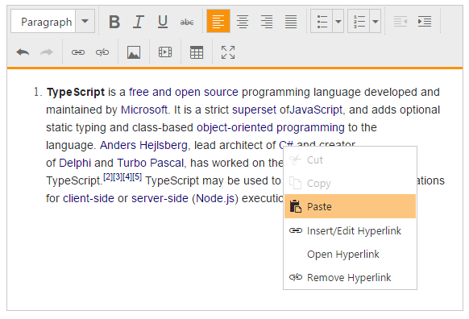

# Context Menu 

Editor provides custom context menu support, which enables more interaction on the content modification and also it can be enabled dynamically. The showContextMenu property helps to enable custom context menu within editor area.
Based on the target content type context menu provides different actions. Refer the details with below table.



@{Html.EJ().RTE("rteSample").Width("800px").ContentTemplate(@

    The Rich Text Editor
    (RTE) control is an easy to render in client side. Customer easy to edit the contents
    and get the HTML content for the displayed content. A rich text editor control provides
    users with a toolbar that helps them to apply rich text formats to the text entered
    in the text area.

)
.ShowContextMenu(true)
.Render();}



* Based on the target content type ContextMenu provides different actions- refer the details with below table.

<table>
<tr>
<td>
Content-Type
</td>
<td>
Supported Actions 
</td>
</tr>
<tr>
<td>
Text content
</td>
<td>
cut, copy, paste, add/edit/open/remove hyperlink.
</td>
</tr>
<tr>
<td>
Image content
</td>
<td>
cut, copy, paste, image properties.
</td>
</tr>
<tr>
<td>
Table content
</td>
<td>
cut, copy, paste, insert row/column, remove row/column/table, edit table properties, add/edit/open/remove hyperlink.
</td>
</tr>
</table>

N> We have given support to own context menu by restricting the default browser context menu, which provides you the options for quick access but, with that clipboard action are restricted based on browser behavior.  

However we can disable the context menu by using ShowContextMenu API and it needs to be set as false, if you wish to continue with default browser context menu.

## Adding an item with the context menu

To add a new item to the editor ContextMenu, you need to use the ‘[insertMenuOption’](http://help.syncfusion.com/js/api/ejrte#methods:insertMenuOption "") method and in order to handle the ContextMenu item click using the ‘[contextMenuClick](http://help.syncfusion.com/js/api/ejrte#events:contextMenuClick "")’ client side-event.



@{Html.EJ().RTE("rteSample").Width("800px").ContentTemplate(@

    The Rich Text Editor
    (RTE) control is an easy to render in client side. Customer easy to edit the contents
    and get the HTML content for the displayed content. A rich text editor control provides
    users with a toolbar that helps them to apply rich text formats to the text entered
    in the text area.

)
.ShowContextMenu(true)
.Render();}



## Removing an item from the context menu

To remove a menu-item from the editor ContextMenu, you have to use the ‘removeMenuOption’ method from the ejRTE object and find the method and parameter details with the [API-document](http://help.syncfusion.com/js/api/ejrte#methods:removeMenuOption "").



@{Html.EJ().RTE("rteSample").Width("800px").ContentTemplate(@

    The Rich Text Editor
    (RTE) control is an easy to render in client side. Customer easy to edit the contents
    and get the HTML content for the displayed content. A rich text editor control provides
    users with a toolbar that helps them to apply rich text formats to the text entered
    in the text area.

)
.ShowContextMenu(true)
.Render();}

 



