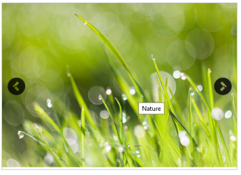
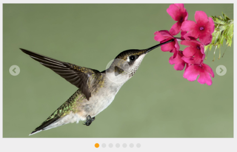
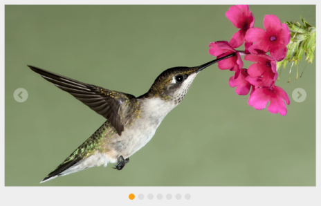
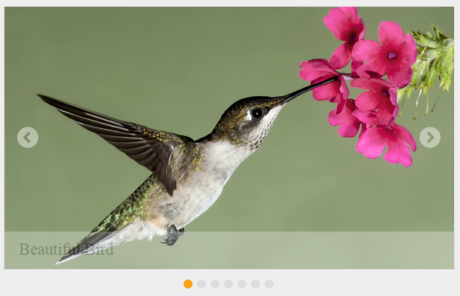

# Behavior settings

## Enabling rotator

Enabled property is a Boolean type, which allow us to enables or disable the Rotator control. The default value is ‘true’. You can specify the property Enabled in the script as follows.



@Html.EJ().Rotator("slidercontent").Datasource((IEnumerable<Localdata>)ViewBag.datasource)
.RotatorFields(t => t.Text("Text").Url("Url"))
.SlideWidth("600px").SlideHeight("350px").Enabled(false)



The following banner displaying as output.

## Responsive rotator

### IsResponsive

IsResponsive property is Boolean type, which allow us to resizes the Rotator when the browser window is resized. The default value is ‘false’. You can specify the property IsResponsive in the script as follows.



@Html.EJ().Rotator("slidercontent").Datasource((IEnumerable<Localdata>)ViewBag.datasource)
.RotatorFields(t => t.Text("Text").Url("Url")).SlideWidth("600px")
.SlideHeight("350px").IsResponsive(true)



## EnableAutoPlay

The Rotator Items continuously rotate without user interference by enable the EnableAutoPlay property. The default value is ‘false’. The value set to this property is Boolean. You can specify the property EnableAutoPlay in the script as follows.



@Html.EJ().Rotator("slidercontent").Datasource((IEnumerable<Localdata>)ViewBag.datasource)
.RotatorFields(t => t.Text("Text").Url("Url")).SlideWidth("600px")
.SlideHeight("350px").EnableAutoPlay(true)



## StopOnHover

StopOnHover property is Boolean type, which allow us to pause the auto play while hover on the Rotator content. The default value is ‘false’. You can specify the property StopOnHover in the script as follows.



/ / Add this code in your CSHTML page and refer local data section for binding Rotator items.

@Html.EJ().Rotator("slidercontent").Datasource((IEnumerable<Localdata>)ViewBag.datasource)
.RotatorFields(t => t.Text("Text").Url("Url")).SlideWidth("600px")
.SlideHeight("350px").EnableAutoPlay(true).StopOnHover(true)



## Pager settings

### PagerPosition

This property specifies the position of the Pager in the Rotator Item. The default value is ‘Outside’. This property is only applicable when ShowPager property is set true. The value set to the PagerPosition property is string or enum. 

* Syncfusion.JavaScript.PagerPosition.BottomLeft
* Syncfusion.JavaScript.PagerPosition.BottomRight
* Syncfusion.JavaScript.PagerPosition.Outside
* Syncfusion.JavaScript.PagerPosition.TopCentre
* Syncfusion.JavaScript.PagerPosition.TopLeft
* Syncfusion.JavaScript.PagerPosition.TopRight

You can specify the property PagerPosition in the script as follows.



/ / Add this code in your CSHTML page and refer local data section for binding Rotator items.

@Html.EJ().Rotator("slidercontent").Datasource((IEnumerable<Localdata>)ViewBag.datasource)
.RotatorFields(t => t.Text("Text").Url("Url"))
.SlideWidth("600px").SlideHeight("350px")
.PagerPosition(Syncfusion.JavaScript.PagerPosition.TopLeft)



## ShowPager

This property turns on or off the pager support in the Rotator control. The Pager is used to navigate the Rotator Items. The default value is ‘true’. The value set to this property is Boolean. 



/ / Add this code in your CSHTML page and refer local data section for binding Rotator items.

@Html.EJ().Rotator("slidercontent").Datasource((IEnumerable<Localdata>)ViewBag.datasource)
.RotatorFields(t => t.Text("Text").Url("Url")).SlideWidth("600px")
.SlideHeight("350px").ShowPager(false)



## Show options

### ShowPlayButton

ShowPlayButton property is Boolean type which allow us to enable play / pause button on Rotator. The default value of ShowPlayButton is ‘false’. 



/ / Add this code in your CSHTML page and refer local data section for binding Rotator items.

@Html.EJ().Rotator("slidercontent").Datasource((IEnumerable<Localdata>)ViewBag.datasource).RotatorFields(t => t.Text("Text").Url("Url")).SlideWidth("600px").SlideHeight("350px").ShowPlayButton(true)



## ShowNavigateButton

This property turns on or off the slide buttons (next and previous) in the Rotator Items. Slide buttons are used to navigate the Rotator Items. The default value is ‘false’. The value set to this property is Boolean. 



/ / Add this code in your CSHTML page and refer local data section for binding Rotator items.

@Html.EJ().Rotator("slidercontent").Datasource((IEnumerable<Localdata>)ViewBag.datasource)
.RotatorFields(t => t.Text("Text").Url("Url"))
.SlideWidth("600px").SlideHeight("350px").ShowNavigateButton(true)



## ShowCaption

When the Rotator Item is an image, you can specify a caption for the Rotator Item. The caption text for each Rotator Item is shown by using ShowCaption property. This property is Boolean type, which allow us to Show or Hide the Caption about Images on bottom of Image. The caption cannot be displayed when multiple Rotator Items are present. The default value is ‘false’. 



/ / Add this code in your CSHTML page and refer local data section for binding Rotator items.

@Html.EJ().Rotator("slidercontent").Datasource((IEnumerable<Localdata>)ViewBag.datasource)
.RotatorFields(t => t.Text("Text").Url("Url")).SlideWidth("600px")
.SlideHeight("350px").ShowCaption(true)



