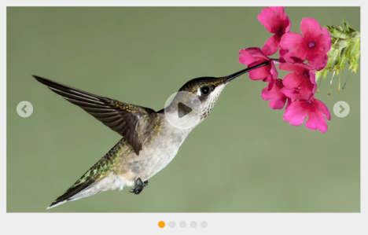
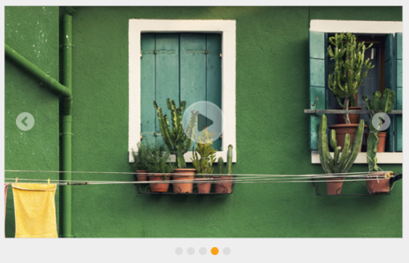

# Getting Started

This section explains briefly about how to create a Rotator in your ASP.NET MVC application.

## Create your first Rotator in MVC

ASP.NET MVC Rotator provides support to display the provided number of images within your web page in a rotating manner. Refer the following guidelines to create a Rotator widget for a real-time website banner scenario that has five images that slide automatically. When you click the center button, images slide in a rotating manner and on second click, the rotation stops.

The following screenshot illustrates a Rotator widget.

Rotator
{:.caption}

## Create a Rotator

Essential Studio ASP.NET MVCRotator widget has built-in features such as unobtrusive and flexible APIs. You can easily create the Rotator widget using simple HTML helper as follows.

1. Create a MVC Project and add necessary assemblies, styles, and scripts to it.

   Refer [MVC-Getting Started](http://help.syncfusion.com/aspnetmvc/rotator/getting-started).
   
2. Add the following code example to the corresponding view page to render Rotator. Move the images under the folder ~/Images/rotator.

   ~~~ cshtml

	

		@{Html.EJ().Rotator("content").Items(item =>

		{

			item.Add().ContentTemplate(@

			

			
);

			item.Add().ContentTemplate(@

			

			 

			
);

			item.Add().ContentTemplate(@

			

			
);

			item.Add().ContentTemplate(@

			

			
);

			item.Add().ContentTemplate(@

			

			
);

		}) .SlideWidth("600px").SlideHeight("350px").ShowPlayButton(true).Render();}

	

   ~~~
   

3. The following banner is displayed as output.

	