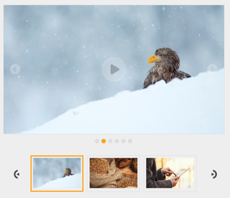

# Keyboard interaction

The AllowKeyboardNavigation property turns on keyboardinteraction with the Rotator items. You must set this property to ‘true’ to access the keyboard shortcuts. The default value is ‘true’. The value set to this property is Boolean.

The entire Rotator commands are accessed through the keyboard by specifying the KeyboardShortcut in the following table.

<table>
<tr>
<th>
Keyboard Shortcut</th><th>
Function</th></tr>
<tr>
<td>
Alt + j</td><td>
Focuses the control</td></tr>
<tr>
<td>
Up/ Right</td><td>
Move to next slide</td></tr>
<tr>
<td>
Down/Left</td><td>
Move to previous slide.</td></tr>
<tr>
<td>
Space</td><td>
Move to Play/Pause slide.</td></tr>
<tr>
<td>
Alt + Right</td><td>
Move thumbnail item to right and select item.</td></tr>
<tr>
<td>
Alt + Left</td><td>
Move thumbnail item to left and select item.</td></tr>
<tr>
<td>
Enter</td><td>
Selected the thumbnail item</td></tr>
</table>

You can refer the following code example for keyboard navigation.


    // Add this code in your CSHTML page and refer local data section for binding Rotator items.
	<ul id="slide" style="display: none">    
		<li>  </li>    
		<li>  </li>    
		<li>  </li>    
		<li>  </li>    
		<li>        </li>    
		<li>        </li>
	</ul>
	
	@Html.EJ().Rotator("slidercontent").Items(itemElement =>  { 
	
	itemElement.Add().ContentTemplate(@
  
);                           
	itemElement.Add().ContentTemplate(@
   
);                           
	itemElement.Add().ContentTemplate(@
   
);                           
	itemElement.Add().ContentTemplate(@
  
);                           
	itemElement.Add().ContentTemplate(@
  
);                           
	itemElement.Add().ContentTemplate(@
  
);})
	
	.SlideWidth("600px").SlideHeight("350px")
	.ShowThumbnail(true).ThumbnailSourceID("slide")
	.AllowKeyboardNavigation(true).ShowPlayButton(true)  
	

	




Run the above sample, we get the output like this,

