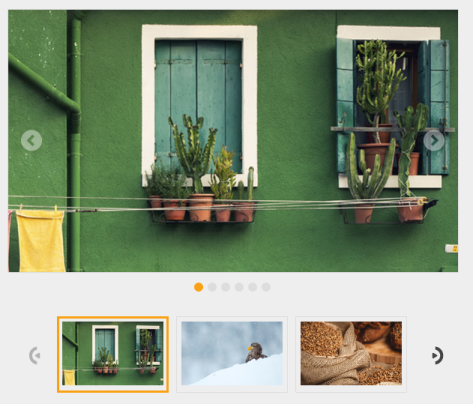

## Thumbnail 

This feature implements Thumbnail in Rotator control. You can view or access any of the Rotator items instantly. All the images are given as Thumb Element to use this feature. 

The property ShowThumbnail is Boolean type, which allow us to Show or Hide the Thumbnail in Rotator control. Thumbnail is used to navigate between slides. Thumbnail supports only single slide transition. You must specify the source for thumbnail elements through the ThumbnailSourceID property. The default value is ‘false’.

The property ThumbnailSourceID specifies the source for thumbnail elements. The default value is null. The value set to this property is object. 

You can refer the following code example of Thumbnail in Rotator.

[CSHTML]

&lt;ul id="slide" style="display: none"&gt;

    &lt;li&gt;

        &lt;img src="@Url.Content("~/Images/rotator/green.jpg")" title="Green" /&gt;&lt;/li&gt;

    &lt;li&gt;

        &lt;img src="@Url.Content("~/Images/rotator/snow.jpg")" title="Snow" /&gt;&lt;/li&gt;

    &lt;li&gt;

        &lt;img src="@Url.Content("~/Images/rotator/wheat.jpg")" title="Wheat" /&gt;&lt;/li&gt;

    &lt;li&gt;

        &lt;img src="@Url.Content("~/Images/rotator/tablet.jpg")" title="Tablet" /&gt;&lt;/li&gt;

    &lt;li&gt;

        &lt;img src="@Url.Content("~/Images/rotator/sea.jpg")" title="Sea" /&gt;&lt;/li&gt;

    &lt;li&gt;

        &lt;img src="@Url.Content("~/Images/rotator/bread.jpg")" title="Bread" /&gt;&lt;/li&gt;

&lt;/ul&gt;

@Html.EJ().Rotator("slidercontent").Items(itemElement =>

                       {

                           itemElement.Add().ContentTemplate(@&lt;div&gt;

                               &lt;img class="image" src="@Url.Content("~/Images/rotator/green.jpg")" /&gt;

                           &lt;/div&gt;);

                           itemElement.Add().ContentTemplate(@&lt;div&gt;

                               &lt;img class="image" src="@Url.Content("~/Images/rotator/snow.jpg")"/&gt;

                           &lt;/div&gt;);

                           itemElement.Add().ContentTemplate(@&lt;div&gt;

                               &lt;img class="image" src="@Url.Content("~/Images/rotator/wheat.jpg")" /&gt;

                           &lt;/div&gt;);

                           itemElement.Add().ContentTemplate(@&lt;div&gt;

                               &lt;img class="image" src="@Url.Content("~/Images/rotator/tablet.jpg")" /&gt;

                           &lt;/div&gt;);

                           itemElement.Add().ContentTemplate(@&lt;div&gt;

                               &lt;img class="image" src="@Url.Content("~/Images/rotator/sea.jpg")" /&gt;

                           &lt;/div&gt;);

                           itemElement.Add().ContentTemplate(@&lt;div&gt;

                               &lt;img class="image" src="@Url.Content("~/Images/rotator/bread.jpg")" /&gt;

                           &lt;/div&gt;);

                       }).SlideWidth("600px").SlideHeight("350px").ShowThumbnail(true).ThumbnailSourceID("slide")          

{  | markdownify }
{:.image }

