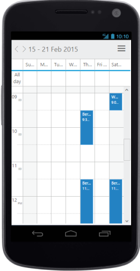
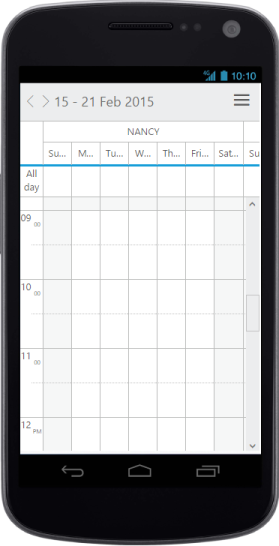
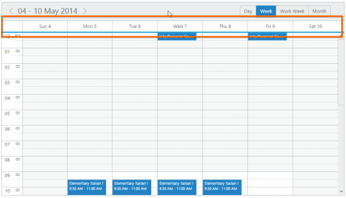
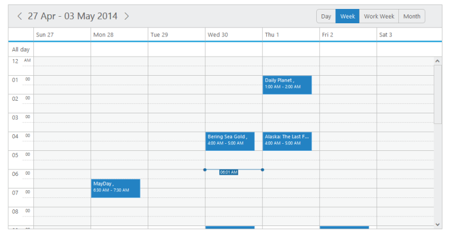
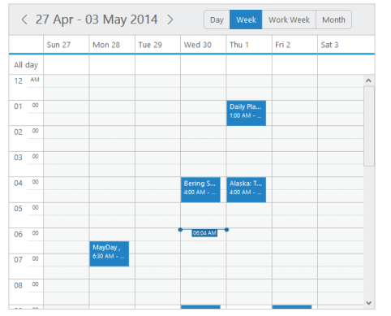
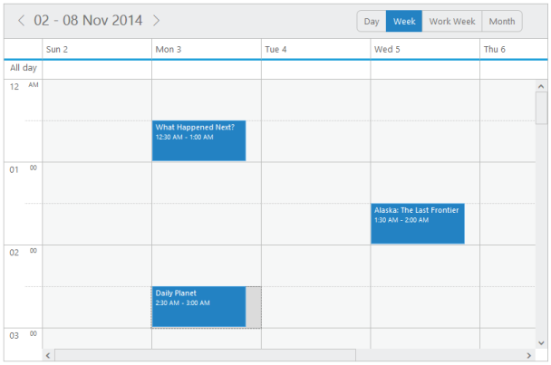
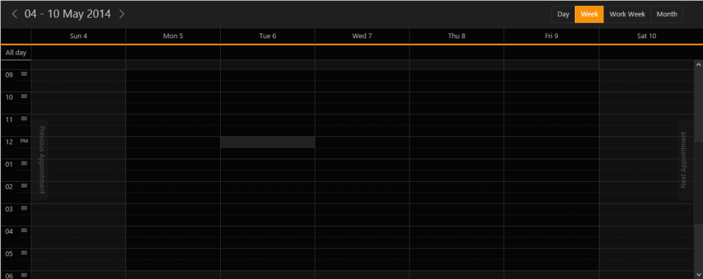

## Appearance and Styling

Adaptive Schedule

* The Schedule control has been provided with the built-in support for adaptive functionality. With this behaviour enabled, the Schedule control can be accessed in any of the mobile devices as per the screen size. 
* To enable the adaptive layout of the Schedule control, it is necessary to set the property isResponsive to True. By default, it is set to false. 
* When the isResponsive property is set to true, the Schedule control automatically chooses the appropriate rendering method to display it either on the mobile or desktop mode, based on the screen size it is rendered. Except the horizontal mode orientation, all the other default functionalities of the Schedule control are supported in this feature. 

Dependencies

For Adaptive Schedule, you can refer to the following css file in the application that can be downloaded from the link,

[http://www.syncfusion.com/downloads/support/directtrac/general/Responsive.zip](http://www.syncfusion.com/downloads/support/directtrac/general/Responsive.zip)

[MVC]

[razor]

@(Html.EJ().Schedule("AdaptiveSchedule")

.Width(“100%")

.Height("500px")

.IsResponsive(true)

.AppointmentSettings(eve=>eve.DataSource((IEnumerable)ViewBag.dataSource)

.Id("Id")

.Subject("Subject")

.StartTime("StartTime")

.EndTime("EndTime")

.Description("Description")

.AllDay("AllDay")

.Recurrence("Recurrence")

.RecurrenceRule("RecurrenceRule"))

)

[Controller]

// follow the code as same as declared in Read Only part

{  | markdownify }
{:.image }

{  | markdownify }
{:.image }

* [Click here](http://mvc.syncfusion.com/demos/web/schedule/adaptive) to see the__working of__Adaptive Schedule.

Show/Hide All Day Show 

* The all-day cells row in the Schedule control can be displayed or hidden from the user. When the showAllDayRow is set to false, the allday row is hidden from the user.
*  By default, this property is set to true.The following code example explains how to use the showAllDayRow property of the Schedule control.  

[Razor]

@(Html.EJ().Schedule("Schedule1")

.Width("100%")

.Height("525px")

// Disables showAllDayRow property to the schedule

.CurrentDate(new DateTime(2014,5,12))

.ShowAllDayRow(false)

.AppointmentSettings(fields => fields.Datasource(ViewBag.datasource)

.Id("Id")

.Subject("Subject")

.StartTime("StartTime")

.EndTime("EndTime")

.AllDay("AllDay")

.Recurrence("Recurrence")

.RecurrenceRule("RecurrenceRule"))

)

The following screenshot displays the Schedule control with all-day row hidden,

{  | markdownify }
{:.image }

_Figure 2: Schedule with disabled all day row_

Adjust Schedule Size

Height

* The height of the Schedule control is handled using the height property that accepts only the pixel values.
* By default, the Schedule control is set with the height of 800px.

The following code eample explains how to change the height of the Schedule control.  

[Razor]

@(Html.EJ().Schedule("Schedule1")

.Width("100%")

.Height("500px")

.AppointmentSettings(fields => fields.Datasource(ViewBag.datasource)

.Id("Id")

.Subject("Subject")

.StartTime("StartTime")

.EndTime("EndTime")

.AllDay("AllDay")

.Recurrence("Recurrence")

.RecurrenceRule("RecurrenceRule"))

)

The following screenshot displays the Schedule control with the height set to “500px”. 

{  | markdownify }
{:.image }

   _Figure_ _111__:  Adjusting schedule size height._

width

* The width of the Schedule control is handled with the width property that accepts both the pixel values as well as percentage values. 
* By default, the schedule control is set with the width of 800px.

The following code example explains how to change the width of the Schedule control,  

[Razor]

@(Html.EJ().Schedule("Schedule1")

.Width("600px")

.Height("500px")

.AppointmentSettings(fields => fields.Datasource(ViewBag.datasource)

.Id("Id")

.Subject("Subject")

.StartTime("StartTime")

.EndTime("EndTime")

.AllDay("AllDay")

.Recurrence("Recurrence")

.RecurrenceRule("RecurrenceRule"))

)

&lt;/head&gt;

The following screenshot displays the Schedule control with the width set to “600px”.

{  | markdownify }
{:.image }

   _Figure_ _112__:  Adjusting schedule size width_

Adjust Cell Size

* The size of the cells within the Schedule control can be customized with two of the available options, cellWidth and cellHeight. 
* In order to view the appointments more clearly within the schedule control, you can enhance the height and width of the cells using these options.

cellHeight

* The cell height of the Schedule control is handled with the cellHeight property that accepts only the pixel values.

cellWidth

* The cell width of the Schedule control is handled with the cellWidth property that accepts only the pixel values.

The following code example explains how to change the cell height and width of the Schedule control.  

[Razor]

// Setting the cell height and width of the schedule

@(Html.EJ().Schedule("Schedule1")

.Width("100%")

.Height("525px")

.CellHeight("60px")

.CellWidth("160px")

.CurrentDate(new DateTime(2014,5,2))

.AppointmentSettings(fields => fields.Datasource(ViewBag.datasource)

.Id("Id")

.Subject("Subject")

.StartTime("StartTime")

.EndTime("EndTime")

.AllDay("AllDay")

.Recurrence("Recurrence")

.RecurrenceRule("RecurrenceRule"))

)

The following screenshot displays the Schedule control with the cell width set to “160px” and cell height set to “60px”.

{  | markdownify }
{:.image }

Theme

* Schedule control’s style and appearance is controlled based on CSS classes. In order to apply styles to the Schedule control, you are required to refer 2 files namely, ej.widgets.core.min.css and ej.theme.min.css. 
* When the ej.widgets.all.min.css fileis referred, it is not necessary to include the ej.widgets.core.min.css and ej.theme.min.css files in your project as ej.widgets.all.min.css is the combination of these two files. 
* By default, there are 12 theme support available for Schedule control namely,
1. default-theme
2. flat-azure-dark
3. fat-lime
4. flat-lime-dark
5. flat-saffron
6. flat-saffron-dark
7. gradient-azure
8. gradient-azure-dark
9. gradient-lime
10. gradient-lime-dark
11. gradient-saffron
12. gradient-saffron-dark

Replace the following code in Layout file -> View page to apply different theme to schedule control.

&lt;link href="http://cdn.syncfusion.com/13.1.0.21/js/web/flat-saffron-dark/ej.web.all.min.css" rel="stylesheet" /&gt; &lt;!—this is CDN Link  --&gt;

&lt;!—You can replace the highlighted theme with any one of the above mentiond 12 themes--&gt;

The schedule control will render as follows

{  | markdownify }
{:.image }

Show/Hide Header Bar

In the Schedule control, you can show/hide the header bar by using the showHeaderBar property. By default, this property is set to true and when it is set to false, the Schedule control is rendered without the date and view navigation options.

The following code example explains on how to use the showHeaderBar property.

@(Html.EJ().Schedule("Schedule1")

        .Width("100%")

        .Height("525px")

        .CurrentDate(new DateTime(2014,5,12))

        //Diables the showHeaderBar property to the schedule 

.ShowHeaderBar(false)

        .AppointmentSettings(fields => fields.Datasource((IEnumerable)ViewBag.datasource)

            .Id("Id")

            .Subject("Subject")

            .StartTime("StartTime")

            .EndTime("EndTime")

            .AllDay("AllDay")

            .Recurrence("Recurrence")

            .RecurrenceRule("RecurrenceRule"))

        )

The following screenshot displays the Schedule control with the hidden header bar. 

{  | markdownify }
{:.image }

_Schedule with header bar hidden_

