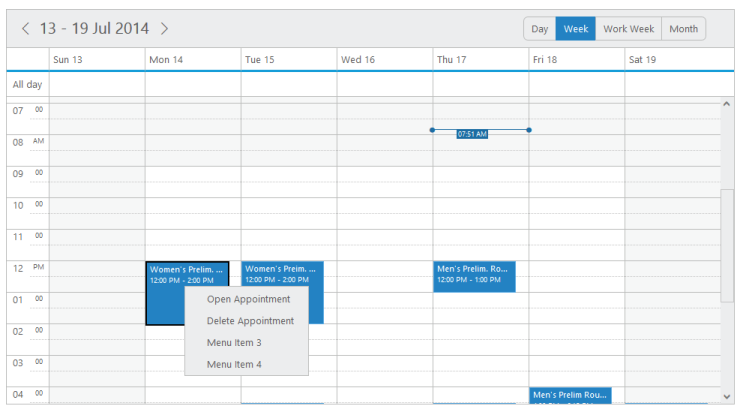
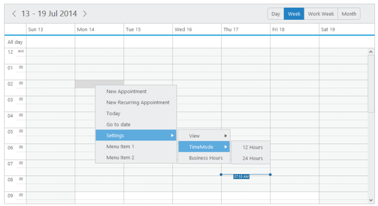

## Context Menu

* Schedule control is added with the context menu options that opens when you right-click over the cells or appointments. In addition to the default menu items available, it allows you to add the custom menu items and also the sub menu-items as per your requirement.

contextMenuSettings

* It is a collection that holds the menu items data.

enable

* It specifies whether to enable/disable the Context menu options.

menuItems

* It holds the appointment and cell related menu and custom-menu options.

appointment

* This collection accepts the id, text and parent Id of the menu items that are to be displayed when you right-click the appointments. It can also include custom-menu items.

cells

* This collection accepts the id, text and parent Id of the menu items that are to be displayed when you right-click the Schedule cells. It  also include custom-menu items.

Appointment Menu Items

* By default, the appointment menu options are provided with 2 items namely Open Appointment and Delete Appointment. 
* If you want to customize and use your own custom menu items, then you can replace the appointment menu items with their desired collections as explained in the following code.

<table>
<tr>
<td>
[Razor]@(Html.EJ().Schedule("Schedule1").Width("100%").Height("525px").CurrentDate(new DateTime(2014,4,1  ))// Custom context menu items.ContextMenuSettings(menu=>menu.Enable(true).MenuItems(item=>item.Cells(ViewBag.cell).Appointment(ViewBag.app))).AppointmentSettings(fields => fields.Datasource(ViewBag.datasource).Id("Id").Subject("Subject").StartTime("StartTime").EndTime("EndTime").AllDay("AllDay").Recurrence("Recurrence").RecurrenceRule("RecurrenceRule")))</td></tr>
<tr>
<td>
[Controller]namespace MVCSampleBrowser.Controllers{public partial class ScheduleController : Controller{//// GET: /Default/public ActionResult ContextMenu(){List<Appointment> appointment = new List<Appointment>();appointment.Add(new Appointment() { Id = "open", Text = "Open Appointment" });appointment.Add(new Appointment() { Id = "delete", Text = "Delete Appointment" });appointment.Add(new Appointment() { Id = "custommenu3", Text = "Custom Menu3" });appointment.Add(new Appointment() { Id = "custommenu4", Text = "Custom Menu4" });List<person> persons = new List<person>();persons.Add(new person() { Id = 100, Subject = "product meeting", StartTime = new DateTime(2014, 4, 1, 1, 0, 20), EndTime = new DateTime(2014, 4, 1, 5, 0, 20), AllDay = false, Recurrence = false, RecurrenceRule = "FREQ=WEEKLY;COUNT=10;INTERVAL=1;BYDAY=MO,TU,WE,TH,FR,SA,SU" });persons.Add(new person() { Id = 101, Subject = "conference meeting", StartTime = new DateTime(2014, 4, 1, 6, 0, 20), EndTime = new DateTime(2014, 4, 1, 7, 0, 20), AllDay = false, Recurrence = false, RecurrenceRule = "FREQ=WEEKLY;COUNT=10;INTERVAL=1;BYDAY=MO,TU" });persons.Add(new person() { Id = 102, Subject = "New Meeting ", StartTime = new DateTime(2014, 4, 3, 4, 0, 20), EndTime = new DateTime(2014, 4, 3, 7, 0, 20), AllDay = false, Recurrence = false, RecurrenceRule = "FREQ=WEEKLY;COUNT=10;INTERVAL=1;BYDAY=MO,TU" });persons.Add(new person() { Id = 103, Subject = "New Meeting ", StartTime = new DateTime(2014, 4, 5, 6, 0, 20), EndTime = new DateTime(2014, 4, 5, 7, 0, 20), AllDay = false, Recurrence = false, RecurrenceRule = "FREQ=WEEKLY;COUNT=1;INTERVAL=1;BYDAY=MO,TU" });ViewBag.dataSource = persons;ViewBag.app = appointment;return View();}Public class person{Public int Id;Public string Subject;Public DateTime StartTime;Public DateTime EndTime;Public bool AllDay;Public bool Recurrence;Public string RecurrenceRule;}}}</td></tr>
</table>

Execute the above code to render the following output.

{  | markdownify }
{:.image }

 _Figure_ _98__:  schedule with appointment menu items_

Categorize 

* A new default menu item is included in the appointment menu items to support the categorize option through context menu. 
* The categorize data collection that are passed through the categorizesettings is utilised in rendering the categorize options in the context menu. 

You can refer the following code example to render the categorize options in the context menu.

[Razor]

@(Html.EJ().Schedule("Schedule1")

.CategorizeSettings(Fields=>Fields.Datasource((IEnumerable)ViewBag.categorize).Enable(true).AllowMultiple(true).Id("id").Text("text").Color("color").FontColor("fontColor"))

.ContextMenuSettings(menu=>menu.Enable(true).MenuItems(item=>item.Cells(            ViewBag.app)))

.AppointmentSettings(fields => fields.Datasource((IEnumerable)ViewBag.datasource)

.Id("Id")

.Subject("Subject")

.StartTime("StartTime")

.EndTime("EndTime")

.AllDay("AllDay")

.Recurrence("Recurrence")

.RecurrenceRule("RecurrenceRule")

// bind the resource id fields collection of each level

.Categorize("Categorize"))

)

[controller]

public partial class ScheduleController : Controller

{

public ActionResult CategorizeOption()

{

List<Appointment> appointment = new List<Appointment>();

appointment.Add(new Appointment() { Id = "open", Text = "Open Appointment" });

appointment.Add(new Appointment() { Id = "delete", Text = "Delete Appointment" });

appointment.Add(new Appointment() { Id = "categorize", Text = "Categorize" });

// categorize data collection

List<Categorize> CategorizeValue = new List<Categorize>();

CategorizeValue.Add(new Categorize { text = "Blue Category", id = 1, color = "#7499e1", fontColor = "Red" });

CategorizeValue.Add(new Categorize { text = "Green Category", id = 2, color = "#7cce6e", fontColor = "White" });

CategorizeValue.Add(new Categorize { text = "Orange Category", id = 3, color = "#ffaa00", fontColor = "Green" });

var DataSource = new ScheduleDataDataContext().DefaultSchedules.ToList();

ViewBag.datasource = DataSource;

ViewBag.app = appointment;

ViewBag.categorize = CategorizeValue;

return View();

}

public class Categorize

{

public string text { set; get; }

public int id { set; get; }

public string fontColor { set; get; }

public string color { set; get; }

}

}

* Execute the above code to render the following output with categorized appointments. Also when you right click “Appointment”, the context menu with categorize option is displayed as follows.

{  | markdownify }
{:.image }

Cells 

* By default, the cells menu options are provided with 5 items namely New Appointment, New Recurring Appointment, Today, Go to Date and Settings with sub-options for views, time-mode and highlighting business hours. 
* You can customize and use your own custom menu itemsby replacing the cell menu items with the desired collection as explained in the following code example.

<table>
<tr>
<td>
[Razor]@section SampleHeading{&lt;span class="sampleName"&gt; Schedule / Context Menu}@section ControlsSection{&lt;div&gt;@{}@(Html.EJ().Schedule("Schedule1").Width("100%").Height("525px").CurrentDate(new DateTime(2014,4,1  ))// Custom context menu items.ContextMenuSettings(menu=>menu.Enable(true).MenuItems(item=>item.Cells(ViewBag.cell)).AppointmentSettings(fields => fields.Datasource((IEnumerable)ViewBag.datasource).Id("Id").Subject("Subject").StartTime("StartTime").EndTime("EndTime").AllDay("AllDay").Recurrence("Recurrence").RecurrenceRule("RecurrenceRule")))}&lt;/div&gt;</td></tr>
<tr>
<td>
[Controller]namespace MVCSampleBrowser.Controllers{public partial class ScheduleController : Controller{//// GET: /Default/public ActionResult ContextMenu(){List<Cells> cells = new List<Cells>();cells.Add(new Cells() { Id = "new", Text = "New Appointment" });cells.Add(new Cells() { Id = "recurrence", Text = "New Recurring Appointment" });cells.Add(new Cells() { Id = "today", Text = "Today" });cells.Add(new Cells() { Id = "gotodate", Text = "Go to date" });cells.Add(new Cells() { Id = "settings", Text = "Settings" });cells.Add(new Cells() { Id = "view", Text = "View", ParentId = "settings" });cells.Add(new Cells() { Id = "timemode", Text = "TimeMode", ParentId = "settings" });cells.Add(new Cells() { Id = "view_Day", Text = "Day", ParentId = "view" });cells.Add(new Cells() { Id = "view_Week", Text = "Week", ParentId = "view" });cells.Add(new Cells() { Id = "view_Workweek", Text = "Workweek", ParentId = "view" });cells.Add(new Cells() { Id = "view_Month", Text = "Month", ParentId = "view" });cells.Add(new Cells() { Id = "timemode_Hour12", Text = "12 Hours", ParentId = "timemode" });cells.Add(new Cells() { Id = "timemode_Hour24", Text = "24 Hours", ParentId = "timemode" });cells.Add(new Cells() { Id = "businesshours", Text = "Business Hours", ParentId = "settings" });cells.Add(new Cells() { Id = "custommenu1", Text = "Custom Menu1" });cells.Add(new Cells() { Id = "custommenu2", Text = "Custom Menu2" });List<person> persons = new List<person>();persons.Add(new person() { Id = 100, Subject = "product meeting", StartTime = new DateTime(2014, 4, 1, 1, 0, 20), EndTime = new DateTime(2014, 4, 1, 5, 0, 20), AllDay = false, Recurrence = false, RecurrenceRule = "FREQ=WEEKLY;COUNT=10;INTERVAL=1;BYDAY=MO,TU,WE,TH,FR,SA,SU" });persons.Add(new person() { Id = 101, Subject = "conference meeting", StartTime = new DateTime(2014, 4, 1, 6, 0, 20), EndTime = new DateTime(2014, 4, 1, 7, 0, 20), AllDay = false, Recurrence = false, RecurrenceRule = "FREQ=WEEKLY;COUNT=10;INTERVAL=1;BYDAY=MO,TU" });persons.Add(new person() { Id = 102, Subject = "New Meeting ", StartTime = new DateTime(2014, 4, 3, 4, 0, 20), EndTime = new DateTime(2014, 4, 3, 7, 0, 20), AllDay = false, Recurrence = false, RecurrenceRule = "FREQ=WEEKLY;COUNT=10;INTERVAL=1;BYDAY=MO,TU" });persons.Add(new person() { Id = 103, Subject = "New Meeting ", StartTime = new DateTime(2014, 4, 5, 6, 0, 20), EndTime = new DateTime(2014, 4, 5, 7, 0, 20), AllDay = false, Recurrence = false, RecurrenceRule = "FREQ=WEEKLY;COUNT=1;INTERVAL=1;BYDAY=MO,TU" });ViewBag.dataSource = persons;ViewBag.cell = cells;return View();}}}</td></tr>
</table>

Execute the above code to render the following output when you right-click on the cells.

{  | markdownify }
{:.image }

 _Figure_ _100__:  schedule with cells._

