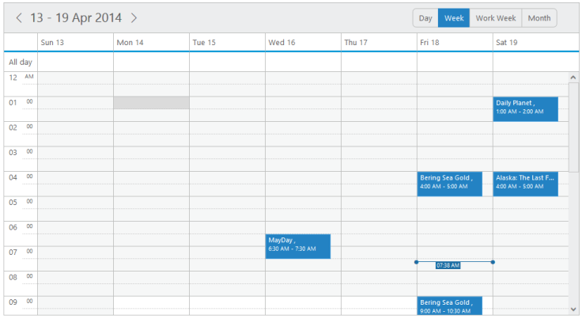
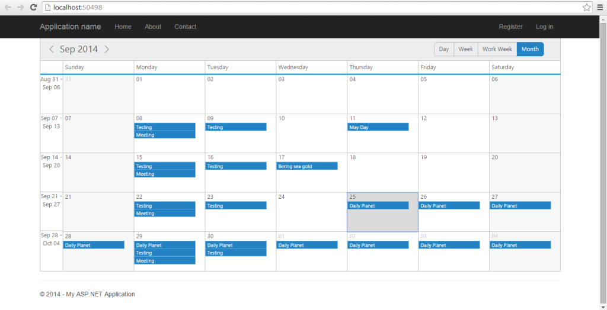

# Data-binding

* To render appointments to the Schedule control, you are required to bind the appointment data. The following sub-properties helps you to bind either the local/remote data to the Schedule control by binding the appropriate appointment data fields to the corresponding options.

### dataSource

* This property assigns the local json data or remote (url binding) data to the Schedule control.

### query 

* It accepts the data of object type, which is usually the query string to fetch the required data from a specific table based on certain condition. As this property is optional, it is not specified. 

The entire records that are initially assigned through dataSource is taken into consideration.

### tableName

* It maps the corresponding name of the table from the location and the records are fetched to the Schedule control. As this property is optional, it is not specified. It takes the default dataSource into consideration. 

### id

* It maps the corresponding id field name from the data table or json data that is assigned to the dataSource with the id property of the Schedule control. The id value that is fetched from the table is unique for each appointment.

### subject

* It maps the corresponding subject field name from the data table or json data that is assigned to the dataSource with the subject property of the Schedule control. The Subject field denotes the appointment subject and it accepts the value of string type.

### description

* It maps the corresponding description field name from the data table or json data that is assigned to the dataSource with the description property of the Schedule control. The description field is used to save more information related to the appointments. It accepts the value of string type.

### startTime

* It maps the corresponding start time field name from the data table or json data that is assigned to the dataSource with the startTime property of the Schedule control. The startTime denotes the starting time of the appointment and it accepts the value of type dateTime.

### endTime

* It maps the corresponding end time field name from the data table or json data that is assigned to the dataSource with the endTime property of the Schedule control. The endTime denotes the ending time of the appointment and it accepts the dateTime values from the database.

### recurrence

* It maps the corresponding recurrence field name from the data table or json data that is assigned to the dataSource with the recurrence property of the Schedule control. This field determines whether the appointment is  normal or recurrence type. It accepts the Boolean type value either true/false. 

### recurrenceRule

* It maps the corresponding recurrence rule field name from the data table or json data that is assigned to the dataSource with the recurrenceRule property of the Schedule control. This field defines the recurrence repeat string and accepts the string value.

### allDay

* It maps the corresponding all day field name from the data table or json data that is assigned to the dataSource with the allDay property of the Schedule control. This field determines whether the appointment is created for the whole day or not. It accepts the Boolean value and when it is true, the appointment is created as an allday appointment in the Schedule control.

### resourceFields

* It accepts the resource related field names as a string separated by a comma separator. When multiple resources are rendered on a Schedule control with multiple categories, then the name availed for each resource level is binded.

### categorize

* It maps the corresponding categorize field name from the data table or JSON data, to the categorize property of the Schedule control.

### startTimeZone

* It maps the corresponding start timezone field name from the data table or json data that is assigned to the Schedule dataSource. The startTimeZone denotes the timeZone of the appointment start time and accepts the value of type string.

### endTimeZone

* It maps the corresponding end timezone field name from the data table or json data that is assigned to the Schedule dataSource. The endTimeZone denotes the timeZone of the appointment end time and accepts the value of type string.

### Daylight Saving Time

The Schedule control provides support to observe the Daylight Saving Time (DST), so thatthe users in the regions with summer-time adjust the clocks forward one hour close to the start of spring or adjust them backward in the autumn to standard time. In Schedule control, the DST can either be kept on/off that is handled by the newly introduced property isDST. By default, this property is set to false and when it is set to true, you can render the Schedule control appointments with appropriate DST time difference based on the countries. 

The following code example explains on how to include the Daylight saving time option.



    @(Html.EJ().Schedule("Schedule1")

        .Width("100%")

        .Height("525px")

        .CurrentDate(new DateTime(2014,5,12))

        // enable the Daylight saving time property to the schedule 

.IsDST(false)

        .AppointmentSettings(fields => fields.Datasource((IEnumerable)ViewBag.datasource)

            .Id("Id")

            .Subject("Subject")

            .StartTime("StartTime")

            .EndTime("EndTime")

            .AllDay("AllDay")

            .Recurrence("Recurrence")

            .RecurrenceRule("RecurrenceRule"))

        )



## appointment settings:

### location

* It maps the corresponding location field name from the data table or JSON data, to the location property of the Schedule control.
* To display the “location field” enable the property “showLocationField”. ShowLocationField is used to display/show the appointments/events location details.
* You can use the following code example to include the “location field” in schedule control.



@(Html.EJ().Schedule("Schedule1")

.Width("100%")

.Height("525px")

.TimeMode(Syncfusion.JavaScript.TimeMode.Hour12)

.CurrentDate(new DateTime(2014, 6, 2))

.ShowLocationField(true)   // To display the Location field in the appointment Window need to enable this property

.AppointmentSettings(fields => fields.Datasource((IEnumerable)ViewBag.datasource)

.Id("Id")

.Subject("Subject")

.StartTime("StartTime")

.EndTime("EndTime")

.AllDay("AllDay")

.Location("Location")        // To display the Location value in the appointment window need to bind the property like this

.Recurrence("Recurrence")

.RecurrenceRule("RecurrenceRule"))

)



// Follow the code declared in Read only part




On executing the above specified code the Location field will be added in the create appointment window as follows:

### priority

* It maps the corresponding priority field name from the data table or JSON data, to the priority property of the Schedule control.

### Local data

* You can locally assign the data to Scheduler control. Inorder to define the local data to the Scheduler control, map the user-defined json data names with its appropriate dataSource column names. 
* Specify the valid array of appointment objects to the dataSource property of the Schedule control as shown in the below code.


@(Html.EJ()
.Schedule("Schedule1")
.Width("100%")
.Height("525px")
.CurrentDate(new DateTime(2014, 4, 1))
.AppointmentSettings(fields => 
fields.Datasource(ViewBag.datasource)
.Id("Id")
.Subject("Subject")
.StartTime("StartTime")
.EndTime("EndTime")
.AllDay("AllDay")
.Recurrence("Recurrence")
.RecurrenceRule("RecurrenceRule")))

[controller]
namespace MVCSampleBrowser.Controllers
{
   public partial class ScheduleController : Controller
   {
       //// GET: /LocalDataBinding/
	   public ActionResult LocalDataBinding()
	   {
		   List<person> persons = new List<person>();
		   // three different data	   collection
		   persons.Add(new person(){Id=100,Subject="product meeting",StartTime=new DateTime(2014,4,1,1,0,20),EndTime=new DateTime(2014,4,1,2,0,20),AllDay=true,Recurrence=false,RecurrenceRule="FREQ=WEEKLY;COUNT=10;INTERVAL=1;BYDAY=MO,TU,WE,TH,FR,SA,SU"});
		   persons.Add(new person() { Id = 101, Subject = "conference meeting", StartTime = new DateTime(2014, 4, 6, 3, 0, 20), EndTime = new DateTime(2014, 4, 6, 4, 0, 20), AllDay = false, Recurrence = true, RecurrenceRule = "FREQ=WEEKLY;COUNT=10;INTERVAL=1;BYDAY=MO,TU" });
		   persons.Add(new person() { Id = 102, subject = "New Meeting ", StartTime = new DateTime(2014, 5, 1, 4, 0, 20), EndTime = new DateTime(2014, 5, 1, 5, 0, 20), AllDay = false, Recurrence = true, RecurrenceRule = "FREQ=WEEKLY;COUNT=10;INTERVAL=1;BYDAY=MO,TU" });
		   ViewBag.dataSource = persons;return View();
	   }
	   Public class person
	   {
	      Public int Id
		  Public string Subject
		  Public DateTime StartTime
		  Public DateTime EndTime
		  Public bool AllDay
		  Public bool Recurrence
		  Public string RecurrenceRule
	   }
	}
}



On executing the above specified code the Scheduler displays the appointments across the specific timeslots as follows:

_Figure_ _50_: schedule with Local Data Binding

### Remote data

* Apart from assinging the local data you can bind the remote data to the Schedule control using service url.
* Inorder to avail that option refer the following steps:



@(Html.EJ().Schedule("Schedule1")

.Width("100%")

.Height("525px")

.CurrentDate(new DateTime(2014,5,6))

// referring data from remote service (url binding)

.AppointmentSettings(fields => fields.Datasource("http://mvc.syncfusion.com/OdataServices/Northwnd.svc/")

// query to fetch the records from the specified table “Events”

.Query("ej.Query().from('Events').take(10)")

.Id("Id")

.Subject("Subject")

.StartTime("StartTime")

.EndTime("EndTime")

.AllDay("AllDay")

.Recurrence("Recurrence")

.RecurrenceRule("RecurrenceRule"))

)



The following screenshot displays the remote data bound to the Schedule control.

Figure 51: Schedule with Remote Data BindingLoad On Demand

* Load on demand is a powerful technique that is used to reduce the bandwidth size of consuming data. Load on demand support has been added in our Schedule control, so that, it retrieves only the required appointment data from service/database during loading time, and that too for the current view. 
* The__enableLoadOnDemand  property is used to enable or disable the load on demand functionality of the schedule.
* If you have developer tools, you can capture the network transfer to check the consumed data of the Schedule. The following screnshot shows the data being loaded in Schedule.

_Figure 3: Schedule Demanded data_

The following code example shows you how load on demand works with Schedule.


@(Html.EJ()
.Schedule("Schedule1")
.Width("100%")
.Height("525px")
// Enable load on demand property to the schedule.EnableLoadOnDemand(true).CurrentDate(new DateTime(2014, 5, 2)).EnableAppointmentNavigation(false).AppointmentSettings(fields => fields.Datasource(ds => ds.URL("GetRecords").Adaptor(AdaptorType.UrlAdaptor)).Id("Id").Subject("Subject").StartTime("StartTime").EndTime("EndTime").Description("Description").AllDay("AllDay").Recurrence("Recurrence").RecurrenceRule("RecurrenceRule")))


public partial class ScheduleController : Controller
{
  public ActionResult LoadOnDemand()
  {
    return View();
  }
  //To Get the records from database then filter the collection and return appointment list with count details.
  public ActionResult GetRecords(string CurrentView, DateTime CurrentDate, string CurrentAction)
  {
	  var data = AppointmentRepository.FilterAppointment(CurrentDate, CurrentAction, CurrentView);
	  BatchDataResult result = new BatchDataResult();
	  result.result = data;
	  result.count =AppointmentRepository.GetAllRecords().ToList().Count > 0 ? AppointmentRepository.GetAllRecords().ToList().Max(p => p.Id):1;
	  return Json(result, JsonRequestBehavior.AllowGet);
  }
  public class BatchDataResult
  {
	  public IEnumerable result { get; set; }
	  public int count { get; set; }
  }
}



* Add the file “AppointmentRepository.cs” in the Models folder of your project that contains the code example for filtering appointments – it filters the appointment data to be retrieved from the database and returned to Schedule.



public static class AppointmentRepository

{

public static IList<DefaultSchedule> GetAllRecords()

{

IList<DefaultSchedule> appoint = (IList<DefaultSchedule>)HttpContext.Current.Session["Appointments"];

if (appoint == null)

HttpContext.Current.Session["Appointments"] = appoint = new ScheduleDataDataContext().DefaultSchedules.ToList();

return appoint;

}

//To filter the appointment based on current date, current action and current view

public static List<DefaultSchedule> FilterAppointment(DateTime CurrentDate, String CurrentAction, String CurrentView)

{

DateTime CurrDate = Convert.ToDateTime(CurrentDate);

DateTime StartDate = FirstWeekDate(CurrDate.Date);

DateTime EndDate = FirstWeekDate(CurrDate.Date);

List<DefaultSchedule> appointmentList = GetAllRecords().ToList();

switch (CurrentView)

{

case "day":

StartDate = CurrentDate;

EndDate = CurrentDate;

break;

case "week":

EndDate = EndDate.AddDays(7);

break;

case "workweek":

EndDate = EndDate.AddDays(5);

break;

case "month":

StartDate = CurrDate.Date.AddDays(-CurrDate.Day + 1);

EndDate = StartDate.AddMonths(1);

break;

}

DateTime st; DateTime et;

appointmentList = GetAllRecords().ToList().Where(app => DateTime.TryParse(app.StartTime.ToString(), out st) &&

((st.ToLocalTime().Date >= Convert.ToDateTime(StartDate.Date)) &&

DateTime.TryParse(app.EndTime.ToString(), out et) && (et.ToLocalTime().Date <= Convert.ToDateTime(EndDate.Date))) || app.Recurrence == 1).ToList();

return appointmentList;

}

//To Get first day of schedule based on current date

internal static DateTime FirstWeekDate(DateTime CurrentDate)

{

try

{

DateTime FirstDayOfWeek = CurrentDate;

DayOfWeek WeekDay = FirstDayOfWeek.DayOfWeek;

switch (WeekDay)

{

case DayOfWeek.Sunday:

break;

case DayOfWeek.Monday:

FirstDayOfWeek = FirstDayOfWeek.AddDays(-1);

break;

case DayOfWeek.Tuesday:

FirstDayOfWeek = FirstDayOfWeek.AddDays(-2);

break;

case DayOfWeek.Wednesday:

FirstDayOfWeek = FirstDayOfWeek.AddDays(-3);

break;

case DayOfWeek.Thursday:

FirstDayOfWeek = FirstDayOfWeek.AddDays(-4);

break;

case DayOfWeek.Friday:

FirstDayOfWeek = FirstDayOfWeek.AddDays(-5);

break;

case DayOfWeek.Saturday:

FirstDayOfWeek = FirstDayOfWeek.AddDays(-6);

break;

}

return (FirstDayOfWeek);

}

catch

{

return DateTime.Now;

}

}

}



The following screenshot is the result of the above code example.

_Figure 4: Schedule with load on demand_

* [Click here](http://mvc.syncfusion.com/demos/web/schedule/loadondemand) to see how load on demand works with Schedule.

### MySQL Data Bound

* You can render the appointments from the MySQL table to the Schedule control.

The following steps illustrate you how to meet the requirement bind the MySQL data toschedule.

Step 1: Establish a connection with the created database in the MySQL and Schedule control through the controller. In the controller page, create a class, establish & open MySQL connection as follows.



public class Default

{

public int Id { get; set; }

public string Subject { get; set; }

public string Location { get; set; }

public DateTime StartTime { get; set; }

public DateTime EndTime { get; set; }

public string Description { get; set; }

public int Owner { get; set; }

public Boolean Recurrence { get; set; }

public Boolean AllDay { get; set; }

public string RecurrenceRule { get; set;

}



Step 2: Once the class is created, you can add the following method to convert the database objects into List type as follows.



public List<Default> SelectRecords()

{

string qry = "Select * from scheduleappointment";

var list = new List<Default>();

MySqlConnection conn = new MySql.Data.MySqlClient.MySqlConnection();

string myConnectionString = "server=127.0.0.1;uid=root;pwd=xxxxxxxxx;database=scheduledata;"; // Please specify your own connectionstring here with your specific password and databasename. ‘scheduledata’ is a name of the database that we have created in the MySQL server and used here. You can use your own DB here

conn.ConnectionString = myConnectionString;

conn.Open();

MySqlCommand cmd = new MySqlCommand(qry, conn);

//Create a data reader and Execute the command

MySqlDataReader dataReader = cmd.ExecuteReader();

while (dataReader.Read())

{

list.Add(new Default

{

Id = int.Parse(dataReader["Id"].ToString()),

Subject = dataReader["Subject"].ToString(),

Location = dataReader["Location"].ToString(),

StartTime = Convert.ToDateTime(dataReader["StartTime"]).ToUniversalTime(),

EndTime = Convert.ToDateTime(dataReader["EndTime"]).ToUniversalTime(),

Description = dataReader["Description"].ToString(),

Owner = int.Parse(dataReader["Owner"].ToString()),

Recurrence = Convert.ToBoolean(dataReader["Recurrence"].ToString()),

AllDay = Convert.ToBoolean(dataReader["AllDay"].ToString()),

RecurrenceRule = dataReader["RecurrenceRule"].ToString(),

});

}

dataReader.Close();

conn.Close();

return list;

}

Step 3: Now the JSON records that are enumerated can be returned to the view page, through the following action.



    public JsonResult GetData()

        {

            IEnumerable data = SelectRecords().Take(20); 

            return Json(data, JsonRequestBehavior.AllowGet); }
			


Step 4: In the view page, the dataManger with the specific Url is created as follows and assigned to the Schedule control.



 

<script type="text/javascript">

$(function () {

var rManager = ej.DataManager({

url: "/Home/GetData,

offline: false

});

rManager.adaptor = new ej.UrlAdaptor();

$("#Schedule1").ejSchedule({

width: "100%",

height: "525px",

showCurrentTimeIndicator: false,

currentDate: new Date("2014,09,06"),

appointmentSettings: {

dataSource: rManager,

id: "Id",

subject: "Subject",

startTime: "StartTime",

endTime: "EndTime",

allDay: "AllDay",

recurrence: "Recurrence",

recurrenceRule: "RecurrenceRule",

resourceFields:"Owner"

}

});

});

[MVC - Razor]

@(Html.EJ().Schedule("Schedule1")

.Width("100%")

.Height("525px")

.CurrentDate(new DateTime(2014, 6, 2))

.AllowDragDrop(true)

.AppointmentSettings(fields => fields.Datasource(ds => ds.URL("Home/GetData").Adaptor("UrlAdaptor"))

.Id("Id")

.Subject("Subject")

.Description("Description")

.StartTime("StartTime")

.EndTime("EndTime")

.ResourceFields("Owner")

.AllDay("AllDay")

.Recurrence("Recurrence")

.RecurrenceRule("RecurrenceRule")

.ResourceFields("Owner"))

)



Important: Add the required script and theme files for the JS schedule control and add the necessary assemblies (dll’s) for MVC schedule control. Also in order to use the MySQL keywords, it is necessary to refer the “MySQL. Data dll” in your project.

Step 5: Then run the code example. The control will be rendering with the MySQL table data as shown in following screenshot.

