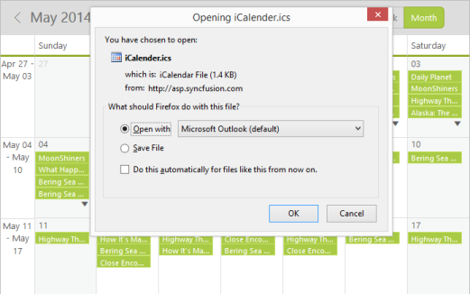

## Exporting

* Schedule appointments is exported to ISC file format. Therefore, it is possible to import the appointments to Microsoft outlook. Exporting can be achieved by the public method export. It contains two argument. 
* The first argument states that for MVC, the action name that is to be redirected is mentioned and for ASP it is set as null. 
* The second argument is for exporting type. Currently there is only ICSExport. For MVC project it is not required to pass this argument. You can achieve exporting by using the following code example in MVC and in ASP.

Important: Exporting feature is not applicable for JS as it is performed in Server side.

<table>
<tr>
<td>
[Razor]@(Html.EJ().Schedule("Schedule1")// Add the necessary schedule properties here)&lt;script type="text/javascript"&gt;$(document).ready(function () {// Function to bind the button click event$('.print').bind("click", function () {var obj = $("#Schedule1").data("ejSchedule");// need to specify the Action name as parameterobj.export("ExportToICS");});});&lt;/script&gt;</td></tr>
<tr>
<td>
[Controller]public partial class ScheduleController : Controller{ScheduleDataDataContext db = new ScheduleDataDataContext();public ActionResult ScheduleICSExport(){var DataSource = new ScheduleDataDataContext().DefaultSchedules.ToList();ViewBag.dataSource = DataSource;return View();}// Action name denoted in the scriptpublic void ExportToICS(FormCollection form){string JSONModel = Request.Form["ScheduleModel"];var model = JsonConvert.DeserializeObject<Dictionary<string, object>>(JSONModel);IEnumerable data = db.DefaultSchedules.Take(5);// method for ICS File export has been called.ScheduleExport obj = new ScheduleExport(model, data);}    }</td></tr>
</table>
Execute the above code to render the following output.

{  | markdownify }
{:.image }

_Figure_ _129__: Schedule with Appointment export feature_

