# Getting started

* This section encompasses on how to configure the ScheduleMVC control for your business requirements. You can pass data that are bound to the Schedule control through various API’s available within it. 
* The most important data used in the Schedule control is the appointment data that is bound to it through the “appointmentSettings” and “DataSource” property. The appointment data can either be passed locally or remotely to the Schedule control.

* In addition, there are other additional options available in the Schedule control to customize the appearance and behavior of it. In this example, you will see how to add a Schedule control to an application to manage some of the important activities in a worksheet.

The following screenshot displays the Schedule control with daily important activities

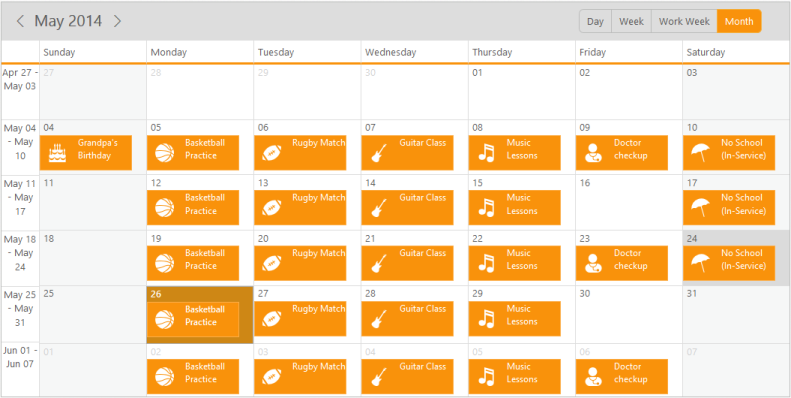

_Figure_ _18_: Schedule control with a person’s daily important activities_

## Create a Schedule

ASP.NET MVC Schedule widget basically renders with flexible API’s. You can easily create the Schedule widget by using simple code snippet as follows.

1. First create a MVC Project and add necessary Dll’s and Scripts with the help of the given [MVC-Getting Started](http://docs.syncfusion.com/aspnetmvc/schedule/getting-started) Documentation.

2. Add the mentioned code to the corresponding view page for Schedule rendering.

   ~~~ cs

		@(Html.EJ().Schedule("schedule"))

   ~~~
   {:.prettyprint }

3. Add the following code example in  Controller page

   ~~~ cs

		public ActionResult Default()

		{

		return View();

		}

   ~~~
   {:.prettyprint }

4. If you run the above code example an empty Scheduler is displayed without appointments. In Order, to display the appointments in the Schedule you need to pass data to it.

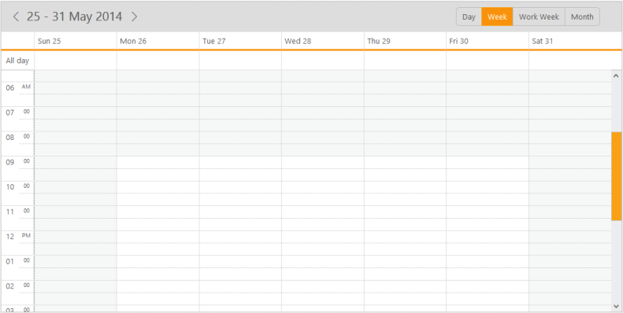

## Pass data to Schedule control

* You can add appointment of the Schedule control by passing data to the Schedule control either locally or remotely. In the following code example, you can see how to bind the remote data to the Schedule control.
* In order to bind the remote data to the Schedule control from the OdataServices, assign the remote service URL to the DataSource property of the Scheduler. In the DataSource property the specific service URL is retrieved from the data for Schedule control. 
* You can also bind the field names used in the referred link with the corresponding fields property of the Scheduler as shown in the following code example.



	@(Html.EJ().Schedule("schedule")

	.CurrentDate(new DateTime(2014,5,30))

	.AppointmentSettings(fields => fields.Datasource("http://mvc.syncfusion.com/OdataServices/Northwnd.svc/"

	)

	.Query("ej.Query().from('Events').take(10)")

	.Id("Id")

	.Subject("Subject")

	.StartTime("StartTime")

	.EndTime("EndTime")

	.AllDay("AllDay")

	.Recurrence("Recurrence")

	.RecurrenceRule("RecurrenceRule"))

	)



The following screenshot display a Schedule control with the appointments in a normal style.

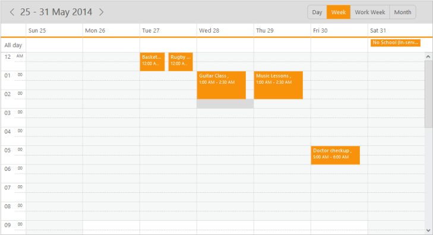

* You can also customize the appointments within the Scheduler using the template support discussed in the following sections.

## Add Templates to the appointments

* You can change the appearance of the appointments and also can add images for better  look-and-feel of the appointments. You can use the template concept to achieve this.
* In order to add templates to the Schedule appointments, you need to pass the id of the template to the “appointmentTemplateId” property. 



@(Html.EJ().Schedule("schedule")

.AppointmentTemplateId("#MyTemplate")

.Width("100%")

.Height("525px")

.CurrentDate(new DateTime(2014,5,30))

.AppointmentSettings(fields => fields.Datasource("http://mvc.syncfusion.com/OdataServices/Northwnd.svc/"

)

.Query("ej.Query().from('Events').take(10)")

.Id("Id")

.Subject("Subject")

.StartTime("StartTime")

.EndTime("EndTime")

.AllDay("AllDay")

.Recurrence("Recurrence")

.RecurrenceRule("RecurrenceRule"))

)

// method to choose images for the appointments

[Template Content]



Important: The images used in the above code example are taken from the installation location of the Essential ASP.NET MVC Studio in your machine,

For example: $system drive: \Program Files\ Syncfusion\EssentialStudio\12.1.0.43\MVC\samples\web\Images\schedule

* You can create a folder named “Images” in the same location of your newly created MVC Project and then move all the images from the installation folder to the newly created “Images” folder. This helps you in referring appointments appropriately within the Schedule control.
* Once you set the template for the appointments, the scheduler is displayed with the customized appointments as shown in the following screenshot.

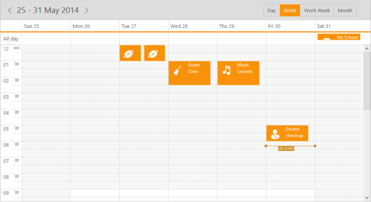

## Change the Schedule View

* You can change the view of the schedule from “week” to “month” by using the currentView property. By default, the schedule control is displayed in a “week” view.



@(Html.EJ().Schedule("schedule")

.AppointmentTemplateId("#MyTemplate")

.Width("100%")

.Height("525px")

.CurrentView(CurrentView.Month)

.CurrentDate(new DateTime(2014,5,30))

.AppointmentSettings(fields => fields.Datasource("http://mvc.syncfusion.com/OdataServices/Northwnd.svc/"

)

.Query("ej.Query().from('Events').take(10)")

.Id("Id")

.Subject("Subject")

.StartTime("StartTime")

.EndTime("EndTime")

.AllDay("AllDay")

.Recurrence("Recurrence")

.RecurrenceRule("RecurrenceRule"))

)

[Template Content]



* When you execute the above code example, a scheduler is displayed as follows with the fixed appointment height in a “month” view.

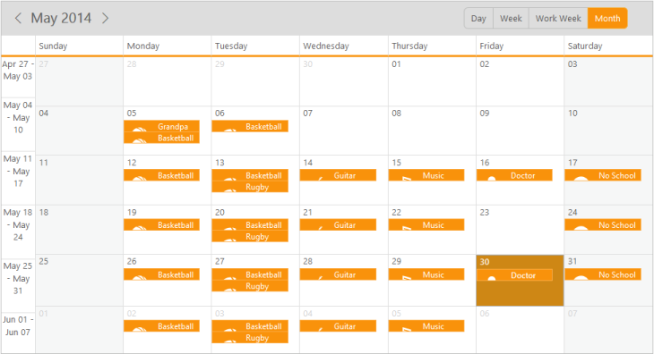

_Figure_ _22_: Schedule with template appointments in month view 

## Change the appointment height through CSS

* The default height of an appointment is always suitable for the text. In order to display an image and text in the appointment, you can change the height of the appointments in a “month” view, through css styles manually as shown in the following code example. You can set the appointment height to auto to display the images within it.







@(Html.EJ().Schedule("schedule")

.AppointmentTemplateId("#MyTemplate")

.Width("100%")

.Height("525px")

.CurrentView(CurrentView.Month)

.CurrentDate(new DateTime(2014,5,30))

.AppointmentSettings(fields => fields.Datasource("http://mvc.syncfusion.com/OdataServices/Northwnd.svc/"

)

.Query("ej.Query().from('Events').take(10)")

.Id("Id")

.Subject("Subject")

.StartTime("StartTime")

.EndTime("EndTime")

.AllDay("AllDay")

.Recurrence("Recurrence")

.RecurrenceRule("RecurrenceRule"))

)

[Template Content]



After you set the height for appointments in “month” view, the Schedule control is rendered as follows.

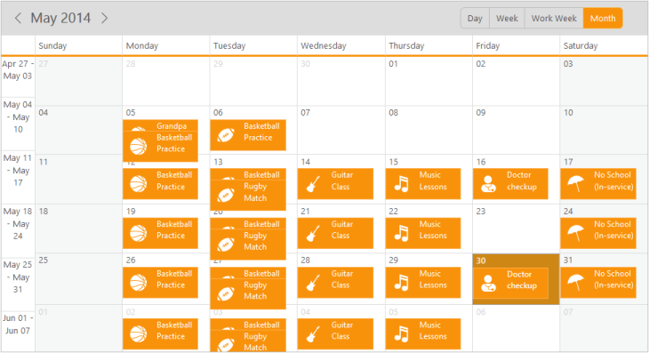

## Manipulate the Appointments

### Appointment Creation

* Initially, you saw how the appointments are rendered by binding the remote data. In order to add the appointments through the user interface (run-time) to the schedule control, double-click on the appropriate schedule cell and provide the required details in the appointment window pop-up.
* You can quickly create an appointment by clicking on the exact schedule cell with appropriate time slot and then filling only the subject of that appointment in a quick appointment pop up. 

Important: While adding new appointments to the schedule control either by using local or remote data, the new appointment data is saved automatically to the appointment collection.

The following screenshot displays an appointment window pop-up that appears when you double click on the schedule cells.

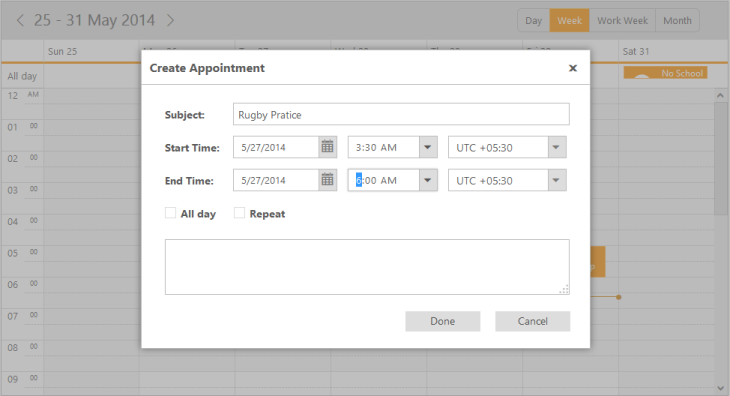

The following screenshot illustrates a quick appointment pop-up window.

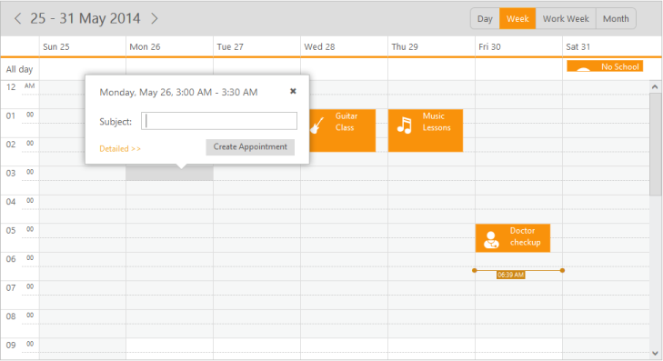

Important: In case you need to manipulate with newly created or edited appointments, you can use the events available within the schedule control.

* The event named “appointmentSaved” is triggered while saving a new appointment to the Schedule control. It provides the new appointment data as an argument that helps to retrieve the newly entered appointment data through a function.

### Edit/Delete Appointments

* You can edit or delete the appointments in the Schedule control using events  “appointmentEdited” and “appointmentDeleted” respectively. 
* In order to edit the appointments, double-click the desired appointment, and then edit the required fields in the appointment pop-up as shown in the following screenshot.

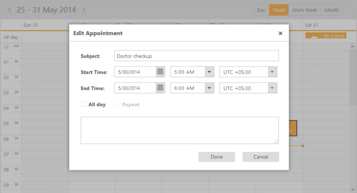

* To delete an appointment, click the appointment and then click delete icon in the quick appointment pop-up as shown in the following screenshot.

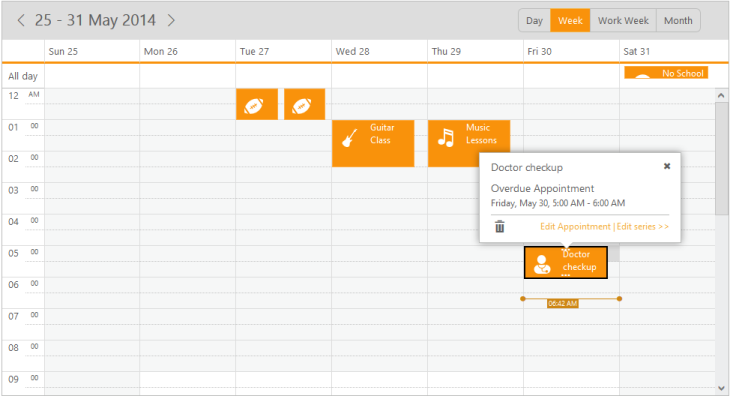

* You can also delete the required appointment in the Schedule control using the delete key option. This works only when you set “allowKeyboardNavigation” option to “True”

## Manipulate Recurrence Appointments

### Add Recurrence Appointment

* To add recurrence appointments, you need to check the “repeat” option in the appointment window as shown in the following screenshot.

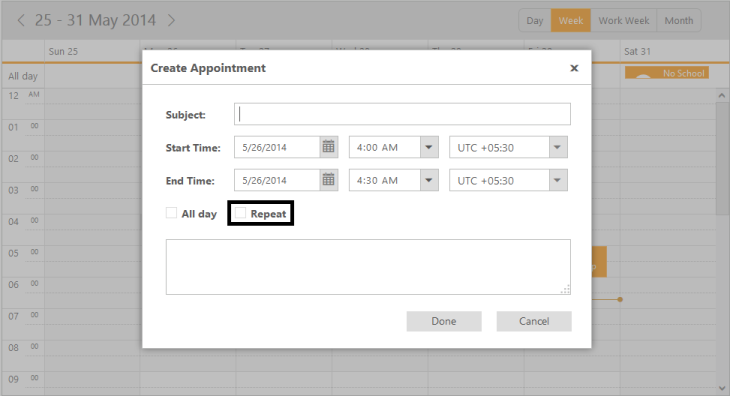

* When you check the “repeat” option the sub-options available in the recurrence category are shown in the appointment pop-up as follows.

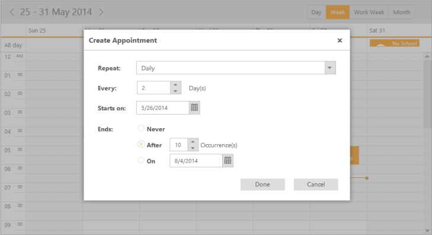

* You can choose the required recurrence pattern from the available options and then click “Done”. The main appointment pop-up appears as shown in the following screenshot.

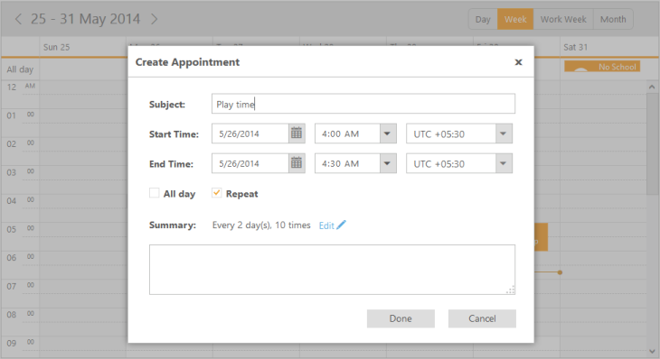

* Click “Done”. The recurrence appointment with daily pattern is created for every two days that ends after 10 occurrences.

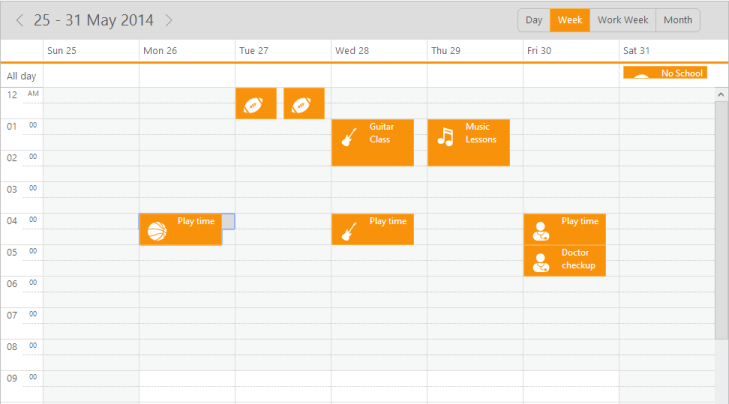

* You can store the chosen recurrence options usually in a RecurrenceRule field in a string format.  Also, the Recurrence field indicates whether the appointments created are normal or recurrence type. You can create appointments in a recurrence type by setting Boolean type to “True”.

### Edit/Delete Recurrence Appointment

* You can follow the same procedure for editing/deleting recurrence appointments. But in recurrenceappointment, you can either edit/delete the single occurrence of the appointment or the entire series in an intermediate confirmation pop-up.
* When you double-click the recurrence appointment a pop-up window appears as shown in the following screenshot. 

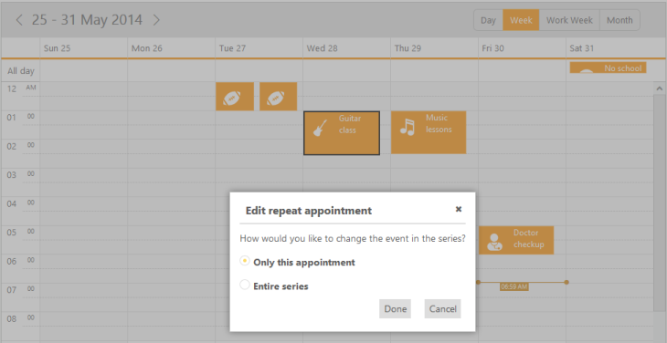

_Figure_ _32__: Edit recurrence appointment_

* When you click the recurrence appointment, a quick appointment window opens with the following options: “Edit Appointment”, “Edit Series” and “delete” icon for deleting the appointments.

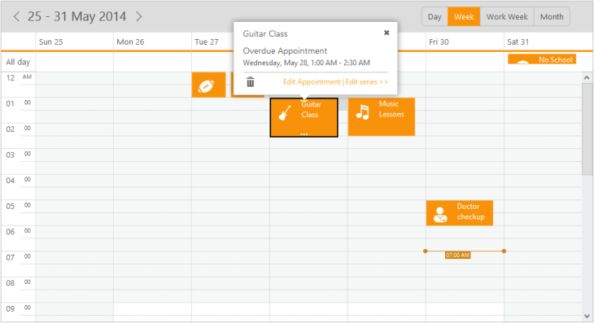

### Behaviour customization using the events

* You can restrict creation of the appointments during weekends in ASP.NET MVCSchedule using the events and by validating its arguments such as startTime and endTime.
* For example, you can block the appointment pop-up on all the weekends (Default week start date is Monday) using the following code sample with appointmentWindowOpen event. 



@(Html.EJ().Schedule("schedule")

.CurrentDate(new DateTime(2014,5,30))

.Width("100%")

.Height("525px")

.AppointmentSettings(fields => fields.Datasource("http://mvc.syncfusion.com/OdataServices/Northwnd.svc/"

)

.Query("ej.Query().from('Events').take(10)")

.Id("Id")

.Subject("Subject")

.StartTime("StartTime")

.EndTime("EndTime")

.AllDay("AllDay")

.Recurrence("Recurrence")

.RecurrenceRule("RecurrenceRule"))

.ScheduleClientSideEvents(eventt =>

eventt.AppointmentWindowOpen("onAppointmentBeforeOpen"))

)



