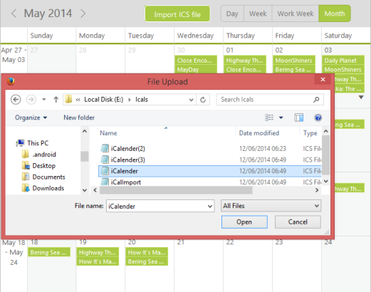
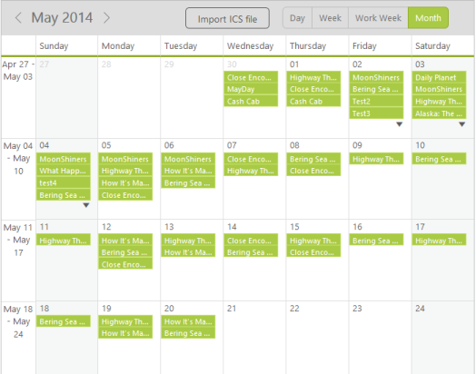

# Import Appointments

* With this feature, you can import the appointments from the .ics file into the Schedule control. ICS files that are generated from the Outlook, Google calendar and the exported files from the Syncfusion Schedule can be easily imported into the Schedule control. 
* Generally, the import functionality is achieved by using the server-side method renderingImportAppointments that takes the path of an ics file as its parameter. This method can be accessed through the object of the ScheduleImport class. You can dynamically choose the ics files to be imported into the Schedule control by using the upload box to select the ics file from the specific location. 
* Importing can be achieved by using the following code example in MVC and ASP. It is not applicable for JS, as it is done through server-side.


// Upload box to dynamically import the ICS files from any of the system location
@(Html.EJ()
.Uploadbox("UploadDefault")
.Height("30px")
.SaveUrl("SaveDefault")
.UploadBoxButtonText(btn=>
btn.Browse("Import ICS file"))
.ExtensionsAllow(".ics")
.RemoveUrl("RemoveDefault")
.AutoUpload(true)
.ShowFileDetails(false)
.MultipleFilesSelection(false
).ClientSideEvents(evt=>
evt.Complete("onUploadComplete")))
@(Html.EJ().Schedule("Schedule1")
.Width("100%")
.Height("525px")
.CurrentDate(new DateTime(2014,5,2))
.AppointmentSettings(fields => 
fields.Datasource((System.Collections.IEnumerable)ViewBag.dataSource)
.Id("Id")
.Subject("Subject")
.StartTime("StartTime")
.EndTime("EndTime")
.AllDay("AllDay")
.Recurrence("Recurrence")
.RecurrenceRule("RecurrenceRule")))
@section ScriptSection{
}
<style>
#UploadDefault{margin-right: 45px;margin-top: 10px;float: right;}
#UploadDefault .e-selectpart{padding: 3px 10px;}


public partial class ScheduleController : Controller
{
	public ActionResult ScheduleImport()
	{
		IEnumerable DataSource = new ScheduleDataDataContext().DefaultSchedules.ToList();
		ViewBag.dataSource = DataSource;return View();
	}
	// Action gets called on successful completion of the file upload that returns back the imported appointments along with the schedule’s original data.
	public ActionResult ScheduleImportData()
	{
		IEnumerable DataSource = new ScheduleDataDataContext().DefaultSchedules.ToList();
		var data = DataSource;
		if (TempData["dataSource"] != null)
		    data = (IEnumerable)TempData["dataSource"];
		else
		    data = DataSource;return Json(data, JsonRequestBehavior.AllowGet);
	}
	// Action called by uploadBox control to save the uploaded Ics files into corresponding folder.
	public ActionResult SaveDefault(IEnumerable<HttpPostedFileBase> UploadDefault)
	{
		var destinationPath = "";foreach (var file in UploadDefault)
		{
			var fileName = Path.GetFileName(file.FileName);
			destinationPath = Path.Combine(Server.MapPath("~/App_Data"), fileName);file.SaveAs(destinationPath);
		}
		// Create an object of the class ScheduleImport
		ScheduleImport importApps = new ScheduleImport();
		// Access the method to import the ics file appointments into schedule control through the object created above.
		var app =importApps.renderingImportAppointments(destinationPath);
		var dataSource = new ScheduleDataDataContext().DefaultSchedules.ToList();
		int intMax = dataSource.Max(a => a.Id);
		for (var i = 0; i < app.Count; i++)
		{
			app[i].Id = intMax + 1;
			DefaultSchedule row = new DefaultSchedule(app[i].Id, app[i].Subject, app[i].Location, app[i].StartTime, app[i].EndTime, app[i].Description, null, null, app[i].Recurrence, null, null, app[i].AppointmentCategorize, null, app[i].AllDay, null, null, app[i].RecurrenceRules);
			dataSource.Add(row);intMax = app[i].Id;}ViewBag.dataSource = dataSource;
			TempData["dataSource"] = dataSource;return RedirectToAction("ScheduleImport","ScheduleImport");
		}
		// To Remove the uploaded ICS files.
		public ActionResult RemoveDefault(string[] fileNames)
		{
			foreach (var fullName in fileNames)
			{
				var fileName = Path.GetFileName(fullName);
				var physicalPath = Path.Combine(Server.MapPath("~/App_Data"), fileName);
				if (System.IO.File.Exists(physicalPath)){System.IO.File.Delete(physicalPath);
			}
		}
		return Content("");
	}
}




* Execute the above code. Now, click on the browse button. 
* It displays a window to choose the ics files which is to be uploaded into the Schedule control as illustrated in the following screenshot. 
* Choose the file and click “Open” to imports the selected file into your Schedule control.

* [Click here](http://mvc.syncfusion.com/demos/web/schedule/scheduleicsexport) to see the__working of__Import and Export Appointments.

