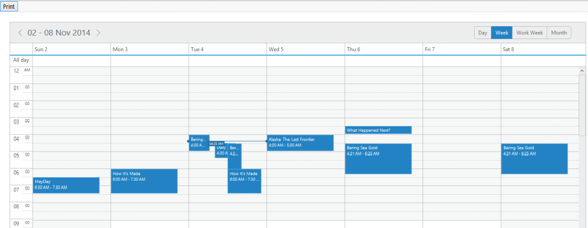
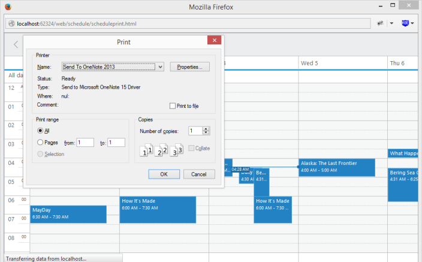
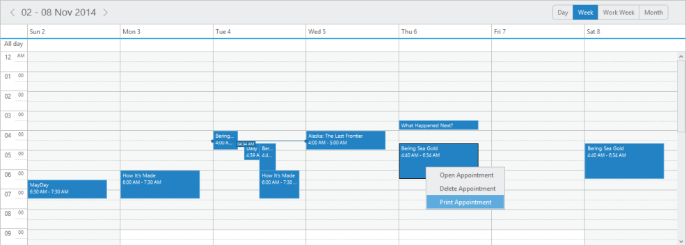

# Print

Schedule control is provided with the Print feature. You can print the entire Schedule control or separately print the appointment based on your requirement.

## Schedule Print

You can print the Schedule control by using print() method. Use the following code example to print the Schedule control.


 



<input class="print" type="button" value="Print" />
@(Html.EJ().Schedule("Schedule1")
// Add the necessary schedule properties here)


     
      // follow the code as same as declared in Read Only part</td></tr>

 

Execute the above code to render the following output.

Schedule with print button
{:.caption}

Click the print button to render the following output.

Schedule with Print window
{:.caption}

## Appointment Print

* In Schedule control, you can print the appointment alone by using context menu. Add print as menu item in the context menu settings as in the following code example.





@(Html.EJ()
.Schedule("Schedule1")
// To Add the Context menu settings
.ContextMenuSettings(cms =>
cms.Enable(true)
// To Add menu items.MenuItems(item=>
item.Appointment(ViewBag.app)))
// Add the Appointment setting collection here)



public ActionResult Print()
{
	// create list for menu item collection
	List<Appointment> appointment = new List<Appointment>();
	appointment.Add(new Appointment() { Id = "open", Text = "Open Appointment" });
	appointment.Add(new Appointment() { Id = "delete", Text = "Delete Appointment" });
	// To Add print item in that collection.
	appointment.Add(new Appointment() { Id = "print", Text = "Print Appointment" });
	var DataSource = new ScheduleDataDataContext().DefaultSchedules.ToList();
	ViewBag.dataSource = DataSource;ViewBag.app = appointment;
	return View();
}

 

* Right click on the appointment and select print appointment in the context menu as follows.

Schedule with Print option in Context Menu_
{:.caption}

* Now, the widow is promoted to new document with appointment details and print window opens.

Schedule with Appointment Print
{:.caption}
