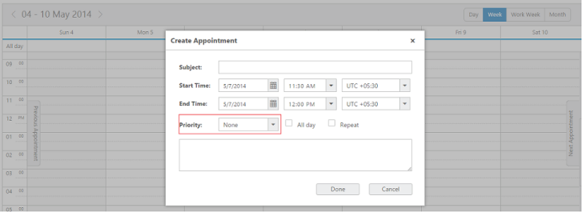
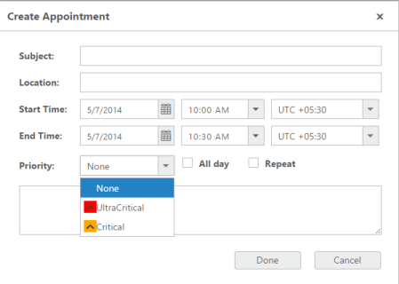
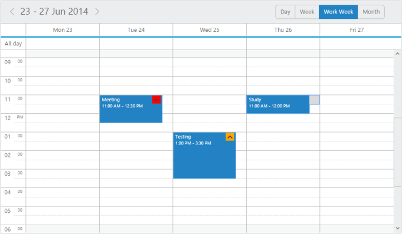

## Priority

* This feature allows you to prioritize the appointments with various priority options each differentiated with its individual icons/images. 
* You can also denote the priority of the appointments using this priority option and can specify your own user-defined priority collection.
### Priority settings

* The prioritySettings is an object collection that holds the priority related information. 
* For example enable property enables/disables the priority value to be displayed.

The following are the sub-properties used within the prioritySettings.

enable

* This option accepts either true or false, denoting whether to enable/disable the priority option.

datasource 

* It either accepts the local JSON data or remote data for binding the priority related information.

text

* It holdsthe binding name for text field in the priority dataSource.

id

* It holds the binding name for id field in the priority dataSource.

value

* It holds the binding name for value field in the priority dataSource.

The following code example illustrates on how to render priority feature in the Schedule control.

[MVC-Razor]

@(Html.EJ().Schedule("Schedule1")

.Width("100%")

.Height("525px")

.TimeMode(Syncfusion.JavaScript.TimeMode.Hour12)

.CurrentDate(new DateTime(2014, 6, 2))

.PrioritySettings(eve => eve.Enable(true).Text("text").Id("id").Value("value"))

.AppointmentSettings(fields => fields.Datasource(ViewBag.datasource)

.Id("Id")

.Subject("Subject")

.StartTime("StartTime")

.EndTime("EndTime")

.AllDay("AllDay")

.Priority("Priority")  // To display the Priority value in appointment window need to bind the property like this

.Recurrence("Recurrence")

.RecurrenceRule("RecurrenceRule"))

)

[Controller]

// Follow the code declared in Read only part

Execute the above code to render the following output.

{{ '' | markdownify }}
{:.image }

template

* The Priority option can be customized based on the user- defined datasource. 
* You need to mention the “template” value also while passing the user-defined datasource. 

The following code example illustrates on how to render priority feature with user- defined datasource in the Schedule control. 

[MVC-Razor]

@(Html.EJ().Schedule("Schedule1")

.Width("100%")

.Height("525px")

.TimeMode(Syncfusion.JavaScript.TimeMode.Hour12)

.CurrentDate(new DateTime(2014, 6, 2))

.ShowLocationField(true)

.PrioritySettings(eve => eve.Enable(true).Text("text").Id("id").Value("value").Template("

").Datasource((System.Collections.IEnumerable)ViewBag.Priority))  // To display the Priority option in the appointment window while passing custom datasource we need to mention the Template and DataSource like this

.AppointmentSettings(fields => fields.Datasource(ViewBag.datasource)

.Id("Id")

.Subject("Subject")

.StartTime("StartTime")

.EndTime("EndTime")

.AllDay("AllDay")

.Priority("Priority")

.Recurrence("Recurrence")

.RecurrenceRule("RecurrenceRule")))

[Controller]

List<Priority> PriorityValue = new List<Priority>();

public ActionResult Index()

{

PriorityValue.Add(new Priority { text = "None", id = 1, value = "none" });

PriorityValue.Add(new Priority { text = "Critical", id = 2, value = "critical" });

PriorityValue.Add(new Priority { text = "UltraCritical", id = 3, value = "ultracritical" });

ViewBag.Priority = PriorityValue.ToList();  // We can pass the custom datasource (priority option) for the schedule control like this

return View();

}

public class Priority

{

public string text { set; get; }

public int id { set; get; }

public string value { set; get; }

}

// For appointment data follow the code declared in Read only part

* And then need to define the styles to display the “priority icon/images (you can use your desired images)” with the priority options. 
* The class name (while defining styles) should be the field name in template. For example if you define the template (ex: Template ("

")) then you need to define class with “value field and its value should be a class name (ex: critical)”. 

The following code example illustrates how to define the css style while using the template.

// Her we are defining the style of the “custom priority icon”

* Similarly you can use the image tag directly in the template. Following code snippets illustrates the image tag usage in the template.

[MVC- Razor]

@(Html.EJ().Schedule("Schedule1")

.Width("100%")

.Height("525px")

.TimeMode(Syncfusion.JavaScript.TimeMode.Hour12)

.CurrentDate(new DateTime(2014, 6, 2))

.ShowLocationField(true)

.PrioritySettings(eve => eve.Enable(true).Text("text").Id("id").Value("value").Template("").Datasource((System.Collections.IEnumerable)ViewBag.Priority))

// We can use the image tag directly to display the priority icon/image

.AppointmentSettings(fields => fields.Datasource((IEnumerable)ViewBag.datasource)

.Id("Id")

.Subject("Subject")

.StartTime("StartTime")

.EndTime("EndTime")

.AllDay("AllDay")

.Priority("Priority")

.Recurrence("Recurrence")

.RecurrenceRule("RecurrenceRule"))

)

[Controller]

List<Priority> PriorityValue = new List<Priority>();

public ActionResult Index()

{

PriorityValue.Add(new Priority { text = "None", id = 1, value = "none" });

PriorityValue.Add(new Priority { text = "Critical", id = 2, value = "critical" });

PriorityValue.Add(new Priority { text = "UltraCritical", id = 3, value = "ultracritical" });

ViewBag.Priority = PriorityValue.ToList();  // We can pass the custom datasource (priority option) for the schedule control like this

return View();

}

public class Priority

{

public string text { set; get; }

public int id { set; get; }

public string value { set; get; }

}

// For appointment data follow the code declared in Read only part

On excuting the above mentioned codes will render the same output as follows.

{{ '' | markdownify }}
{:.image }

{{ '' | markdownify }}
{:.image }

