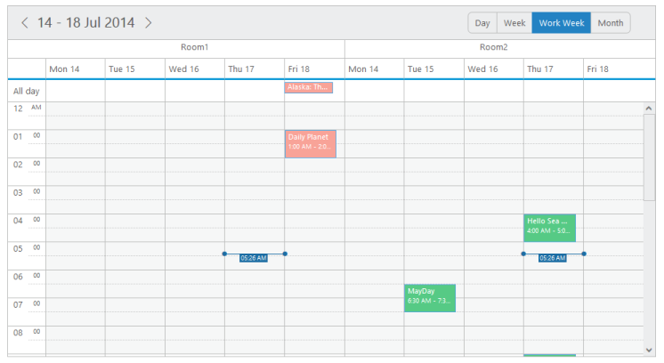
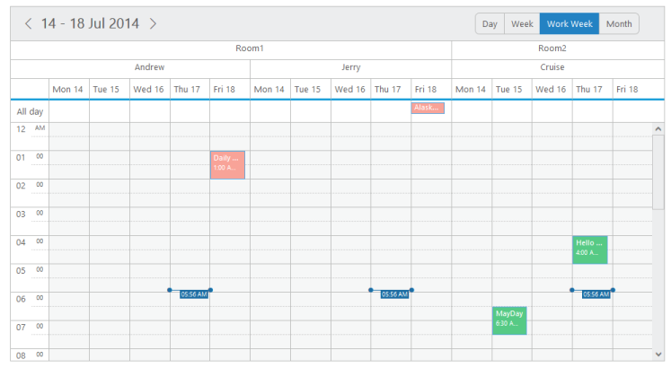
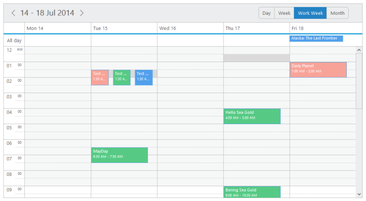

# Resources

## Multiple Resources

* Multiple Resource feature provides support for rendering multiple resources on the Schedule control. You can group multiple resources under certain categories. 
* You can also save the appointments simultaneously on multiple resources or within the multiple categories using allowMultiple property enabled for different levels of resources.
* The two important properties to be defined for grouping the multiple resources are as follows:

## Resources

* It accepts the resource data as an array collection. Here, you can define the field name with resourceFields to each of the resource level. The order of resource data objects that you provide within the resource collection defines the rendering order of the resources in the Schedule. 
* The first resource data object provided within the collection is always rendered as the top level order in the Schedule. The important sub-options available are as follows:

_field_

* This option holds the field name to be bound to each level of the resources.

_title_

* This option accepts a title string from the user that is displayed as the appropriate title for the resource field on the appointment window.

_name_

* It uniquely identifies each resource level while grouping.

_resourceSettings_

* It accepts the dataSource and bind field names related to the resources data. The sub-options present within it are as follows,

_dataSource_

* It either accepts the local JSON data or remote data for the resource related information. The field names it accepts are 

_text_

* It holds the binding name for text field in the resource dataSource.

_id_

* It holds the binding name for id field in the resource dataSource.

_groupId_

* It holds the binding name for group id field in the resource dataSource.

_color_

* It holds the binding name for color field in the resource dataSource.

_appointmentClass_

* It specifies the custom css class name to be applied for the appointments that belongs to each resource.

_allowMultiple_

* This property enables or disables the multiple selections of each resource in the appointment window. 

The following code example explains how to render the multiple resources on the Schedule control,


@(Html.EJ()
.Schedule("Schedule1")
.Width("100%")
.Height("525px")
.CurrentDate(new DateTime(2014,4,1))
.CurrentView(CurrentView.Month)
// resource data collection.Resources(res=> 
{res.Field("OwnerId").Title("Owner").Name("Owners")
// enable the multiple selection of resources in the appointment window.
.AllowMultiple(true)
.ResourceSettings(flds => 
flds.Datasource(ViewBag.Owners).Text("text")
.Id("id")
.Color("color"))
.Add();}).Group(gr=>
{gr.Resources(ViewBag. Resources);})
.AppointmentSettings(fields => 
fields.Datasource(ViewBag.datasource)
.Id("Id")
.Subject("Subject")
.StartTime("StartTime")
.EndTime("EndTime")
.AllDay("AllDay")
.Recurrence("Recurrence")
.RecurrenceRule("RecurrenceRule")
// bind the resource id fields collection of each level.ResourceFields("OwnerId")))


namespace MVCSampleBrowser.Controllers
{
	public partial class ScheduleController : Controller
	{
		//// GET: /MultipleResource/
		public ActionResult MultipleResource()
		{
			// The appointment data along with resource data to be passed to the dataSource are as follows,
			List<person> persons = new List<person>();
			persons.Add(new person() { Id = 100, Subject = "product meeting", StartTime = new DateTime(2014, 4, 1, 1, 0, 20), EndTime = new DateTime(2014, 4, 1, 5, 0, 20), AllDay = false, Recurrence = false, RecurrenceRule = "FREQ=DAILY;COUNT=10;INTERVAL=2;BYDAY=MO,TU,WE,TH,FR,SA,SU", RoomId = "1", OwnerId = "1" });
			persons.Add(new person() { Id = 101, Subject = "conference meeting", StartTime = new DateTime(2014, 4, 1, 6, 0, 20), EndTime = new DateTime(2014, 4, 1, 7, 0, 20), AllDay = false, Recurrence = false, RecurrenceRule = "FREQ=WEEKLY;COUNT=10;INTERVAL=1;BYDAY=MO,TU", RoomId = "2", OwnerId = "3" });
			persons.Add(new person() { Id = 102, Subject = "New Meeting ", StartTime = new DateTime(2014, 4, 3, 4, 0, 20), EndTime = new DateTime(2014, 4, 3, 7, 0, 20), AllDay = false, Recurrence = false, RecurrenceRule = "FREQ=WEEKLY;COUNT=10;INTERVAL=1;BYDAY=MO,TU", RoomId = "1", OwnerId = "1" });
			persons.Add(new person() { Id = 103, Subject = "New Meeting ", StartTime = new DateTime(2014, 4, 2, 4, 0, 20), EndTime = new DateTime(2014, 4, 2, 7, 0, 20), AllDay = false, Recurrence = false, RecurrenceRule = "FREQ=WEEKLY;COUNT=1;INTERVAL=1;BYDAY=MO,TU", RoomId = "1", OwnerId = "5" });
			ViewBag.datasource = persons;List<Rooms> owners = new List<Rooms>();
			owners.Add(new Rooms { text = "Andrew", id = "1", color = "#f8a398" });
			owners.Add(new Rooms { text = "Cruise", id = "3", color = "#56ca85" });
			owners.Add(new Rooms { text = "Jerry", id = "5", color = "#51a0ed" });
			ViewBag.Owners = owners;List<String> resources = new List<String>();
			resources.Add("Owners");ViewBag.Resources = resources;return View();
		}
	}
	Public class person
	{
		Public int Id;
		Public string Subject;
		Public string RoomId;
		Public string OwnerId;
		Public DateTime StartTime;
		Public DateTime EndTime;
		Public bool AllDay;Public bool Recurrence;Public string RecurrenceRule;
	}
	public class Rooms
	{
		public string text;
		public string id ;
		public string color ;
	}
}



</table>
The output of the above code looks as follows.

   _Figure_ _87_:  schedule with multiple resource.

## Resource Grouping

* The Schedule control supports another important property group related to the multiple resources. It accepts the unique name assigned to each resources in the resource collection. The names that are all listed in this option is grouped in the Schedule control.

The following steps defines the way to start with rendering multiple resources on the Schedule control.

* Define the appointment data with required resource-related information fields as follows.



namespace MVCSampleBrowser.Controllers

{

public partial class ScheduleController : Controller

{

//

// GET: /ResourceGrouping/

List<Rooms> rooms = new List<Rooms>();

List<Rooms> owner = new List<Rooms>();

public ActionResult ResourceGrouping()

{

List<person> persons = new List<person>();

persons.Add(new person() { Id = 100, Subject = "product meeting", StartTime = new DateTime(2014, 4, 1, 1, 0, 20), EndTime = new DateTime(2014, 4, 1, 5, 0, 20), AllDay = false, Recurrence = true, RecurrenceRule = "FREQ=DAILY;COUNT=10;INTERVAL=2;BYDAY=MO,TU,WE,TH,FR,SA,SU", RoomId = "1", OwnerId = "1" });

persons.Add(new person() { Id = 101, Subject = "conference meeting", StartTime = new DateTime(2014, 4, 6, 3, 0, 20), EndTime = new DateTime(2014, 4, 6, 7, 0, 20), AllDay = false, Recurrence = true, RecurrenceRule = "FREQ=WEEKLY;COUNT=10;INTERVAL=1;BYDAY=MO,TU", RoomId = "2", OwnerId = "3" });

persons.Add(new person() { Id = 102, Subject = "New Meeting ", StartTime = new DateTime(2014, 5, 1, 4, 0, 20), EndTime = new DateTime(2014, 5, 1, 7, 0, 20), AllDay = false, Recurrence = true, RecurrenceRule = "FREQ=WEEKLY;COUNT=10;INTERVAL=1;BYDAY=MO,TU", RoomId = "1", OwnerId = "1" });

persons.Add(new person() { Id = 102, Subject = "New Meeting ", StartTime = new DateTime(2014, 3, 1, 4, 0, 20), EndTime = new DateTime(2014, 3, 1, 7, 0, 20), AllDay = false, Recurrence = true, RecurrenceRule = "FREQ=WEEKLY;COUNT=1;INTERVAL=1;BYDAY=MO,TU", RoomId = "1", OwnerId = "5" });

//   var DataSource = new ScheduleDataDataContext().MultipleResources.ToList();

ViewBag.datasource = persons;

rooms.Add(new Rooms { text = "Room1", id = "1", color = "#f8a398" });

rooms.Add(new Rooms { text = "Room2", id = "2", color = "#56ca85" });

ViewBag.Rooms = rooms;

owner.Add(new Rooms { text = "Andrew", id = "1", groupId = "1", color = "#f8a398" });

owner.Add(new Rooms { text = "Cruise", id = "3", groupId = "2", color = "#56ca85" });

owner.Add(new Rooms { text = "Jerry", id = "5", groupId = "1", color = "#51a0ed" });

ViewBag.Owners = owner;

List<String> resources = new List<String>();

resources.Add("Rooms"); resources.Add("Owners");

ViewBag.Resources = resources;

return View();

}

}

public class person

{

public int Id;

public string Subject;

public string RoomId;

public string OwnerId;

public DateTime StartTime;

public DateTime EndTime;

public bool AllDay;

public bool Recurrence;

public string RecurrenceRule;

}

public class Rooms

{

public string text;

public string id ;

public string groupId ;

public string color ;

}

}



* The above specified resource related fields are require to  bound to the resource dataSource and the following code defines the way to provide data to the resources and group collection. This step helps you to render multiple resources on the Schedule control,



@(Html.EJ().Schedule("Schedule1")

.Width("100%")

.Height("525px")

.CurrentDate(new DateTime(2014,4,1))

.CurrentView(CurrentView.Month)

// resource data collection

.Resources(res=> {

// disables the multiple selection of resources in the appointment window.

res.Field("RoomId").Title("room").Name("Rooms").AllowMultiple(false)

.ResourceSettings(flds => flds.Datasource(ViewBag.Rooms).Text("text").Id("id").Color("color")).Add();

res.Field("OwnerId").Title("owner").Name("Owners").AllowMultiple(true)

.ResourceSettings(flds => flds.Datasource(ViewBag.Owners).Text("text").Id("id").GroupId("groupId").Color("color")).Add();

})

// Groups the resources listed out in the below collection

.Group(gr=> {

gr.Resources(ViewBag.Resources);

})

.AppointmentSettings(fields => fields.Datasource(ViewBag.datasource)

.Id("Id")

.Subject("Subject")

.StartTime("StartTime")

.EndTime("EndTime")

.AllDay("AllDay")

.Recurrence("Recurrence")

.RecurrenceRule("RecurrenceRule")

// bind the resource id fields collection of each level

.ResourceFields("RoomId,OwnerId"))

)



* Execute the above code to render the output as follows.

  _Figure_ _88_:  schedule with resource grouping.

## Multiple Appointment Creation

* The “allowMultiple” option available for each resource object within the resource collection enables/disables the functionality of saving same appointment for multiple resources. 
* When this property is set to true, the resource related fields in the appointment window allows you to select multiple resources. Refer the following code example.


namespace MVCSampleBrowser.Controllers
{
	public partial class ScheduleController : Controller
	{
		//// GET: /MultipleResource/
		List<Rooms> owners = new List<Rooms>();
		public ActionResult MultipleResource()
		{
			List<person> persons = new List<person>();
			persons.Add(new person() { Id = 100, Subject = "product meeting", StartTime = new DateTime(2014, 4, 1, 1, 0, 20), EndTime = new DateTime(2014, 4, 1, 5, 0, 20), AllDay = false, Recurrence = false, RecurrenceRule = "FREQ=DAILY;COUNT=10;INTERVAL=2;BYDAY=MO,TU,WE,TH,FR,SA,SU", RoomId = "1", OwnerId = "1" });
			persons.Add(new person() { Id = 101, Subject = "conference meeting", StartTime = new DateTime(2014, 4, 1, 6, 0, 20), EndTime = new DateTime(2014, 4, 1, 7, 0, 20), AllDay = false, Recurrence = false, RecurrenceRule = "FREQ=WEEKLY;COUNT=10;INTERVAL=1;BYDAY=MO,TU", RoomId = "2", OwnerId = "3" });
			persons.Add(new person() { Id = 102, Subject = "New Meeting ", StartTime = new DateTime(2014, 4, 3, 4, 0, 20), EndTime = new DateTime(2014, 4, 3, 7, 0, 20), AllDay = false, Recurrence = false, RecurrenceRule = "FREQ=WEEKLY;COUNT=10;INTERVAL=1;BYDAY=MO,TU", RoomId = "1", OwnerId = "1" });
			persons.Add(new person() { Id = 103, Subject = "New Meeting ", StartTime = new DateTime(2014, 4, 2, 4, 0, 20), EndTime = new DateTime(2014, 4, 2, 7, 0, 20), AllDay = false, Recurrence = false, RecurrenceRule = "FREQ=WEEKLY;COUNT=1;INTERVAL=1;BYDAY=MO,TU", RoomId = "1", OwnerId = "5" });
			ViewBag.datasource = persons;
			owners.Add(new Rooms { text = "Andrew", id = "1", color = "#f8a398" });
			owners.Add(new Rooms { text = "Cruise", id = "3", color = "#56ca85" });
			owners.Add(new Rooms { text = "Jerry", id = "5", color = "#51a0ed" });
			ViewBag.Owners = owners;return View();
		}
	}
	Public class person
	{
		Public int Id;
		Public string Subject;
		Public string RoomId;
		Public string OwnerId;
		Public DateTime StartTime;
		Public DateTime EndTime;
		Public bool AllDay;
		Public bool Recurrence;
		Public string RecurrenceRule;
	}
	public class Rooms
	{
		public string text { set; get; }
		public string id { set; get; }
		public string color { set; get; }
	}
}


@(Html.EJ()
.Schedule("Schedule1")
.Width("100%")
.Height("525px")
.CurrentDate(new DateTime(2014,4,1))
.CurrentView(CurrentView.Month)
.Resources(res=> 
{
// enables the multiple selection of resources in the appointment window.
res.Field("OwnerId")
.Title("Owner")
.Name("Owners")
.AllowMultiple(true)
.ResourceSettings(flds => 
flds.Datasource(ViewBag.Owners)
.Text("text")
.Id("id")
.Color("color"))
.Add();})
.AppointmentSettings(fields => 
fields.Datasource(ViewBag.datasource)
.Id("Id")
.Subject("Subject")
.StartTime("StartTime")
.EndTime("EndTime").AllDay("AllDay")
.Recurrence("Recurrence")
.RecurrenceRule("RecurrenceRule")

// bind the resource id fields collection of each level.ResourceFields("OwnerId")))




* Execute the above code to display the Schedule control with appointments saved for multiple resources differentiated with its specific colors.

 _Figure_ _89_:  schedule with multiple resource creation.

* To save the same appointment for multiple resources, refer the following steps,
1. Double-click on the required work cell, the appointment window pops up as shown in the following image with an individual autocomplete field for selecting the available resources.

_Figure_ _90_:  schedule with multiple appointment window.

2. Since the allowMultiple property is set to ‘true’ for this resource object, so you can select any number of available resources in it as follows.

_Figure_ _91_:  schedule with multiple appointment window with different type owner.

3. The same appointment with the subject Test Ride is created for each resource individually as follows when you click the Done button.

_Figure_ _92_:  schedule with saved multiple appointments with different type owner

