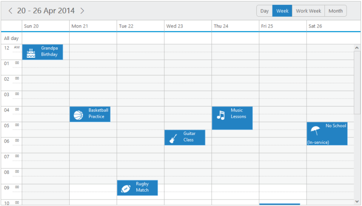

# Template

## Appointment Template

* The appointments are provided with rich template support, so that the customizations are done easily. You can add the appointment template to the Schedule control as follows.



@(Html.EJ().Schedule("Schedule1")
.Width("100%")
.Height("525px")
.CurrentDate(new DateTime(2014,4,1))
.CurrentView(CurrentView.Month)
.AppointmentSettings(fields => fields.Datasource(ViewBag.datasource)
.Id("Id").Subject("Subject").
StartTime("StartTime").
EndTime("EndTime").
AllDay("AllDay").
Recurrence("Recurrence").
RecurrenceRule("RecurrenceRule"))
// specify the template id
.AppointmentTemplateId("#MyTemplate"))
// appointment template definition



namespace MVCSampleBrowser.Controllers{public partial class ScheduleController : Controller
{
	//// GET: /Templates/
	public ActionResult Templates(){List<person> persons = new List<person>();
	// var DataSource = new ScheduleDataDataContext().TimeModes.ToList();
	persons.Add(new person() { Id = 100, Subject = "product meeting", StartTime = new DateTime(2014, 4, 1, 1, 0, 20), EndTime = new DateTime(2014, 4, 1, 5, 0, 20), AllDay = false, Recurrence = false, RecurrenceRule = "FREQ=WEEKLY;COUNT=10;INTERVAL=1;BYDAY=MO,TU,WE,TH,FR,SA,SU" });
	persons.Add(new person() { Id = 101, Subject = "conference meeting", StartTime = new DateTime(2014, 4, 2, 6, 0, 20), EndTime = new DateTime(2014, 4, 2, 7, 0, 20), AllDay = false, Recurrence = false, RecurrenceRule = "FREQ=WEEKLY;COUNT=10;INTERVAL=1;BYDAY=MO,TU" });
	persons.Add(new person() { Id = 102, Subject = "New Meeting ", StartTime = new DateTime(2014, 4, 3, 4, 0, 20), EndTime = new DateTime(2014, 4, 3, 7, 0, 20), AllDay = false, Recurrence = false, RecurrenceRule = "FREQ=WEEKLY;COUNT=10;INTERVAL=1;BYDAY=MO,TU" });
	persons.Add(new person() { Id = 102, Subject = "New Meeting ", StartTime = new DateTime(2014, 4, 4, 4, 0, 20), EndTime = new DateTime(2014, 4, 4, 7, 0, 20), AllDay = false, Recurrence = false, RecurrenceRule = "FREQ=WEEKLY;COUNT=1;INTERVAL=1;BYDAY=MO,TU" });
	ViewBag.dataSource = persons;return View();}}}</td></tr>


* The output for the above code is as follows that displays the appointment with the template defined for it.

 _Figure82: schedule with template.

### ResorceHeader Template

* The resources are provided with rich template support, so that the customizations are done easily. You can add the resource header template to the Schedule control as follows.


@(Html.EJ()
.Schedule("Schedule1")
.Width("100%")
.Height("525px")
.CurrentDate(new DateTime(2014,4,1))
.CurrentView(CurrentView.Month)
// resource data collection.Resources(res=> {
res.Field("OwnerId").Title("Owner").Name("Owners")
// enable the multiple selection of resources in the appointment window.
.AllowMultiple(true)
.ResourceSettings(flds => 
flds.Datasource(ViewBag.Owners).Text("text").Id("id").Color("color")).Add();})
.Group (gr=> {gr.Resources (ViewBag. Resources);})
.AppointmentSettings(fields => fields.Datasource(ViewBag.datasource).Id("Id")
.Subject("Subject")
.StartTime("StartTime")
.EndTime("EndTime")
.AllDay("AllDay")
.Recurrence("Recurrence")
.RecurrenceRule("RecurrenceRule")
// bind the resource id fields collection of each level.ResourceFields("OwnerId"))
// specify the template id.ResourceHeaderTemplateId("#resourceHeaderTemplateId"))
// resourceHeader template definition



namespace MVCSampleBrowser.Controllers
{
	public partial class ScheduleController : Controller
	{
		//// GET: /MultipleResource/
		public ActionResult MultipleResource()
		{	
			// The appointment data along with resource data to be passed to the dataSource are as follows,
			List<person> persons = new List<person>();
			persons.Add(new person() { Id = 100, Subject = "product meeting", StartTime = new DateTime(2014, 4, 1, 1, 0, 20), EndTime = new DateTime(2014, 4, 1, 5, 0, 20), AllDay = false, Recurrence = false, RecurrenceRule = "FREQ=DAILY;COUNT=10;INTERVAL=2;BYDAY=MO,TU,WE,TH,FR,SA,SU", RoomId = "1", OwnerId = "1" });
			persons.Add(new person() { Id = 101, Subject = "conference meeting", StartTime = new DateTime(2014, 4, 1, 6, 0, 20), EndTime = new DateTime(2014, 4, 1, 7, 0, 20), AllDay = false, Recurrence = false, RecurrenceRule = "FREQ=WEEKLY;COUNT=10;INTERVAL=1;BYDAY=MO,TU", RoomId = "2", OwnerId = "3" });
			persons.Add(new person() { Id = 102, Subject = "New Meeting ", StartTime = new DateTime(2014, 4, 3, 4, 0, 20), EndTime = new DateTime(2014, 4, 3, 7, 0, 20), AllDay = false, Recurrence = false, RecurrenceRule = "FREQ=WEEKLY;COUNT=10;INTERVAL=1;BYDAY=MO,TU", RoomId = "1", OwnerId = "1" });
			persons.Add(new person() { Id = 103, Subject = "New Meeting ", StartTime = new DateTime(2014, 4, 2, 4, 0, 20), EndTime = new DateTime(2014, 4, 2, 7, 0, 20), AllDay = false, Recurrence = false, RecurrenceRule = "FREQ=WEEKLY;COUNT=1;INTERVAL=1;BYDAY=MO,TU", RoomId = "1", OwnerId = "5" });ViewBag.datasource = persons;
			List<Rooms> owners = new List<Rooms>();
			owners.Add(new Rooms { text = "Andrew", id = "1", color = "#f8a398" });
			owners.Add(new Rooms { text = "Cruise", id = "3", color = "#56ca85" });
			owners.Add(new Rooms { text = "Jerry", id = "5", color = "#51a0ed" });
			ViewBag.Owners = owners;List<String> resources = new List<String>();
			resources.Add("Owners");ViewBag.Resources = resources;return View();
		}
	}
	Public class person
	{
		Public int Id;
		Public string Subject;
		Public string RoomId;
		Public string OwnerId;
		Public DateTime StartTime;
		Public DateTime EndTime;
		Public bool AllDay;
		Public bool Recurrence;
		Public string RecurrenceRule;
	}
	public class Rooms
	{
		public string text;
		public string id ;
		public string color ;
	}
}


Important: The above used images should be present in a separate images folder, so that it will be referred properly.The images name should be saved with id as same as given in the resourceSettings inorder to set unqiue images to all resources.

The output of the above code looks as follows.

