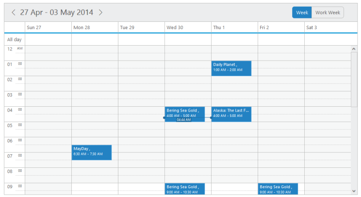

# Views

## View Customization

* The views option in the Schedule control is a collection that allows you to add/remove the view items to it. The items that are added to it is displayed in the date-header section of the Schedule control.
* It accepts the following string array collections:
1. Day
2. Week
3. WorkWeek
4. Month
5. CustomView

The following code example describes how to customize the display of view options of the Schedule control.



@{List<string> view = new List<string>() { "Week", "WorkWeek" };}

@(Html.EJ().Schedule("Schedule1")

.Width("100%")

.Height("525px")

.Views(view)

.CurrentDate(new DateTime(2014, 5, 1))

.AppointmentSettings(fields => fields.Datasource(ViewBag.datasource)

.Id("Id")

.Subject("Subject")

.StartTime("StartTime")

.EndTime("EndTime")

.AllDay("AllDay")

.Recurrence("Recurrence")

.RecurrenceRule("RecurrenceRule"))

)

[controller]

// follow the code as same as declared in Read Only part



* The following screenshot displays the output of the above code with the view customizations by displaying only two views namely Week and Workweek in the toolbar.

_Figure84: schedule with view customization._

## Current View

* By default, the Schedule control is displayed with the Week view. It is possible to change the current view of the Schedule control by setting the currentView option with the required view name. 
* The valid enum values that are accepted by currentView property are as follows,
1. ej.Schedule.CurrentView.Day
2. ej.Schedule.CurrentView.Week
3. ej.Schedule.CurrentView.Workweek
4. ej.Schedule.CurrentView.Month
5. ej.Schedule.CurrentView.CustomView
* By setting CustomView option to the currentView property, the dates specified as the start and end in the renderDates object are rendered in the Schedule

The following code example explains how to change the current view of the Schedule control.



@(Html.EJ().Schedule("Schedule1")

.Width("100%")

.Height("525px")

.CurrentView(Syncfusion.JavaScript.CurrentView.Day)

.CurrentDate(new DateTime(2014, 5, 1))

.AppointmentSettings(fields => fields.Datasource(ViewBag.datasource)

.Id("Id")

.Subject("Subject")

.StartTime("StartTime")

.EndTime("EndTime")

.AllDay("AllDay")

.Recurrence("Recurrence")

.RecurrenceRule("RecurrenceRule"))

)



* Execute the above code to render the following screenshot that displays day view as the currentView of the Schedule control,

   _Figure85:  schedule with current view.

## Custom Date Rendering

* It is possible to render only the user-specified date ranges in the Schedule control by using the renderDates property. 
* To render the Schedule control with specific date ranges, it is necessary to specify the start and end dates as follows.



@* Add the customView option to the default available view items as follows*@

@{

List<string> views = new List<string>()

{ "Day", "Week", "WorkWeek", "Month", "CustomView" };

}

@(Html.EJ().Schedule("Schedule1")

.Width("100%")

.Height("525px")

.Views(views) // Renders the above listed view items.

//Sets the currentView as customView.

.CurrentView(CurrentView.CustomView)

//Renders the user-specified date ranges.

.RenderDates(dt => dt.Start(“7/11/2014”).End(“10/12/2014”))

.AppointmentSettings(fields =>

fields.Datasource(ViewBag.datasource)

.Id("Id")

.Subject("Subject")

.StartTime("StartTime")

.EndTime("EndTime")

.AllDay("AllDay")

.Recurrence("Recurrence")

.RecurrenceRule("RecurrenceRule")))

[controller]

// follow the code as same as declared in Read Only part



The output of the above code example is as follows.

Important: When the date ranges specified in the renderDates property yield more than the difference of 7 days, then the schedule is rendered in the month-like view with the user provided dates. When the date difference yields less than 7, then the schedule gets rendered in the normal view with the specified dates.

