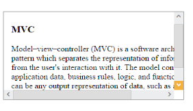

# Customizing the scroll Step

The Scroller control allows you to specify the scroll movement step in a pixel value, this step value is added to the scrollbar position when you press the arrow key. Based on position value, the scrollbar moves in its corresponding orientation. You can achieve this by using ScrollOneStepBy.

The following steps explains you the configuration of ScrollOneStepBy property in Scroller. 

1. In the View page, add a scroller helper to configure Scroller widget.

   ~~~ cshtml

	// In the CSHTML page, add a 
 element to configure Scroller widget and initialize the control.

	

		
                              
			@*Wrapper div for Scroller.*@
			
       
			@*Content div*@
			<h3>MVC </h3>	
			
 
				Model–view–controller (MVC) is a software architecture pattern which 
				separates the representation of information from the user's interaction
				with it. The model consists of application data, business rules, logic, and
				functions. A view can be any output representation of data, such as a chart or a diagram.
			

			

		

	

	@{Html.EJ().Scroller("scrollContent").Height(170).Width(350).ScrollOneStepBy(50).Render();}
	
   ~~~
   

	The following screenshot displays the Scroller control with scroll step value.

	

	Scroller Control with scroll step value
	{:.caption}